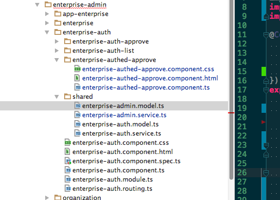
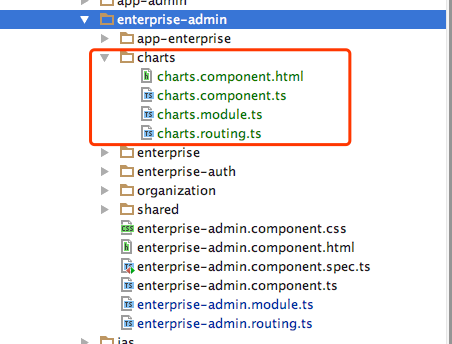

**目录**  

[TOC]

## 一、API 网关地址 配置    

cloudlink-front-framework/config/webpack.dev.js    
```
# line 13 ~ 19
/**
 * Webpack Constants 
 */
const ENV = process.env.ENV = process.env.NODE_ENV = 'development';
const HOST = process.env.HOST || 'localhost';
const PORT = process.env.PORT || 3000;
const HMR = helpers.hasProcessFlag('hot');

# line 150 ~ 171
devServer: {
            port: METADATA.port,
            host: METADATA.host,
            historyApiFallback: {
                index: '/index.html'
            },
            watchOptions: {
                aggregateTimeout: 300,
                poll: 1000
            },
            proxy: {
                '/cloudlink/v1/**': {
                    target: 'http://192.168.100.90:8050',
                    // target: 'http://192.168.120.110:8050',

                    // target: 'http://192.168.20.221:8901', //赵杨 ip
                    // target: 'http://192.168.100.212:8050',
                    secure: false,
                    pathRewrite: { '^/cloudlink/v1': '' }
                }
            }
        },
```

------
## 二、服务注册使用

   

如上图所示，先有一个模型跟服务，需要在`enterprise-auth/enterprise-authed-approve`里面使用：    
**模型使用：**   
```
# enterprise-admin/enterprise-auth/enterprise-authed-approve/enterprise-authed-approve.component.ts 
# 只需要在这个文件中写如下代码即可：
import {EnterpriseAdminModel} from "../shared/enterprise-admin.model";
```
**服务的使用：**        

***注意：*** 如果服务里面又引入服务，那么在使用这个服务时，也要导入引入的服务。        

```
# 服务的依赖注入： https://angular.cn/docs/ts/latest/guide/dependency-injection.html
# 方法一： 直接在组件中引入使用
# enterprise-admin/enterprise-auth/enterprise-authed-approve/enterprise-authed-approve.component.ts 
# 在文件中写入如下代码：
import {EnterpriseAdminService} from "../shared/enterprise-admin.service"; # 导入服务文件

@Component({
    selector: "jas-enterprise-authed-approve",
    templateUrl: "./enterprise-authed-approve.component.html",
    styleUrls: ["./enterprise-authed-approve.component.css"],
    providers:[EnterpriseAdminService]                               # 在这里写上服务名字
})
------------------------------------------------------------------------------------------

# 方法二： 在组件的所在的模块中注册服务后，在组件中直接使用
# enterprise-auth/enterprise-auth.module.ts 
# 在文件中写入如下代码：
import { EnterpriseAdminService } from './shared/enterprise-admin.service';
@NgModule({
    imports: [
    ],
    declarations: [
    ],
    providers:[EnterpriseAdminService    ]  # 引入声明
})

# enterprise-auth/enterprise-authed-approve/enterprise-authed-approve.component.ts 
# 在文件中写入如下代码：
import {EnterpriseAdminService} from "../shared/enterprise-admin.service";  # 引入使用

------------------------------------------------------------------------------------------
# 方法三：在组件的所在的模块中为服务申明一个名字，在子模块中直接用这个名字调用
# enterprise-auth/enterprise-auth.module.ts 
# 在文件中写入如下代码：
mport { EnterpriseAdminService } from './shared/enterprise-admin.service';
@NgModule({
    providers:[
       {provide:'view',useClass:EnterpriseAdminService} # 引入声明
    ]  
})

# enterprise-auth/enterprise-authed-approve/enterprise-authed-approve.component.ts 
# 在构造函数中直接引用：
constructor(@Inject('view') private viewService,

```

---------------
## 三、模块组件注册使用

     

如上图所示，模块`charts`需要在`enterprise-admin`下注册使用：      
```
# 模块的注册使用 

# src/app/jasframework/enterprise-admin/charts/charts.module.ts 
import {Charts} from './charts.component';
import {ChartsRoutes} from './charts.routing'
import {NgModule}      from '@angular/core';
import {CommonModule} from '@angular/common';
@NgModule({
  imports: [CommonModule, ChartsRoutes],
  declarations: [Charts],
  bootstrap: [Charts]
})
export default class ChartsModule {
}

# src/app/jasframework/enterprise-admin/charts/charts.routing.ts
import {Routes, RouterModule} from '@angular/router';
import {Charts} from './charts.component';
const routes:Routes = [
  {
    path: '',
    component: Charts,
    children: [ ]
  },
];
export const ChartsRoutes = RouterModule.forChild(routes);

# src/app/jasframework/enterprise-admin/charts/charts.component.ts
import {Component, OnInit} from '@angular/core';
@Component({
  selector: 'charts',
  templateUrl: 'charts.component.html',
  providers: [ ]
})
export class Charts implements OnInit {
  constructor() { }
  ngOnInit() { }
} 

# src/app/jasframework/enterprise-admin/charts/charts.component.html
<div>hello charts</div>

# 注册模块使之生效   
# 只需要在enterprise-admin的路由文件中注册这个路径就可以了
# src/app/jasframework/enterprise-admin/enterprise-admin.routing.ts
const routes: Routes = [
    {
        path: '', 
        component: EnterpriseAdminComponent,
        children:[{
              path: 'charts',   # 这里是路径
              loadChildren: ()=>System.import('./charts/charts.module.ts'), # 指导去哪里找这个模块
          }]
    },
];
```

模块比组件多了xx.module.ts与xx.routing.ts两个文件。如果删除这2个文件，那么就是组件。
组件的加载使用：   
```
# 还是以charts为例，代码在上面，少了xx.module.ts与xx.routing.ts两个文件。

# 注册组件使之生效   
# 需要在enterprise-admin的路由文件中注册这个路径，在模块中也需要声明
# src/app/jasframework/enterprise-admin/enterprise-admin.routing.ts
import {Charts} from './charts/charts.component';  # 引入这个组件
const routes: Routes = [
    {
        path: '', 
        component: EnterpriseAdminComponent,
        children:[{
              path: 'charts',   # 这里是路径
              component: Charts, # 指明组件
          }]
    },
];

# src/app/jasframework/enterprise-admin/enterprise-admin.module.ts
import {Charts} from './charts/charts.component'; # 引入这个组件
@NgModule({
    imports:      [ CommonModule,EnterpriseAdminRoutes ],
    declarations: [ EnterpriseAdminComponent, Charts ],   # 在这里写入Charts,这里是声明
    bootstrap:    [ EnterpriseAdminComponent ]
})
```

---------------
## 四、html中style类动态绑定   

### 1. 单个类的绑定：[class.special]="isSpecial"   

单个style类绑定介绍：https://angular.cn/guide/template-syntax#css-类绑定    
由class前缀，一个点 (.)和 CSS 类的名字组成， 其中后两部分是可选的。形如：[class.class-name]。     

```
// 不使用style类绑定的代码：
<!-- standard class attribute setting  -->
<div class="bad curly special">Bad curly special</div>    

// 当badCurly 有值的时候，会清除所有样式类
<!-- reset/override all class names with a binding  -->
<div class="bad curly special" [class]="badCurly">Bad curly</div>

// 使用style绑定
<!-- toggle the "special" class on/off with a property -->
<div [class.special]="isSpecial">The class binding is special</div>
```

当模板表达式的求值结果是真值时，Angular 会添加这个类，反之则移除它。     

### 2. 多个类的绑定：[ngClass]="{'selected':status === '','saveable': this.canSave,}"

参考链接：https://angular.cn/guide/template-syntax#ngclass-指令    
用`ngClass`绑定到一个key:value 形式的控制对象。这个对象中的每个 key 都是一个 CSS 类名，     
如果它的 value 是true，这个类就会被加上，否则就会被移除。    

```
// component.ts
currentClasses: {};
setCurrentClasses() {
  // CSS classes: added/removed per current state of component properties
  this.currentClasses =  {
    'saveable': this.canSave,
    'modified': !this.isUnchanged,
    'special':  this.isSpecial
  };
}

// component.thml
<div [ngClass]="currentClasses">This div is initially saveable, unchanged, and special</div>
```

### 3. 单个内联样式绑定：[style.color]="isSpecial ? 'red': 'green'"     

https://angular.cn/guide/template-syntax#样式绑定           
单个内联样式绑定由style前缀，一个点 (.)和 CSS 样式的属性名组成。 形如：[style.style-property]。     

```
<button [style.color]="isSpecial ? 'red': 'green'">Red</button>
<button [style.background-color]="canSave ? 'cyan': 'grey'" >Save</button>
```

有些样式绑定中的样式带有单位。在这里，以根据条件用 “em” 和 “%” 来设置字体大小的单位。   

```
<button [style.font-size.em]="isSpecial ? 3 : 1" >Big</button>
<button [style.font-size.%]="!isSpecial ? 150 : 50" >Small</button>
```

### 4. 多个内联样式绑定：[ngStyle]="currentStyles"    

https://angular.cn/guide/template-syntax#ngstyle-指令     
NgStyle需要绑定到一个 key:value 控制对象。 对象的每个 key 是样式名，它的 value 是能用于这个样式的任何值。      
下面的列子会根据另外三个属性的状态把组件的currentStyles属性设置为一个定义了三个样式的对象：    

```
// src/app/app.component.ts
currentStyles: {};
setCurrentStyles() {
  // CSS styles: set per current state of component properties
  this.currentStyles = {
    'font-style':  this.canSave      ? 'italic' : 'normal',
    'font-weight': !this.isUnchanged ? 'bold'   : 'normal',
    'font-size':   this.isSpecial    ? '24px'   : '12px'
  };
}

// src/app/app.component.html
<div [ngStyle]="currentStyles">
  This div is initially italic, normal weight, and extra large (24px).
</div>
```

你既可以在初始化时调用setCurrentStyles()，也可以在所依赖的属性变化时调用。


------------
## **angular2 第三方插件的使用**             

以 使用primeNG插件为例:https://www.primefaces.org/primeng/#/setup            

### 1. 安装插件：     

```
npm install primeng --save
```

### 2. 模块中引入prime    

```
# src/app/advanced-research/advanced-research.module.ts
import { DropdownModule } from 'primeng/primeng';
@NgModule({
  imports: [
    DropdownModule,
  ],
  providers: [],
  declarations: []
})
export default class advancedResearchModule { }
```

### 3. 在组件中使用插件     


## angular中阻止点击事件冒泡   

在点击事件中调用下面方法，或者在点击事件的父元素中调用方法

```
// component.ts 文件中
  // 阻止事件冒泡
  public stopBubble(e) {
    // 如果提供了事件对象，则这是一个非IE浏览器
    if (e && e.stopPropagation) {
      // 因此它支持W3C的stopPropagation()方法
      e.stopPropagation();
    } else {
      // 否则，我们需要使用IE的方式来取消事件冒泡
      window.event.cancelBubble = true;
    }
  }

// component.html文件中
<!--阻止事件冒泡-->
        <ul (click)="commonService.stopBubble($event)">
          <div *ngFor="let subItem of item.child">
            <li nz-menu-item (click)="menuClick(subItem.url)" class="menu-li">
              <i class="anticon anticon-appstore menu-icon"></i> {{subItem.name}}
            </li>
          </div>
        </ul>
```