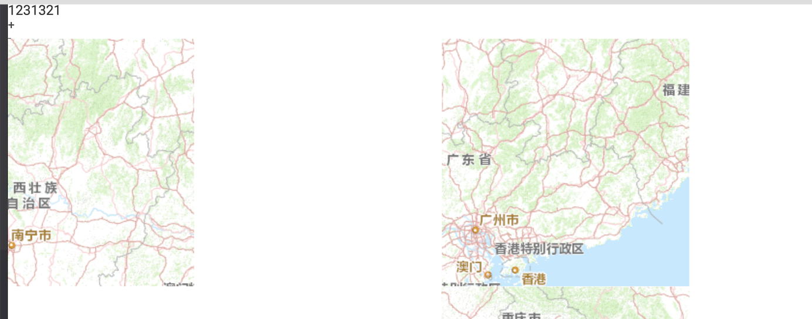
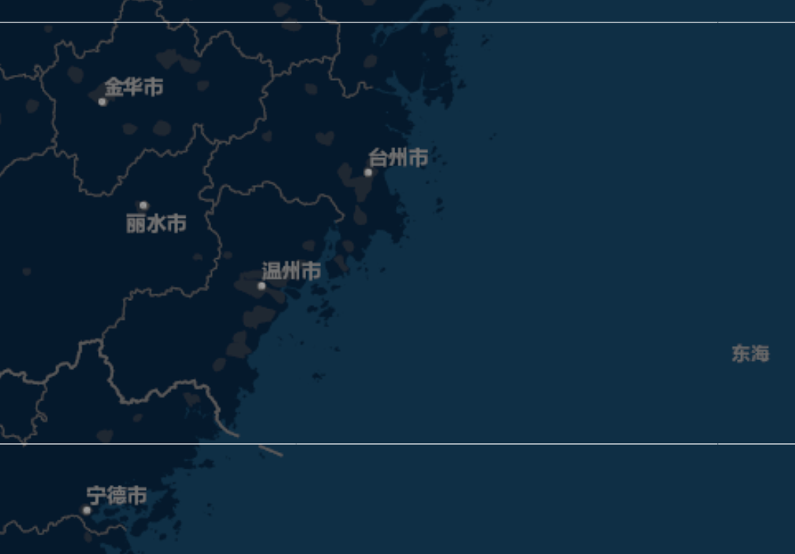

***目录***    

[TOC]    

-------------

## 地图加载后不完全：  arcgis自己的样式没有加载上



如上图所示，arcgis地图加载不完全，经过排查，是由于没有加载arcgis自己的CSS样式，把CSS加载上就好了。 


## 运行后，页面没有地图，地图服务报500错误   

运行网页后，页面没有地图，打开 console后看见如下信息：   

```
dojo.io.script error Error {__zone_symbol__error: Error
    at Error.g (http://192.168.100.92/polyfills.6fc95ed753dec1452ced.bundle.js:3:13200)
    at…, …}

__zone_symbol__message
:
"Error handling service request : Could not find a service with the name 'MapServer/ChinaOnlineStreetColor' in the configured clusters. Service may be stopped or ArcGIS Server may not be running."
```

经查找，这个是地图服务发生错误，导致不能读取地图了，   


## angular中，arcgis JA API 3.18版本中，画线没有提示信息了   

这个是由于 bootstrap样式中 `.tooltip`CSS 样式类中 `opacity`属性冲突了，导致了arcgis自己的样式失效了。
可在全局样式中添加如下属性：    

```
/*arcgis 组件3.18版本中在地图中画线时 提示语句出现：覆盖掉bootstrap中的样式才能出现。如果以后不用arcgis了，可以删除这个样式*/
.arcgis-version-three-map .tooltip {
  opacity: 1; /*透明度*/
}
```

## 地图中出现白线，样式出错导致的（arcgis3.18版本API）

    


如上图所示在地图中出现了一条白线，经过查找，在显示地图的块中，对DIV块进行了宽高的拉伸,     
arcgis地图显示的DIV块可使用arcgis自己的类样式来拉伸：   

```
/*arcgis地图大小，通过arcgis自己的css类来实现*/
html, body, div.map {
  width: 100%;
  height: 100%;
  padding: 0;
  margin: 0 auto;
  overflow: hidden;
}
```

同时把自己写的地图拉伸样式去掉就可以了


-----------

-------------