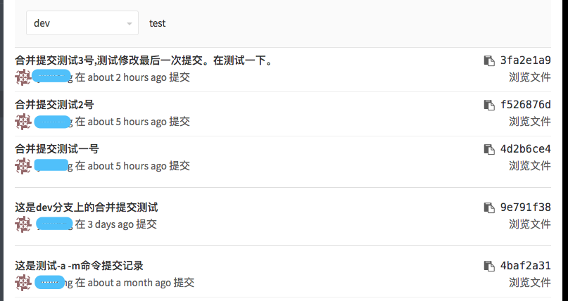

[TOC]


# git使用教程-高级(平时用的很少，了解就好)

## 1. git stash: 代码暂存

git stash 用来把代码暂存起来，把工作目录变干净，方便切换分支等做一些其他事情。

当你的工作已经做了一段时间后，所开发的功能还没有完成， 而这时候你想要切换分支做一点别的事情。    
但你又不想应为过一会就回到这一点而为做了一半工作就创建一次提交，这个时候你就可以使用`git stash`命令。   
`git stash`命令会处理工作目录的脏的状态，即修改的跟踪文件与暂存的改动。然后将未完成的修改保存到一个栈上，    
而你可以在任何时候重新应用这些改动。     

### 1.1  把代码储藏起来： git stash

```bash
$ git status
Changes to be committed:
  (use "git reset HEAD <file>..." to unstage)

	modified:   index.html

Changes not staged for commit:
  (use "git add <file>..." to update what will be committed)
  (use "git checkout -- <file>..." to discard changes in working directory)

	modified:   lib/simplegit.rb

//储藏代码
$ git stash
Saved working directory and index state \
  "WIP on master: 049d078 added the index file"
HEAD is now at 049d078 added the index file
(To restore them type "git stash apply")

$ git status
# On branch master
nothing to commit, working directory clean
```

上面使用了`git stash` 储藏了代码，这时候在看工作目录就变成干净了，这个时候你就可以做别的事情了。
还可以使用`git stash save`命令，与 `git stash` 是一样的。

### 1.2  查看储藏的代码： git stash list

要查看储藏的东西，可以使用`git stash list`命令：     

```bash
$ git stash list
stash@{0}: WIP on master: 049d078 added the index file
stash@{1}: WIP on master: c264051 Revert "added file_size"
stash@{2}: WIP on master: 21d80a5 added number to log
```

最新的是stash@{0}  

### 1.3  把储藏的代码取出来： git stash apply

如果想把储藏的代码应用回来，可使用`git stash apply`命令，如果不指定一个储藏，Git 认为指定的是最近的储藏。     
如果想要应用其中一个更旧的储藏，可以通过名字指定它，像这样：`git stash apply stash@{2}`。   

```bash
$ git stash apply --index
// # On branch master
// # Changed but not updated:
// #   (use "git add <file>..." to update what will be committed)
// #
// #      modified:   index.html
// #      modified:   lib/simplegit.rb
// #
```
###  1.4 git stash apply --index

文件的改动被重新应用了,但是之前已修改未暂存的文件却没有回到原来的位置，想要完全回到之前的样子，    
必须使用`--index`选项来运行`git stash apply`命令，来尝试重新应用暂存的修改。       
如果已经那样做了，那么你将回到原来的位置：    

```
$ git stash apply --index
// # On branch master
// # Changes to be committed:
// #   (use "git reset HEAD <file>..." to unstage)
// #
// #      modified:   index.html
// #
// # Changed but not updated:
// #   (use "git add <file>..." to update what will be committed)
// #
// #      modified:   lib/simplegit.rb
// #
```

### 1.5  删除储藏堆栈上的某个储藏：git stash drop stash@{0}

使用`git stash apply` 命令只会尝试应用暂存的工作 ，在堆栈上还有它。     
可以运行`git stash drop`加上将要移除的储藏的名字来移除它：   

```bash
$ git stash list
stash@{0}: WIP on master: 049d078 added the index file
stash@{1}: WIP on master: c264051 Revert "added file_size"
stash@{2}: WIP on master: 21d80a5 added number to log
$ git stash drop stash@{0}
Dropped stash@{0} (364e91f3f268f0900bc3ee613f9f733e82aaed43)
```

### 1.6  应用储藏然后立即从栈上扔掉它：git stash pop

这个命令只会应用最新的，然后丢掉它。   

###  1.7 git stash --keep-index: 不要储藏任何你通过 git add 命令已暂存的东西

当你做了几个改动并只想提交其中的一部分，过一会儿再回来处理剩余改动时，这个功能会很有用。

```bash
$ git status -s
M  index.html
 M lib/simplegit.rb

$ git stash --keep-index
Saved working directory and index state WIP on master: 1b65b17 added the index file
HEAD is now at 1b65b17 added the index file

$ git status -s
M  index.html
```

### 1.8 git stash -u: 把任何创建的未跟踪文件也储藏

默认情况下，`git stash`只会储藏已经在索引中的文件。      
如果指定 `--include-untracked`或`-u`标记，Git 也会储藏任何创建的未跟踪文件。   

```bash
$ git status -s
M  index.html
 M lib/simplegit.rb
?? new-file.txt

$ git stash -u
Saved working directory and index state WIP on master: 1b65b17 added the index file
HEAD is now at 1b65b17 added the index file

$ git status -s
$
```

### 1.9 从储藏创建一个分支:解决应用储藏冲突问题

如果储藏了一些工作，将它留在那儿了一会儿，然后继续在储藏的分支上工作，在重新应用工作时可能会有问题。     
如果应用尝试修改刚刚修改的文件，你会得到一个合并冲突并不得不解决它。      
如果想要一个轻松的方式来再次测试储藏的改动，可以运行`git stash branch`创建一个新分支，    
检出储藏工作时所在的提交，重新在那应用工作，然后在应用成功后扔掉储藏：    

```bash
$ git stash branch testchanges
Switched to a new branch "testchanges"
// # On branch testchanges
// # Changes to be committed:
// #   (use "git reset HEAD <file>..." to unstage)
// #
// #      modified:   index.html
// #
// # Changed but not updated:
// #   (use "git add <file>..." to update what will be committed)
// #
// #      modified:   lib/simplegit.rb
// #
// Dropped refs/stash@{0} (f0dfc4d5dc332d1cee34a634182e168c4efc3359)
```

## 2 git clean：清理工作目录

有时候你想清除工作目录一些无用的文件，或是为了运行一个干净的构建而移除之前构建的残留。      
这个时候你可以使用`git clean`命令。 它被设计为从工作目录中移除未被追踪的文件。        
如果你改变主意了，你也不一定能找回来那些文件的内容。     
一个更安全的选项是运行 git stash --all 来移除每一样东西并存放在栈中。

### 2.1 git clean -f -d:移除工作目录中所有未追踪的文件以及空的子目录

`-d` 是 目录的意思。   
`-f` 意味着 强制 或 “确定移除”。     

```bash
$ git clean -f -d
Removing 6.txt
Removing tttt/
```

### 2.2 git clean -f -d -n: 做一次演习然后告诉你 将要 移除什么

### 2.3 git clean -f -d -x: 移除.gitiignore文件中忽略的文件

默认情况下，git clean 命令只会移除没有忽略的未跟踪文件。     
任何与 .gitiignore 或其他忽略文件中的模式匹配的文件都不会被移除。     
如果你也想要移除那些文件，例如为了做一次完全干净的构建而移除所有由构建生成的 .o 文件，    
可以给 clean 命令增加一个 -x 选项。   

```bash
$ git status -s
 M lib/simplegit.rb
?? build.TMP
?? tmp/

$ git clean -n -d
Would remove build.TMP
Would remove tmp/

$ git clean -n -d -x
Would remove build.TMP
Would remove test.o
Would remove tmp/
```

## 3. 重写历史：git 提交历史修改

### 3.1 修改最后一次提交

修改你最近一次提交可能是所有修改历史提交的操作中最常见的一个。     
对于你的最近一次提交，你往往想做两件事情：修改提交信息，或者修改你添加、修改和移除的文件的快照。    

#### 3.1.1  修改最后一次提交的提交信息：git commit --amend

如果只是想修改最后一次提交的提交信息，可以直接使用如下命令：   

```bash
$ git commit --amend 
[dev 3fa2e1a] 合并提交测试3号,测试修改最后一次提交。在测试一下。
 Date: Thu Nov 2 11:29:00 2017 +0800
 1 file changed, 1 insertion(+)
 create mode 100644 6.txt
```

这会把你带入文本编辑器，里面包含了你最近一条提交信息，供你修改。      
当保存并关闭编辑器后，编辑器将会用你输入的内容替换最近一条提交信息。     

#### 3.1.2 修改最后一次提交的快照：`git add`或`git rm`然后`git commit --amend`

如果你已经完成提交，又因为之前提交时忘记添加一个新创建的文件，想通过添加或修改文件来更改提交的快照，    
也可以通过类似的操作来完成。 通过修改文件然后运行`git add`或`git rm`一个已追踪的文件，     
随后运行`git commit --amend`拿走当前的暂存区域并使其做为新提交的快照。     

使用这个技巧的时候需要小心，因为修正会改变提交的 SHA-1 校验和。     
它类似于一个小的变基 - 如果已经推送了最后一次提交则需要慎重修改。   

#### 3.1.3  把修改的最后一次提交信息强推到服务器：git push --f

此操作要慎重，如果要修改服务器上的最后一次提交，可现在本地修改，    
然后使用`git push --f`(force)强推到服务器中去。     

```bash
git push --force
Counting objects: 3, done.
Delta compression using up to 8 threads.
Compressing objects: 100% (2/2), done.
Writing objects: 100% (3/3), 458 bytes | 458.00 KiB/s, done.
Total 3 (delta 0), reused 0 (delta 0)
To http://192.168.102.9/yulilong/test.git
 + 5c0a032...3fa2e1a dev -> dev (forced update)
```

#### 3.1.4  gitlab服务器强推被拒绝： 仓库 -> 设置 -> 保护分支： 把被保护的分支去掉即可解决问题

### 3.2  使用git rebase合并多次commit

使用`git log` 查看一下历史：   

```bash
$ git log 

commit 3fa2e1a951ff823fbec625a96049e27ef35a85b8 (HEAD -> dev, origin/dev)
Author: yulilong <yulilong222q@outlook.com>
Date:   Thu Nov 2 11:29:00 2017 +0800

    合并提交测试3号,测试修改最后一次提交。在测试一下。

commit f526876def0b80676bfcf52937f78052e2d63955
Author: yulilong <yulilong222q@outlook.com>
Date:   Thu Nov 2 11:27:20 2017 +0800

    合并提交测试2号

commit 4d2b6ce4d5154c0b739e552e679bb7f4ce05fb2c
Author: yulilong <yulilong222q@outlook.com>
Date:   Thu Nov 2 11:25:59 2017 +0800

    合并提交测试一号

commit 9e791f38f4d5f472a371a8c147f37670185582f8
Author: yulilong <yulilong222q@outlook.com>
Date:   Mon Oct 30 10:22:02 2017 +0800

    这是dev分支上的合并提交测试

commit 4baf2a319c0de8f46630ba85db11cc4aebd1d2cd
Author: yulilong <yulilong222q@outlook.com>
Date:   Fri Sep 29 10:20:08 2017 +0800

    这是测试-a -m命令提交记录
```

如果想要合并最后三次的提交，可使用`git rebase -i HEAD~3`或`git rebase -i 9e791f38f4d`命令来压缩.    
该命令执行后，会弹出一个编辑窗口，3次提交的commit倒序排列，最上面的是最早的提交，最下面的是最近一次提交。      

```bash
  1 pick 4d2b6ce 合并提交测试一号
  2 pick f526876 合并提交测试2号
  3 pick 3fa2e1a 合并提交测试3号,测试修改最后一次提交。在测试一下。
  4 
  5 # Rebase 9e791f4..3fa2e1a onto 9e791f3 (3 commands)
  6 #
  7 # Commands:
  8 # p, pick = use commit
  9 # r, reword = use commit, but edit the commit message
 10 # e, edit = use commit, but stop for amending
 11 # s, squash = use commit, but meld into previous commit
 12 # f, fixup = like "squash", but discard this commit's log message
 13 # x, exec = run command (the rest of the line) using shell
 14 # d, drop = remove commit
 15 #
 16 # These lines can be re-ordered; they are executed from top to bottom.
 17 #
 18 # If you remove a line here THAT COMMIT WILL BE LOST.
 19 #
 20 # However, if you remove everything, the rebase will be aborted.
 21 #
 22 # Note that empty commits are commented out
```

修改第二行、第三行的第一个单词pick为squash(这些命令什么意思下面的注释有说明)。     
然后保存退出，git会压缩提交历史，    
如果有冲突，需要修改，修改的时候要注意，保留最新的历史，不然我们的修改就丢弃了。    
修改以后要记得敲下面的命令：    

```bash
$ git add .  
# git rebase --continue  
```

如果你想放弃这次压缩的话，执行以下命令：    

```bash
$ git rebase --abort 
```

如果没有冲突，或者冲突已经解决，则会出现如下的编辑窗口：      

```bash
  1 # This is a combination of 3 commits.
  2 # This is the 1st commit message:
  3 
  4 合并提交测试一号
  5 
  6 # This is the commit message #2:
  7 
  8 合并提交测试2号
  9 
 10 # This is the commit message #3:
 11 
 12 合并提交测试3号,测试修改最后一次提交。在测试一下。
 13      
 14 # Please enter the commit message for your changes. Lines starting
 15 # with '#' will be ignored, and an empty message aborts the commit.
 16 #   
 17 # Date:      Thu Nov 2 11:25:59 2017 +0800
 18 #        
 19 # interactive rebase in progress; onto 9e791f3
 20 # Last commands done (3 commands done):
 21 #    squash f526876 合并提交测试2号
 22 #    squash 3fa2e1a 合并提交测试3号,测试修改最后一次提交。在测试一下。
 23 # No commands remaining.
 24 # You are currently rebasing branch 'dev' on '9e791f3'.
 25 #
 26 # Changes to be committed:
 27 #   modified:   1.txt
 28 #   new file:   5.txt
 29 #   new file:   6.txt
```

编辑好合并的提交信息后保存，可看见如下输出信息：     

```bash
[detached HEAD 83d65c7] 三次合并提交的测试，成功了。
 Date: Thu Nov 2 11:25:59 2017 +0800
 3 files changed, 7 insertions(+)
 create mode 100644 5.txt
 create mode 100644 6.txt
Successfully rebased and updated refs/heads/dev.
```

最后把合并的记录强推到服务器中去：   

```bash
git push -f
Counting objects: 5, done.
Delta compression using up to 8 threads.
Compressing objects: 100% (3/3), done.
Writing objects: 100% (5/5), 596 bytes | 596.00 KiB/s, done.
Total 5 (delta 1), reused 0 (delta 0)
To http://192.168.102.9/yulilong/test.git
 + 3fa2e1a...83d65c7 dev -> dev (forced update)
```

服务器合并提交前：   

     

服务器合并后：   

      

参考链接：http://blog.csdn.net/yangcs2009/article/details/47166361    

### 3.3  把一个文件从提交历史中彻底删除：git filter-branch --tree-filter 'rm -f 1.txt' HEAD

有些人不经思考使用git add .，意外地提交了一个巨大的二进制文件，你想将它从所有地方删除。      
也许你不小心提交了一个包含密码的文件，而你想让你的项目开源。filter-branch大概会是你用来清理整个历史的工具。   
如果想要从整个历史总删除1.txt文件，你可以在`filter-branch`上使用`--tree-filte`r选项：   

```bash
$ git filter-branch -f --tree-filter 'rm -f 1.txt' HEAD 
Rewrite 83d65c7b098e0ec1f14d9a332187632b49d2ad9f (5/5) (0 seconds passed, remaining 0 predicted)    
Ref 'refs/heads/dev' was rewritten
```

如果执行命令的时候提示如下错误，删除 .git/refs/original/ 目录,或使用`-f`命令强制覆盖：  

```bash
$ git filter-branch -f --tree-filter 'rm -f 1.txt' HEAD 
Cannot create a new backup.
A previous backup already exists in refs/original/
Force overwriting the backup with -f   

git filter-branch -f --tree-filter 'rm -f 1.txt' HEAD 
Rewrite 83d65c7b098e0ec1f14d9a332187632b49d2ad9f (5/5) (0 seconds passed, remaining 0 predicted)    
Ref 'refs/heads/dev' was rewritten
```

#### 3.4.1 如果后悔删除了，可使用如下命令恢复：git reset --hard refs/original/refs/heads/[分支名]

```bash
$ git reset --hard refs/original/refs/heads/dev
HEAD is now at 83d65c7 三次合并提交的测试，成功了。
```

#### 3.4.2 把删除后的项目提交到服务器：git push origin +[分支名] 注意：一旦运行此命令，删除的文件不能找回

```bash
$ git push origin +dev         

Counting objects: 14, done.
Delta compression using up to 8 threads.
Compressing objects: 100% (9/9), done.
Writing objects: 100% (14/14), 1.40 KiB | 1.40 MiB/s, done.
Total 14 (delta 1), reused 0 (delta 0)
To http://192.168.102.110/user/test.git
 + 83d65c7...4b4da80 dev -> dev (forced update)
```

注意，分支名字前面的`+`号一定不能忘记，否则会报如下错误：     

```bash
To http://192.168.102.110/user/test.git
 ! [rejected]        dev -> dev (non-fast-forward)
error: failed to push some refs to 'http://192.168.102.110/user/test.git'
hint: Updates were rejected because the tip of your current branch is behind
hint: its remote counterpart. Integrate the remote changes (e.g.
hint: 'git pull ...') before pushing again.
hint: See the 'Note about fast-forwards' in 'git push --help' for details.
```

推送之前要把服务器的分支保护去掉，否则会报如下错误：     

```bash
remote: GitLab: You are not allowed to force push code to a protected branch on this project.
To http://192.168.102.110/user/test.git
 ! [remote rejected] dev -> dev (pre-receive hook declined)
error: failed to push some refs to 'http://192.168.102.110/user/test.git'
```

#### 3.4.3 删除一堆类似文件：git filter-branch --tree-filter "find * -type f -name '*~' -delete" HEAD

### 3.4 全局性地更换电子邮件地址

```bash
$ git filter-branch --commit-filter '
        if [ "$GIT_AUTHOR_EMAIL" = "schacon@localhost" ];
        then
                GIT_AUTHOR_NAME="Scott Chacon";
                GIT_AUTHOR_EMAIL="schacon@example.com";
                git commit-tree "$@";
        else
                git commit-tree "$@";
        fi' HEAD
```

参考链接： https://git-scm.com/book/zh/v2/Git-工具-重写历史        

## 4. GIT的工作原理

Git 的思维框架（将其作为内容管理器）是管理三棵不同的树。“树” 在我们这里的实际意思是 “文件的集合”，而不是指特定的数据结构。    

Git 作为一个系统，是以它的一般操作来管理并操纵这三棵树的：

```
----------------------------
树                       用途

HEAD                    上一次提交的快照，下一次提交的父节点

index                   预期的下一次提交的快照

Working Directory       沙盒（工作目录）
```

### 4.1 HEAD

HEAD 是当前分支引用的指针，它总是指向该分支上的最后一次提交。 这表示 HEAD 将是下一次提交的父结点。     
通常，理解 HEAD 的最简方式，就是将它看做 你的上一次提交 的快照。     

下例命令就显示了`HEAD`快照实际的目录列表，以及其中每个文件的`SHA-1`校验和：    

```bash
$ git cat-file -p HEAD
tree cfda3bf379e4f8dba8717dee55aab78aef7f4daf
author Scott Chacon  1301511835 -0700
committer Scott Chacon  1301511835 -0700

initial commit

$ git ls-tree -r HEAD
100644 blob a906cb2a4a904a152...   README
100644 blob 8f94139338f9404f2...   Rakefile
040000 tree 99f1a6d12cb4b6f19...   lib
```

`cat-file`与`ls-tree`是底层命令，它们一般用于底层工作，在日常工作中并不使用。不过它们能帮助我们了解到底发生了什么。    

### 4.2 index

index(索引)是你的预期的下一次提交。也会将这个概念引用为 Git 的 “暂存区域”，这就是当你运行`git commit`时Git看起来的样子。    

Git 将上一次检出到工作目录中的所有文件填充到索引区，它们看起来就像最初被检出时的样子。      
之后你会将其中一些文件替换为新版本，接着通过 git commit 将它们转换为树来用作新的提交。     

```bash
$ git ls-files -s
100644 a906cb2a4a904a152e80877d4088654daad0c859 0	README
100644 8f94139338f9404f26296befa88755fc2598c289 0	Rakefile
100644 47c6340d6459e05787f644c2447d2595f5d3a54b 0	lib/simplegit.rb
```

`ls-files`是底层命令，它会显示出索引当前的样子。    
确切来说，索引并非技术上的树结构，它其实是以扁平的清单实现的。不过对我们而言，把它当做树就够了。        

### 4.3 Working Directory

Working Directory（工作目录），最后，你就有了自己的工作目录。       
另外两棵树以一种高效但并不直观的方式，将它们的内容存储在 .git 文件夹中。       
工作目录会将它们解包为实际的文件以便编辑。 你可以把工作目录当做 沙盒。      
在你将修改提交到暂存区并记录到历史之前，可以随意更改。      

### 4.4 工作流程

```
+-------------------------------------------------------------------+
|   +--------------+      +---------------+      +--------------+   |
|   |  Working     |      |     Index     |      |     HEAD     |   |
|   |  Directory   |      |               |      |              |   |
|   +-----+--------+      +-------+-------+      +-------+------+   |
|         |                       |                      |          |
|         |                       | Checkout the project |          |
|         |  <-------------------------------------------+          |
|         |                       |                      |          |
|         |    Stage Files        |                      |          |
|         +---------------------> |                      |          |
|         |                       |      Commit          |          |
|         |                       +--------------------> |          |
|         |                       |                      |          |
+-------------------------------------------------------------------+
```

1. 假设我们进入到一个新目录，其中有一个文件。 我们称其为该文件的 v1 版本，将它标记为蓝色。      
现在运行`git init`，这会创建一个 Git 仓库，其中的 HEAD 引用指向未创建的分支（master 还不存在）。   

2. 此时，只有工作目录有内容。 现在我们想要提交这个文件，所以用`git add`来获取工作目录中的内容，并将其复制到索引(Index)中。     

4. 接着运行`git commit`，它首先会移除索引中的内容并将它保存为一个永久的快照，     
然后创建一个指向该快照的提交对象，最后更新 master 来指向本次提交。    

5. 此时如果我们运行`git status`，会发现没有任何改动，因为现在三棵树完全相同。    
现在我们想要对文件进行修改然后提交它。 我们将会经历同样的过程；首先在工作目录中修改文件。      
我们称其为该文件的 v2 版本，并将它标记为红色。     

6. 如果现在运行 git status，我们会看到文件显示在 “Changes not staged for commit,” 下面并被标记为红色，    
因为该条目在索引与工作目录之间存在不同。 接着我们运行`git add`来将它暂存到索引中。     

6. 此时，由于索引和 HEAD 不同，若运行`git status`的话就会看到 “Changes to be committed” 下的该文件变为绿色.    
也就是说，现在预期的下一次提交与上一次提交不同。 最后，我们运行`git commit`来完成提交。    

7. 现在运行`git status`会没有输出，因为三棵树又变得相同了。     
切换分支或克隆的过程也类似。 当检出一个分支时，它会修改 HEAD 指向新的分支引用，     
将 索引 填充为该次提交的快照，然后将 索引 的内容复制到 工作目录 中。     

[git工作详细介绍](https://git-scm.com/book/zh/v2/Git-工具-重置揭密)     

## 5. git重置git reset: 代码回退操作

### 5.1 只移动HEAD(相当于取消上一次提交)：`git reset --soft HEAD~`或 `git reset --soft 99ad0ec`

`reset`做的第一件事是移动`HEAD`的指向。`reset`移动`HEAD`指向的分支。     
`reset --soft`本质上是撤销了上一次`git commit`命令。 当你在运行`git commit`时，`Git`会创建一个新的提交，      
并移动`HEAD`所指向的分支来使其指向该提交。当你将它`reset`回`HEAD~`HEAD 的父结点）时，     
其实就是把该分支移动回原来的位置，而不会改变索引和工作目录。       
现在你可以更新索引并再次运行`git commit`来完成`git commit --amend`所要做的事情了。      

### 5.2 移动HEAD，更新index： `git reset HEAD~` 或`git reset --mixed HEAD~`

它依然会撤销一上次 提交，但还会 取消暂存 所有的东西。 于是，我们回滚到了所有`git add`和`git commit`的命令执行之前。   

### 5.3 移动HEAD，更新index,更新工作目录（working Directory）: `git reset --hard HEAD~`

必须注意，`--hard`标记是`reset`命令唯一的危险用法，它也是`Git`会真正地销毁数据的仅有的几个操作之一。       
其他任何形式的`reset`调用都可以轻松撤消，但是`--hard`选项不能，因为它强制覆盖了工作目录中的文件。      
在这种特殊情况下，我们的`Git`数据库中的一个提交内还留有该文件的`v3`版本，我们可以通过`reflog`来找回它。     
但是若该文件还未提交，`Git`仍会覆盖它从而导致无法恢复。   

`reset`命令会以特定的顺序重写这三棵树，在你指定以下选项时停止：    

1. 移动 HEAD 分支的指向 （若指定了 --soft，则到此停止）

2. 使索引看起来像 HEAD （若未指定 --hard，则到此停止）

4. 使工作目录看起来像索引

### 5.4 使用`git reflog`命令来查看所有已经提交过的commit

### 5.5 通过路径来重置：`git reset file.txt`

假如我们运行`git reset file.txt`（这其实是`git reset --mixed HEAD file.txt`的简写形式，     
因为你既没有指定一个提交的`SHA-1`或分支，也没有指定`--soft`或`--hard`），它会：    

 1. 移动`HEAD`分支的指向 （已跳过）       

 2. 让索引看起来像`HEAD`（到此处停止）

所以它本质上只是将`file.txt`从`HEAD`复制到索引中。       
它还有***取消暂存文件***的实际效果。
我们可以不让Git从HEAD拉取数据，而是通过具体指定一个提交来拉取该文件的对应版本。       
我们只需运行类似于`git reset eb43bf file.txt`的命令即可。     

## 6. git checkout 介绍

### 6.1 切换分支：git checkout [分支名]

运行`git checkout [branch]`与运行`git reset --hard [branch]`非常相似，     
它会更新所有三棵树使其看起来像 [branch]，不过有两点重要的区别。    

首先不同于`reset --hard`，`checkout`对工作目录是安全的，它会通过检查来确保不会将已更改的文件弄丢。      
其实它还更聪明一些。它会在工作目录中先试着简单合并一下，这样所有`还未修改过的`文件都会被更新。      
而`reset --hard`则会不做检查就全面地替换所有东西。

第二个重要的区别是如何更新`HEAD`。`reset`会移动`HEAD`分支的指向，而`checkout`只会移动`HEAD`自身来指向另一个分支。   

例如，假设我们有`master`和`develop`分支，它们分别指向不同的提交；我们现在在`develop`上（所以`HEAD`指向它）。       
如果我们运行`git reset master`，那么`develop`自身现在会和`master`指向同一个提交。       
而如果我们运行`git checkout master`的话，`develop`不会移动，`HEAD`自身会移动。 现在`HEAD`将会指向`master`。

所以，虽然在这两种情况下我们都移动`HEAD`使其指向了提交 A，但_做法_是非常不同的。      
reset 会移动`HEAD`分支的指向，而`checkout`则移动`HEAD`自身。      

### 6.2 放弃index与working Directory的改动：`git checkout [分支名] file.txt`   

该命令不会移动HEAD，只会把HEAD中的代码恢复到index中，同时把工作目录文件也恢复到HEAD中代码的样子。  

### 6.3 值放弃修改working Directory 工作目录中的修改：`git checkout file.txt`放弃单个修改或使用`git checkout .`放弃所有修改

这个命令只会放弃工作目录中的修改，已经提交到index中的修改则不会改动。    

[***reset\checkout命令详细介绍***](https://git-scm.com/book/zh/v2/Git-工具-重置揭密)     