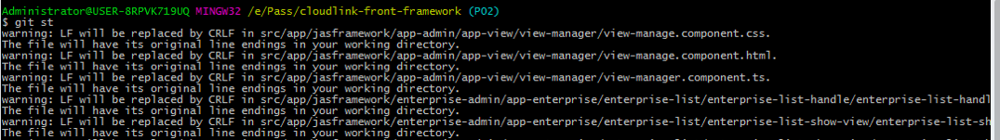
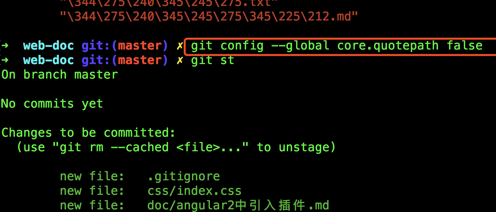
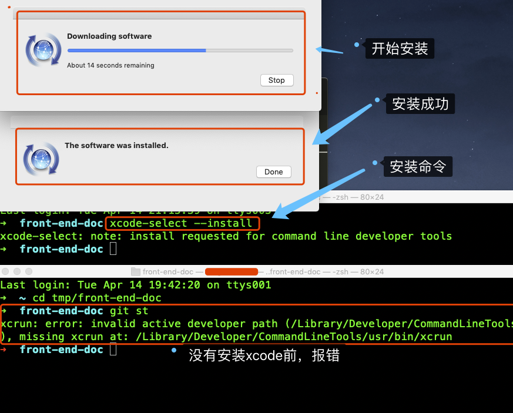
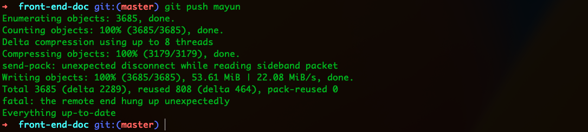
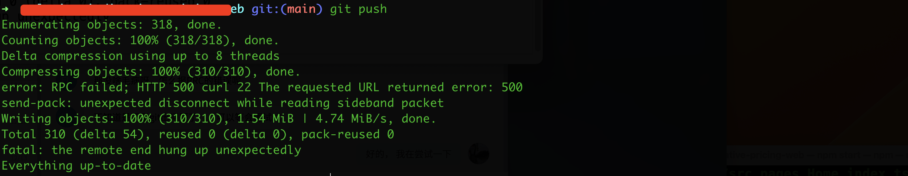
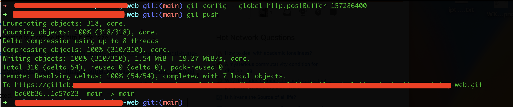

[TOC]

# git常见问题及解决


##  1. 不同操作系统使用git时，CRLF的处理换行问题

     

错误信息类似于：   
```
# https://git-scm.com/book/zh/v2/自定义-Git-配置-Git
~ git diff > tmp.patch
warning: LF will be replaced by CRLF in src/app/theme/components/menuItem/menuItem.component.css.
The file will have its original line endings in your working directory.
warning: LF will be replaced by CRLF in config/webpack.dev.js.

```

###  1.1 什么是CRLF和LF    

CRLF 是 carriage return line feed的缩写。中文意思是回车换行。      
LF是line feed的缩写，中文意思是换行。      
CRLF->Windows-style       
LF->Unix Style       
CR->Mac Style       
CRLF表示句尾使用回车换行两个字符(即我们常在Windows编程时使用"\r\n"换行)      
LF表示表示句尾，只使用换行.        
CR表示只使用回车.        

### 1.2 在Git中设置自动转换     

在Git通过下面的命令配置:      
```
$git config --global core.autocrlf true
# Configure Git on Windows to properly handle line endings
```
设置为true，添加文件到git仓库时，git将其视为文本文件。他将把crlf变成lf。      
设置为false时，line-endings将不做转换操作。文本文件保持原来的样子。      
设置为input时，添加文件git仓库石，git把crlf编程lf。当有人Check代码时还是lf方式。因此在window操作系统下，不要使用这个设置。      

1) true:             x -> LF -> CRLF         
2) input:            x -> LF -> LF            
3) false:            x -> x -> x         

*  其他的命令     

```
# AutoCRLF
#提交时转换为LF，检出时转换为CRLF
git config --global core.autocrlf true   
#提交时转换为LF，检出时不转换
git config --global core.autocrlf input   
#提交检出均不转换
git config --global core.autocrlf false

# SafeCRLF
#拒绝提交包含混合换行符的文件
git config --global core.safecrlf true   
#允许提交包含混合换行符的文件
git config --global core.safecrlf false    # 设置这个命令会把警告取消
#提交包含混合换行符的文件时给出警告
git config --global core.safecrlf warn

```

-------------

## 2. 多个仓库相同代码推送被拒绝     

当添加一个仓库后，推送文件上去不允许,错误信息类似于：    

```
git push github master 
To https://github.com/user/my_wiki.wiki.git
 ! [rejected]        master -> master (fetch first)
error: failed to push some refs to 'https://github.com/user/my_wiki.wiki.git'
hint: Updates were rejected because the remote contains work that you do
hint: not have locally. This is usually caused by another repository pushing
hint: to the same ref. You may want to first integrate the remote changes
hint: (e.g., 'git pull ...') before pushing again.
hint: See the 'Note about fast-forwards' in 'git push --help' for details.
```

如果远程仓库的代码没用了，不要了，则可以选择强推代码解决问题：    

```
~ git push -u github master -f
```

   

## 3. git使用vi编辑器时候报错：Swap file "./.git/.COMMIT_EDITMSG.swp" already exists!

非正常关闭vi编辑器时会生成一个.swp文件。     
使用vi，经常可以看到swp这个文件,那这个文件是怎么产生的呢，当你打开一个文件，     
vi就会生成这么一个.(filename)swp文件 以备不测（不测下面讨论），如果你正常退出，那么这个这个swp文件将会自动删除 。   
swp文件的来历，当你强行关闭vi时，比如电源突然断掉或者你使用了Ctrl+ZZ，vi自动生成一个.swp文件，     
下次你再编辑时，就会出现一些提示。    

比如你正在使用`vi`编辑`file.txt`文件，然后强制关闭终端，这个时候就会产生`.file.txt.swp`文件。  
当再次使用`vi`打开`file.txt`文件就会出现提示， 这个时候可使用下面的命令来恢复未保存的操作：   

```
vi -r file.txt 
```

这个时候保存中断之前的操作后，`.swp`文件不会自动删除，需要自己手动删除： 

```
rm .file.txt.swp
```

## 4. Git中文乱码的问题

在使用git命令的时候，如果文件名是中文的，就会出现如`\200\273\347\273\223.png`的乱码。
解决方法，在终端中输入如下命令：   

```
git config --global core.quotepath false
```

core.quotepath设为false的话，就不会对0x80以上的字符进行quote。中文显示正常。      

    

参考链接： http://blog.csdn.net/tyro_java/article/details/53439537

## 5. GIT不识别大小写文件夹解决

在mac电脑下，git仓库中有文件夹首字母大写，修改成首字母小写后，git没有识别出文件夹的修改， 可使用如下命令设置为大小写敏感：

```bash
git config core.ignorecase false
```

## 6. 同一个文件跟踪两次

由于修改了文件名，仅仅是文件名首字母大小写修改了，然后就导致git同时把这一个文件跟踪了两次，比如我修改了文件夹名字，由Settings 改成 settings,导致文件夹下的文件重复出现：

```bash
modified:   src/views/Settings/TagSet/TagDialog.jsx
modified:   src/views/settings/TagSet/TagDialog.jsx
```

此时可使用`git rm --cached`来取消对重命名之前的文件跟踪

```bash
git rm --cached src/views/Settings/TagSet/TagDialog.jsx
rm 'src/views/Settings/TagSet/TagDialog.jsx'
```

取消跟踪后，使用`git status`查看，就会发现这个文件自动添加到删除中了：

```bash
~ git rm --cached src/views/Settings/TagSet/TaDialog.jsx
rm 'src/views/Settings/TagSet/TagDialog.jsx'

~ git status
On branch master
Your branch is up-to-date with 'origin/master'.

Changes to be committed:
  (use "git reset HEAD <file>..." to unstage)

	deleted:    src/views/Settings/RuleSet/RuleDialog.jsx
	deleted:    src/views/Settings/TagSet/TagDialog.jsx
	modified:   src/views/settings/RuleSet/RuleDialog.jsx
	modified:   src/views/settings/TagSet/TagDialog.jsx
```

## 7. 切换分支报错：有文件未跟踪

当我切换分支的时候，出现如下错误信息：

```bash
~ git co develop
error: The following untracked working tree files would be overwritten by checkout:
	src/data-map/components/atlas-left-Catalog/index.jsx
Please move or remove them before you switch branches.
```

这个文件是不存在的，我之前由于修改了文件夹名大小写并提交了代码，到这这个文件不存在，使用`git rm --cached`无效，

在网上搜索解决方法：

```bash
# 删除 一些 没有 git add 的 文件
git clean -d -fx

git clean 参数 
    -n 显示将要删除的文件和目录；
    -x -----删除忽略文件已经对git来说不识别的文件
    -d -----删除未被添加到git的路径中的文件
    -f -----强制运行
```

这个命令会删除所有没被add的文件，使用命令后就删除了`node_modules`等文件夹，所有使用需谨慎，

我使用这个命令后，并没有解决问题，后来我删除了项目，从新clone一个项目，安装后，在切换分支就好了，

所以可以尝试删除项目，然后从新安装，或者直接从现有的项目中把`node_modules`文件夹复制过来


## 8. gitlab保护分支，导致本地`git push -f`报错

产生原因：服务器提交了错误或者无用的代码，本地回滚代码，然后把代码强推到服务器上，由于gitlab上有分支保护导致代码推送失败：

```bash
git push origin master -f
Total 0 (delta 0), reused 0 (delta 0)
remote: GitLab: You are not allowed to force push code to a protected branch on this project.
To http://git.baijiahulian.com/yunying/bi-fe.git
 ! [remote rejected] master -> master (pre-receive hook declined)
error: failed to push some refs to 'http://git.baijiahulian.com/yunying/bi-fe.git'
```

- 在gitlab上查看保护的分支

  在gitlab上打开项目，点击`Repository`, 然后点击`Branches`,就能看见所有分支，在分支名字后面有个绿色的`protected`就是保护分支。

- 关闭gitlab上的保护分支(需要项目的master或者Owner)

  点击项目右上角(用户logo下面)的小齿轮，选择`Protected Branches`,在打开的页面里面就能看见保护的分支了，然后点击保护分支右边的`Unprotect`,就能删除对这个分支的保护了。

- 开启gitlab上的保护分支(需要项目的master或者Owner)

  点击项目右上角(用户logo下面)的小齿轮，选择`Protected Branches`, 在`Protect a branch`中输入分支名字，选择对应权限，然后点击`Protect`，就会立刻添加一个保护分支了。


## 9. `git rm --cached` 报错：recursively without -r

当需要取消一个文件夹跟踪时，报错：

```bash
git rm --cached src/css/common/theme/

fatal: not removing 'src/css/common/theme/' recursively without -r
```

根据网络查找资料，是说这个文件夹`需要递归取消跟踪列表里的文件`

在命令加上`-f`即可：

```bash
git rm -r --cached src/css/common/theme/
rm 'src/css/common/theme/graph/graph-var.less'
rm 'src/css/common/theme/graph/graph-var.scss'
```

## 10. GIT添加空文件夹到项目`.gitkeep`

因为git空目录无法add。如果想add一个空目录，则需要在它下面创建一个文件。

这个算设计失误吧，好多项目还得弄个假文件在空文件夹里面占位。
大概是linus一开始就把快照设计成只有文件组成，后来想想要改太难，就算了吧。反正你们可以用假文件来占位（oh，so linux！），为什么要linus亲自实现它。

解决办法是在空文件夹下创建一个`.gitkeep`文件，然后添加这个文件即可

## 11. git clone early EOF error 的解决方式

https://www.jianshu.com/p/189fd3c9d0ac

1、在我遇到的这个错误的原因应该是文件太大,解决方式为git添加 compression 配置项:

```bash
~ git config --global core.compression -1
```

compression 是压缩的意思，从 clone 的终端输出就知道，服务器会压缩目标文件，然后传输到客户端，客户端再解压。取值为 [-1, 9]，-1 以 zlib 为默认压缩库，0 表示不进行压缩，1..9 是压缩速度与最终获得文件大小的不同程度的权衡，数字越大，压缩越慢，当然得到的文件会越小。

2、可以增加git的缓存大小

```bash
~ git config --global http.postBuffer 1048576000
```

将http.postBuffer设置的尽量大，例如git config --global http.postBuffer 524288000  （500M）
 git config --global http.postBuffer 1048576000  (1G)。再大的应该是依次类推吧
 因为下载的时候不止是工程数据，还有其它配置数据，总量会大于工程数据量，所以设置的缓存大小一定要比工程大小多一些。

3、配置git的最低速和最低速时间

```bash
git config --global http.lowSpeedLimit 0
git config --global http.lowSpeedTime 999999 单位 秒
```

## 12. git命令报错：xcrun: error: invalid active developer path

我的系统是Mac系统，由于我对Mac系统进行了升级，Mac系统升级到了`Mojave 10.14.6`。

然后，使用git命令后，报错：

```bash
~ git st
xcrun: error: invalid active developer path (/Library/Developer/CommandLineTools), missing xcrun at: /Library/Developer/CommandLineTools/usr/bin/xcrun
```

经过网络查找:https://www.jianshu.com/p/50b6771eb853

需要安装重装xcode command line，终端输入如下命令：

```csharp
xcode-select --install
```

如果没有解决问题，执行以下命令

```csharp
sudo xcode-select -switch /
```




## 13. git pull报错：fatal: refusing to merge unrelated histories

当使用`git pull`拉取代码的时候报错：

```bash
fatal: refusing to merge unrelated histories
```

经过翻译：拒绝合并无关的历史

错误原因：其实这个问题是因为 两个 根本不相干的 git 库， 一个是本地库， 一个是远端库， 然后本地要去拉取代码， 本地库觉得远端库跟自己不相干， 所以告知无法合并。

解决办法，强制拉取合并：

```bash
git pull --allow-unrelated-histories

git pull origin master --allow-unrelated-histories
```

` --allow-unrelated-histories` ：把两段不相干的 分支进行强行合并。

由于两个版本不相干，强制拉取下来后会有很多冲突，如果确定本地的分支不需要了，那么可以删除本地分支，然后在拉取远程分支。

此问题参考：https://blog.csdn.net/Websphere_zxf/article/details/90475875

## 14. 码云仓库上提示代码仓库存储超过500MB

在把代码推送到码云上时，提示代码仓库使用空间超过500MB了， 但是经过查看本地文件大小，发现代码仓库并没有那么大，经过新建仓库，然后把代码推送到新仓库后发现代码并没有那么大，经过查找，需要清理`存储库GC`。

查看码云仓库控使用空间：打开码云仓库 -> 页面右边 star下面的服务按钮 -> 里面有仓库大小显示。

清理`存储库GC`：打开码云仓库 -> 页面右边 star下面的管理按钮 -> 左边选择`存储库GC` -> 点击 存储库GC 按钮清理

也可以在管理页面，选择清空仓库，然后从新把代码推动到仓库中。

## 15. git status 提示：Permission denied

当使用`git status`命令时，终端报如下错误：

```bash
$ git status
warning: could not open directory 'csic-vue/src/api/mixin/': Permission denied
warning: could not open directory 'csic-vue/src/components/ci-file-upload/': Permission denied
```

在网上查找资料：

https://github.com/vuejs/vue-cli/issues/1809

可尝试使用如下命令：

```bash
npm cache clear --force
sudo npm cache clear --force
```

## 16. git忽略本地已存在文件的修改

１、将文件修改忽略

```bash
git update-index --assume-unchanged 带路径的文件名
```

2、取消文件忽略

```bash
git update-index --no-assume-unchanged 带路径的文件名
```

## 17. git pull报错：error: cannot lock ref…unable to resolve reference…reference broken

当使用`git pull`拉取远程仓库代码是报错：

```bash
$ git pull

error: cannot lock ref 'refs/remotes/origin/master':
    unable to resolve reference 'refs/remotes/origin/master': reference broken
From bitbucket.org:xx/mkyong-tutorials
 ! [new branch]      master     -> origin/master  (unable to update local ref)
```

问题原因：       
原因是你这个git工程的.git/refs目录下跟踪的某些git分支，在git pull的时候，与远端的对应分支的refs对比发现不同，所以导致git pull报错。

通常产生这个问题的原因是（以分支git/yousa/feature_01为例）：        
1、有人操作这个分支，在git push的时候使用了`git push –force`，导致远端分支被覆盖，你本地的refs与远端无法一致，导致问题。
2、git分支是不区分大小写的，如果有人删除掉这个远端分支又重新新建了一个这个分支也会出现同样的问题。

解决办法：           
1、强行拉取远程代码，执行`git pull -p`，这种可能会导致本地提交内容被删除掉。       
2、删除掉有问题的refs，再进行git pull(以分支master为例)，可以直接在.git/refs下面根据错误提示删除对应的refs文件，比如上面报错就是需要删除refs/remotes/origin/master文件（嫌麻烦直接删除整个refs目录也行）

- 使用git命令删除相应refs文件：

  `git update-ref -d refs/remotes/origin/master`

- 使用终端命令直接删除这个文件，如下方式：

  ```bash
  $ rm .git/refs/remotes/origin/master
  
  $ git fetch
   From bitbucket.org:xx/mkyong-tutorials
      df0eee8..3f7af90  master     -> origin/master
  
  $ git pull
   Already up to date.
  ```


## 18. git push 报错解决

### 18.1 the remote end hung up unexpectedly

当推送代码到远程仓库的时候，发生报错：

```bash
~ git push mayun
Compressing objects: 100% (184/184), done.
send-pack: unexpected disconnect while reading sideband packet
Writing objects: 100% (188/188), 4.55 MiB | 6.36 MiB/s, done.
Total 188 (delta 111), reused 0 (delta 0), pack-reused 0
fatal: the remote end hung up unexpectedly
Everything up-to-date
# 错误信息大概意思：发送数据时意外断开。致命错误：远程意外挂起
```


经过在网络上搜索发现问题可能原因：

- 网络连接问题
  - 在推送过程中，网络连接中断或不稳定可能会导致这个错误
  - 如果网络连接较慢，推送数据包可能会超过远程服务器的超时设置，从而导致连接中断
- 远程服务器配置问题
  - 如果远程仓库所在的服务器存储空间不足，也可能导致推送失败
  - 如果一次性推送的数据量过大（例如，推送大文件或大量提交记录），可能会超过服务器的处理能力，从而中断连接
- 本地 Git 配置问题
  - Git的默认缓冲区大小可能不足以处理大规模推送操作，导致错误发生

经过排查，我的网络没有问题，代码推送到github仓库能成功推送。

我推送的远程仓库是码云，码云的仓库有大小限制(500MB)，之前仓库有过存储大于500MB了，然后我清理了 存储库GC。我这次清理后，然后在 统计 -> 仓库数据统计 里面仓库大小不到100MB了。再次推送代码，还是报错。然后我又清空了仓库，推送代码还是不行，所以远程仓库问题基本排除了。

剩下的基本就是git的默认缓存区大小问题。

解决办法：

1、增加Git的默认缓冲区大小，设置单位为字节

```bash
# 只在项目中设置，增加Git的默认缓冲区大小
git config http.postBuffer 524288000 # 扩大缓存为500MB
# 查看项目下的git配置命令
git config --list

# 也可以全局设置，这样每个项目都能生效
git config --global http.postBuffer 524288000
# 查看全局的git配置命令
git config --global --list

# 如果仓库使用的ssh形式拉取的，则需要如下命令
# git config ssh.postBuffer 524288000
```

设置后，在次推送代码，发现推送成功，问题解决


2、对于网络问题，可以尝试配置git的最低速度和最低速度时间：

```bash
# 报错：fatal: The remote end hung up unexpectedlyB | 2.00 KiB/s
git config http.lowSpeedLimit 0
git config http.lowSpeedTime 999999 # 单位 秒
# 如果全局设置使用 git config --global 命令
```

这个本人没有试过，如果出现这个网络问题了，可以试试这个

3、以上都无效，可以试试这个:

```bash
git config sendpack.sideband false
# 如果全局设置使用 git config --global 命令
```

这个没试过，如果以上方法都没解决，可以试试这个

参考资料：

https://blog.csdn.net/qq_37380933/article/details/140922355

https://www.cnblogs.com/rgqjson/p/13297526.html

https://github.com/orgs/community/discussions/39210


### 18.2 RPC failed; HTTP 500 curl 22 The requested URL returned error: 500

当使用git push 命令推送代码的时候，报如下错误：

```bash
Enumerating objects: 318, done.
Counting objects: 100% (318/318), done.
Delta compression using up to 8 threads
Compressing objects: 100% (310/310), done.
error: RPC failed; HTTP 500 curl 22 The requested URL returned error: 500
send-pack: unexpected disconnect while reading sideband packet
Writing objects: 100% (310/310), 1.54 MiB | 4.74 MiB/s, done.
Total 310 (delta 54), reused 0 (delta 0), pack-reused 0
fatal: the remote end hung up unexpectedly
Everything up-to-date
```



经过网络查找，这个问题跟 上面的 `18.1` 问题是一样的，是由于 git 缓冲区大小造成的(默认为1MB)。经过查看代码，我这里提交里面有一些图片(共计1.7MB)，超过了缓存区大小，因此报错了，解决方案就是增加缓存大小：

```bash
git config --global http.postBuffer 157286400 # 全局配置，缓存区增加到150MB， 单位是字节
```

配置好后，再次推送代码就成功了。



参考资料：https://community.atlassian.com/t5/Bitbucket-questions/git-push-returns-500-server-error/qaq-p/2809308

