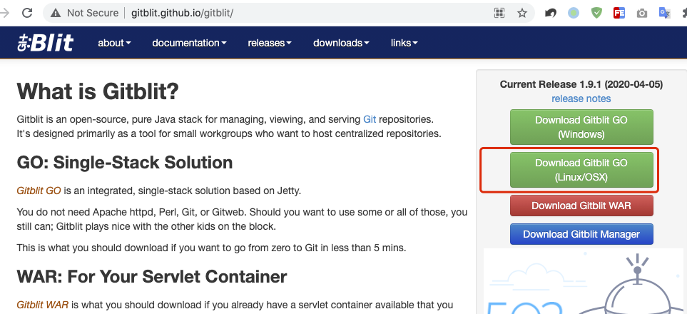
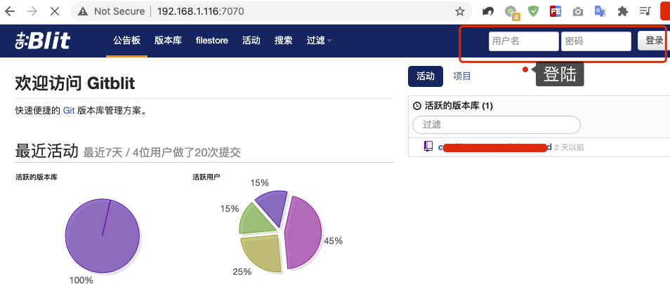
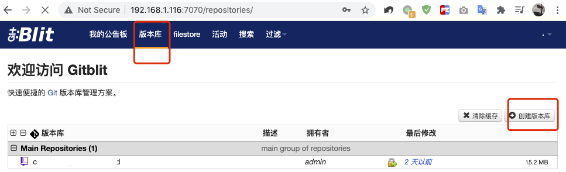
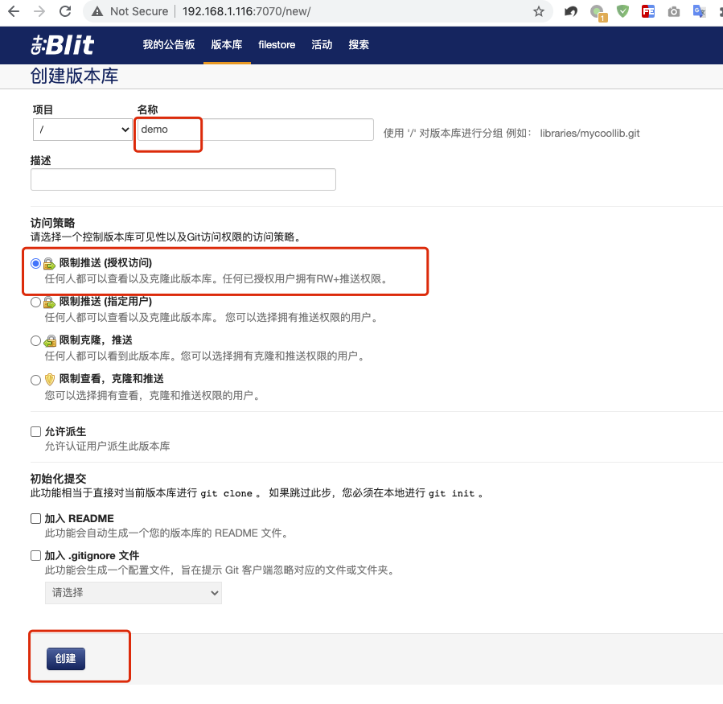
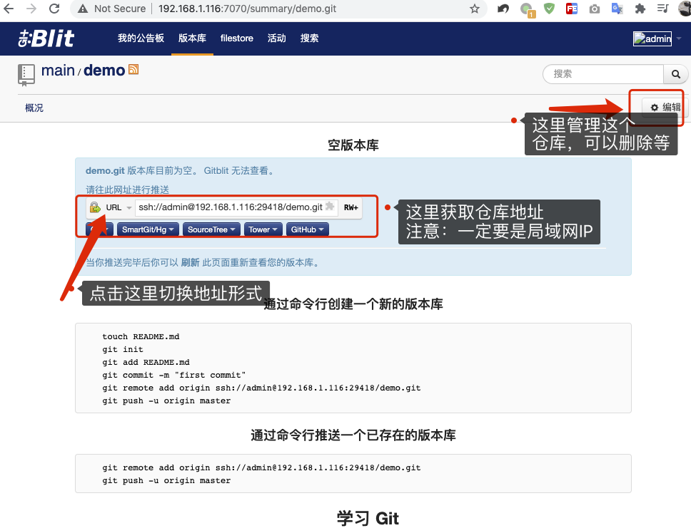

[TOC]


# 使用Gitblit软件开启git服务器，供局域网其他电脑当做git仓库服务

有的时候，代码需要在局域网中电脑间共享，并协调工作，则可以使用Gitblit软件在本地电脑搭建一个git服务器，供局域网其他电脑使用。	

关于Gitblit：

Gitblit是一个开放源代码的纯Java堆栈，用于管理，查看和服务Git存储库。它主要是为希望托管集中存储库的小型工作组设计的工具。

注：其实在网上还找到了使用`git daemon`命令启动服务的，经过尝试， 在自己的电脑中 拉取、上传代码没有问题，但是局域网中其他电脑只能拉取代码，不能上传代码。代码仓库中已经加入了：`git config receive.denyCurrentBranch ignore` 配置。启动服务的命令：`git daemon --reuseaddr --base-path=. --export-all --verbose --enable=receive-pack`

所以在网上又找到了这个软件，经过尝试这个软件是有效的。

## 1. java依赖环境安装

Gitblit软件需要依赖java环境，所以需要安装java依赖，如果已安装请忽略这部分，如果么有安装需要安装一下。

打开链接：https://www.oracle.com/java/technologies/javase-downloads.html

在这个页面中选一个版本，然后点击`JDK Download`按钮，进入下载版本，本人安装的是8的版本：

https://www.oracle.com/java/technologies/javase/javase-jdk8-downloads.html

在这个页面中，选择对应系统的安装包下载，Mac系统的是`jdk-8u281-macosx-x64.dmg`

安装成功后，在终端中输入`java -version`命令，如果出现版本号，则表示安装成功：

```bash
$ java -version

java version "1.8.0_231"
Java(TM) SE Runtime Environment (build 1.8.0_231-b11)
Java HotSpot(TM) 64-Bit Server VM (build 25.231-b11, mixed mode)
```

## 2. Mac系统操作

### 2.1 下载Gitblit、配置参数

官网下载地址：http://gitblit.github.io/gitblit/ 

如果打开失败了，在Gitblit的源码仓库github页面中寻找：https://github.com/gitblit/gitblit   



打开网站后，选择`Download Gitblit GO (Linux/OSX)` 点击下载，下载后，文件名：`gitblit-1.9.1.tar.gz`，解压后，把文件夹放到一个指定的位置，我这里放在了用户文件夹下`~/`。

在解压的文件夹中`gitblit-1.9.1`的`data`文件夹中，找到`defaults.properties`文件，使用编辑器打开，并编辑如下内容：

```bash
# 大约30行，git服务器的文件夹地址，这个文件夹用来存放git仓库，绝对地址
git.repositoriesFolder = /Users/user/gitblit-1.9.1/gitRepository

# 大约2069行，配置浏览器访问的端口
server.httpPort = 7070
```

git.repositoriesFolder的值是一个绝对路径，这个路径指向一个文件夹，用来存放git仓库。这个文件夹需要事先创建好。

文件修改完成后，保存即可。

### 2.2 启动服务

在`gitblit-1.9.1`文件夹中，有一个`gitblit.sh`脚本文件，终端执行此文件，就可以启动服务：

```bash
./gitblit.sh

2021-03-28 20:11:38 [INFO ] 
  _____  _  _    _      _  _  _
 |  __ \(_)| |  | |    | |(_)| |
 | |  \/ _ | |_ | |__  | | _ | |_
 | | __ | || __|| '_ \ | || || __|  http://gitblit.com
 | |_\ \| || |_ | |_) || || || |_   @gitblit
  \____/|_| \__||_.__/ |_||_| \__|  1.9.1

2021-03-28 20:11:38 [INFO ] Running on Mac OS X (10.14.6)
2021-03-28 20:11:38 [INFO ] JVM version 1.8.0_231 (Oracle Corporation)
.....
2021-03-28 20:11:41 [INFO ] Started o.e.j.w.WebAppContext@fd0e5b6{/,file:/Users/user/gitblit-1.9.1/data/temp/webapp/,AVAILABLE}{file:/Users/user/gitblit-1.9.1/gitblit.jar}
2021-03-28 20:11:41 [INFO ] Started ServerConnector@c8eb6b3{SSL-HTTP/1.1}{0.0.0.0:8443}
2021-03-28 20:11:41 [INFO ] Started ServerConnector@362a019c{HTTP/1.1}{0.0.0.0:7070}
2021-03-28 20:11:41 [INFO ] Started @2923ms
```

执行脚本后，终端出现上面的输出信息表示启动成功。

本地电脑通过：`http://127.0.0.1:7070/` 访问，局域网中通过这台电脑的内网地址加端口访问。Mac局域网地址可通过2种方式查看局域网中IP地址：

1、系统设置 -> 网络 -> 高级 -> TCP/IP 选项里面的 `IPv4 Address`。

2、终端使用`ifconfig`命令，在输出的信息中找到`en0`里面的地址。

### 2.3 终止服务：停止脚本即可

如果要停止服务，终端停止执行脚本即可。停止后，刷新访问地址，可以看见网页无法打开了。

在终端使用`control + C`快捷键来终止脚本的运行：

```bash
2021-03-28 22:29:10 [INFO ] Stopped ServerConnector@362a019c{SSL-HTTP/1.1}{0.0.0.0:8443}
2021-03-28 22:29:10 [INFO ] Stopped ServerConnector@1d9bec4d{HTTP/1.1}{0.0.0.0:7070}
2021-03-28 22:29:10 [INFO ] Gitblit context destroyed by servlet container.
2021-03-28 22:29:10 [INFO ] Git Daemon stopping...
2021-03-28 22:29:10 [INFO ] Git Daemon stopped.
2021-03-28 22:29:10 [INFO ] SSH Daemon stopping...
2021-03-28 22:29:10 [INFO ] Stopped o.e.j.w.WebAppContext@fd0e5b6{/,file:/Users/user/gitblit-1.9.1/data/temp/webapp/,UNAVAILABLE}{file:/Users/suer/gitblit-1.9.1/gitblit.jar}
```

## 3. window系统操作

[Window系统下搭建GIT本地服务器](https://www.huaweicloud.com/articles/9e213c053d55e491d9059ed6c7b0413d.html)

### 3.1 下载Gitblit、配置参数

官网下载地址：http://gitblit.github.io/gitblit/

打开网站后，选择window版本的下载，下载后，解压。然后放到一个文件夹中，比如放在E盘根目录下。

在解压的文件夹中`gitblit-1.9.1`的`data`文件夹中，找到`defaults.properties`文件，使用编辑器打开，并编辑如下内容：

```bash
# 大约30行，git服务器的文件夹地址，这个文件夹用来存放git仓库，绝对地址
git.repositoriesFolder = E:/gitblit-1.9.1/gitRepository

# 大约2069行，配置浏览器访问的端口
server.httpPort = 7070
```

文件修改完成后，保存即可。

### 3.2 启动服务

在`gitblit-1.9.1`文件根目录中找到`gitblit.cmd`文件，在终端软件中运行这个文件：

```bash
./gitblit.cmd

2021-03-28 20:11:38 [INFO ]
```

执行脚本后，终端出现上面的输出信息表示启动成功。

本地电脑通过：`http://127.0.0.1:7070/` 访问，局域网中通过这台电脑的内网地址加端口访问。

windows系统查看ip，在终端中输入`ipconfig`来查看。

### 3.3 终止服务：停止脚本即可

在终端使用`control + C`快捷键来终止脚本的运行。


## 4. 仓库的创建与管理

仓库的创建与管理都需要通过网站来完成，在浏览器中打开服务网站。

1、打开网站后，右上角输入账号/密码：admin/admin。



2、登陆后，点击`版本库`菜单，进入git仓库管理页面，然后点击`创建版本库`，如下图：



3、在创建仓库页面，输入创建仓库的信息，然后点击`创建` 按钮，创建仓库：



4、创建后，就会进入到创建的仓库页面，在这个页面有一个仓库地址，复制这个地址给其他同事，然后其他同事添加这个仓库源。注意：地址一定要是局域网IP形式的地址。其他人拉取、上传git时，输入的密码就是地址中用户的密码(下面图片中URL中的密码是admin账号的密码)



5、后期查看仓库可点击`版本库`按钮进入仓库管理界面。

### 4.1 给仓库添加新的用户

1、首先添加一个gitblit用户：登陆admin账号后，点击账号 -> 点击 用户 按钮 -> 在出现的页面中点击`添加用户`按钮，添加新用户。

2、给git仓库添加新用户：仓库页面 -> 点击 编辑按钮 -> permissions 

### 4.2 删除一个仓库

仓库页面 -> 编辑 -> 管理 -> 删除


## 参考资料

[本地搭建Git服务器，两台电脑共享代码如此简单](https://cloud.tencent.com/developer/article/1639022)

[gitblit 软件github地址](https://github.com/gitblit/gitblit)

[Gitblit 官网](http://gitblit.github.io/gitblit/)

