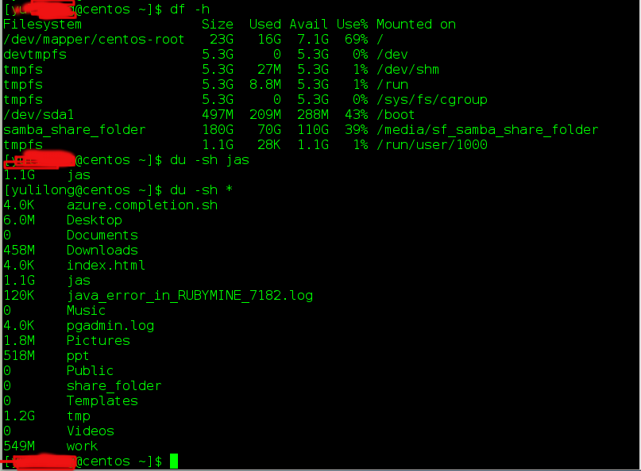

[TOC]    

## 1. MV移动文件、重命名文件

### 1.1 移动文件：mv [选项] 源文件或目录 目标文件或目录

参考链接：   
https://www.cnblogs.com/piaozhe116/p/6084214.html     

### 1.2 文件重命名

```
linux下重命名文件或文件夹的命令mv既可以重命名，又可以移动文件或文件夹.
例子：将目录A重命名为B
mv A B
例子：将/a目录移动到/b下，并重命名为c
mv /a /b/c
其实在文本模式中要重命名文件或目录的话也是很简单的，我们只需要使用mv命令就可以了，比如说我们要将一个名为abc的文件重命名为1234就可以这样来写：mv abc 1234，但是要注意的是，如果当前目录下也有个1234的文件的话，我们的这个文件是会将它覆盖的
```

## 2. 查找：文件，内容，统计文件

### 2.1 find查找文件

```bash
$ find / -name 文件名   
$ find / -name 'azure-armrest*' # 部分名字匹配 例如azure-armrest-0.3.9   
# find ver1.d ver2.d -name '*.c' -print    查找ver1.d,ver2.d *.c文件并打印      
# find . -type d -print 从当前目录查找，仅查找目录，找到后，打印路径名。可用于打印目录结构。
```
[更多详细点这里](https://bitbucket.org/yulilong/my_wiki/wiki/%E6%9F%A5%E6%89%BE%E6%96%87%E4%BB%B6find)      

### 2.2 Linux查找文件内容

```bash
$ grep "被查找的字符串" 文件名  # 从文件内容查找匹配指定字符串的行：
$ find / -type f -name "*.log" | xargs grep "ERROR" # 从根目录开始查找所有扩展名为.log的文本文件，并找出包含”ERROR”的行
```
[更多详细点这里](https://bitbucket.org/yulilong/my_wiki/wiki/Linux%E6%9F%A5%E6%89%BE%E6%96%87%E4%BB%B6%E5%86%85%E5%AE%B9)      

## 3. 查看当前用户

whoami    

##  4. linux修改文件所属用户和组

```
使用chown命令可以修改文件或目录所属的用户：
       命令：chown 用户 目录或文件名
       例如：chown qq /home/qq  (把home目录下的qq目录的拥有者改为qq用户) 
使用chgrp命令可以修改文件或目录所属的组：
       命令：chgrp 组 目录或文件名
       例如：chgrp qq /home/qq  (把home目录下的qq目录的所属组改为qq组)
如果需要修改目录及子目录的权限则需要加 -R
sudo chown yulilong -R local

```

## 5. 复制文件：cp  scp

```bash
http://www.jb51.net/LINUXjishu/70474.html
Linux为我们提供了两个用于文件copy的命令，一个是cp，一个是scp，但是他们略有不同。 
cp --- 主要是用于在同一台电脑上，在不同的目录之间来回copy文件 
scp --- 主要是在不同的Linux系统之间来回copy文件
将档案 aaa 复制(已存在)，并命名为 bbb： 
cp aaa bbb 
从 本地 复制到 远程 
cp [options] source1 source2 source3 …. directory
上面第一条命令为单个文件或目录拷贝，下一个为多个文件拷贝到最后的目录。
options选项包括：
- a 保留链接和文件属性，递归拷贝目录，相当于下面的d、p、r三个选项组合。
- d 拷贝时保留链接。
- f 删除已经存在目标文件而不提示。
- i 覆盖目标文件前将给出确认提示，属交互式拷贝。
- p 复制源文件内容后，还将把其修改时间和访问权限也复制到新文件中。
- r 若源文件是一目录文件，此时cp将递归复制该目录下所有的子目录和文件。当然，目标文件必须为一个目录名。
- l 不作拷贝，只是链接文件。
-s 复制成符号连结文件 (symbolic link)，亦即『快捷方式』档案；
-u 若 destination 比 source 旧才更新 destination。
cp命令使用范例：
1、将文档 file1复制成file2，复制后名称被改file2
cp file1 file2
2、将文档 file1复制到dir1目录下，复制后名称仍未file1
cp file1 dir1
3、将目录dir1复制到dir2目录下，复制结果目录被改名为dir2
cp -r dir1 dir2
# 将web92_dev目录下的node_modules目录所有文件(包括隐藏文件) 复制到 当前目录下的 node_modules 文件夹中
cp -a /Users/dragon/web92_dev/node_modules/ ./node_modules

4、将目录dir1下所有文件包括文件夹，都复制到dir2目录下
cp -r dir1/*.* dir2
常见错误：
1、提示cp: omitting directory错误
复制目录时，使用-r选项即可递归拷贝，如下：
cp -r dir1 dir2


```
```bash
# 从 本地 复制到 远程: 把本地的full.tar.gz 复制到远程的 /home/root目录下
scp /home/daisy/full.tar.gz root@172.19.2.75:/home/root 
# 从 远程 复制到 本地:
scp root@172.19.2.75:/home/root/full.tar.gz /home/daisy
#（然后会提示你输入另外那台172.19.2.75主机的root用户的登录密码，接着就开始copy了）

# 复制目录加参数 -r 即可 
# 远程/var/www/miq/vmdb 复制到当前目录下
scp -r root@192.168.100.110:/var/www/miq/vmdb ./
```

## 6. centos添加用户跟组

http://zhidao.baidu.com/link?url=YWnbBbR1fLGrWwQ9bKROr_2A_7fotpIgs2IJA0yh7-MfDDBKf3GSsB8Hab1pn0-Q8xpBnW0rSUUOhY1jIngKlX_O3-O9q2G0uIQCsANK80e

## 7. centos7开机自动关闭网络,开启网络，有线设置

http://jingyan.baidu.com/article/6dad5075f3d766a123e36eaa.html
```bash
$ cd /etc/sysconfig/network-scirpts
$ ls
$sudo vi ifcfg-eth0
修改：
ONBOOT=yes
关闭
ONBOOT=no
```

##  8. 查看文件文件夹大小*

```bash
[root@bsso yayu]# du -h --max-depth=1 work/testing
27M     work/testing/logs
35M     work/testing
[root@bsso yayu]# du -h --max-depth=1 work/testing/*
8.0K    work/testing/func.php
27M     work/testing/logs

# 查看磁盘各分区大小、已用空间等信息
$ df -h
# 查看foo目录的大小：
$ du -sh foo
# 查看当前目录以下搜索文件和子目录大小:
$ du -sh *
```
       

## 9. linux 压缩、解压

http://www.blogjava.net/jiangjf/archive/2007/07/29/133122.html      
http://blog.csdn.net/liangzhao_jay/article/details/48052913      

```
.tar  # tar命令可以用来压缩打包单文件、多个文件、单个目录、多个目录。
   多个文件压缩打包 tar czvf my.tar.gz file1 file2 ...（file*）（也可以给file*文件mv 目录在压缩）
   单个目录压缩打包 tar czvf my.tar.gz dir1
   多个目录压缩打包 tar czvf my.tar.gz dir1 dir2
   解包至当前目录： tar xzvf my.tar.gz
---------------------------------------------
.rar
　　解压：rar a FileName.rar
　　压缩：r ar e FileName.rar
```

### 9.1 zip压缩、解压

将一个文件夹所有文件打包成一个压缩文件：

```bash
# 显示压缩过程
zip -r -o dist.zip dist/
# 不显示压缩过程
zip -r -o -q dist.zip dist/
# 创建加密zip包，此命令需要在终端输入2次密码
zip -r -e -o password.zip dist/

# 让压缩包在window系统上也能用
zip -r -o -q -l dist.zip dist/
```

上面的命令会将dist文件夹所有文件都打包到dist.zip中，其中指令参数：

```
-r：递归处理，将指定目录下的所有文件和子目录一并处理
-o：以压缩文件内拥有最新更改时间的文件为准，将压缩文件的更改时间设成和该文件相同
-q：不显示压缩过程
-e：使用加密压缩，需要输入2次密码
-l：压缩文件时，把LF字符置换成LF+CR字符。 LF(Linux 中的换行), CR+LF(Carriage-Return+Line-Feed：windows 上的回车加换行)
-ll：压缩文件时，把LF+CR字符置换成LF字符。
```

解压使用如下命令：

```bash
# 默认会显示解压内容
unzip dist.zip
# 不显示解压过程
unzip -q dist.zip
# -d 参数将文件解压到特定文件夹中
unzip -q dist.zip -d portal
```


## 10. 查看当前系统版本

```bash
$ lsb_release -a
$ cat /etc/issue
```

## 11. wget/curl

http://www.cnblogs.com/dingn/p/5658442.html       
```bash
# Linux系统中wget是一个下载文件的工具，它用在命令行下。对于Linux用户是必不可少的工具，我们经常要下载一些软件或从远程服务器恢复备份到本地服务器。
$ wget http://place.your.url/here

```

http://www.linuxdiyf.com/linux/2800.html       
```bash
# 在Linux中curl是一个利用URL规则在命令行下工作的文件传输工具，可以说是一款很强大的http命令行工具。它支持文件的上传和下载，是综合传输工具，但按传统，习惯称url为下载工具。
$ curl www.baidu.com  # 会把百度网页元素语言显示出来

```