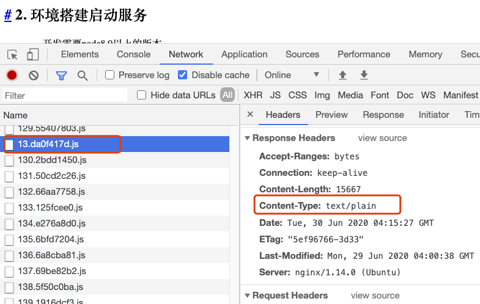

[TOC]


## 1. 安装

通过命令 apt-get install 安装软件，通过安装 nginx 示例如下：

```bash
$ apt-get install nginx
```

如果安装时遇到下面错误：

```bash
E: Unable to locate package nginx
```

执行`sudo apt-get update`命令更新软件源后再安装即可。

软件安装完成后，通过通过 *dpkg -L* 列出软件包所在的目录，及该软件包中的所有文件：

```bash
$ dpkg -L nginx
/.
/usr
/usr/share
/usr/share/doc
/usr/share/doc/nginx
/usr/share/doc/nginx/copyright
/usr/share/doc/nginx/changelog.Debian.gz

$ whereis nginx
nginx: /usr/sbin/nginx /etc/nginx /usr/share/nginx
```

### 1.1 启动Nginx

sudo systemctl start nginx

### 1.2 开机自动启动nginx 服务

sudo systemctl enable nginx

### 1.3 关闭开机自动启动nginx 服务

sudo systemctl disable nginx

### 1.4 重启Nginx服务

nginx -s reload

或者：

sudo systemctl restart nginx

### 1.5 查看Nginx服务

ps -ef|grep nginx

### 1.6 查看nginx配置是否正确

nginx -t

## 2. 配置

配置目录：/etc/nginx/nginx.conf

终端打开配置文件：

```bash
vi /etc/nginx/nginx.conf
```


```bash
user www-data;
worker_processes auto;
pid /run/nginx.pid;

events {
	worker_connections 768;
	# multi_accept on;
}

http {
	# include /etc/nginx/mime.types; # 有的需要这个配置返回正确文件类型
	# default_type application/octet-stream;
	server {
		listen		80;	#port
		server_name	47.104.24.148 www.dragon.com dragon.com;
		location / {
			root	/website/dist;
			index	index.html index.htm;
		}
	}
}
```

配置主要是在http里面的 server，其中参数：

- listen：监听的端口
- server_name：监听的服务名字，以空格间隔
- location：访问服务的路径

保存后终端域名命令`nginx -s reload`重启Nginx来生效命令

## 3. 常见问题

## 3.1 阿里云配置nginx后不能访问，需要开通端口

以前在阿里云配置好nginx后，就可以直接访问网站，现在阿里云虚拟机多了一个安全组，默认所有端口都被禁止了，需要去安全组中配置打开网站的80端口才能访问网站。

https://help.aliyun.com/document_detail/25471.html?spm=5176.11065259.1996646101.searchclickresult.5bc177d5lWlHLD


### 3.1 部署到阿里云的不能正确解析mime.type

在阿里云服务器虚拟机上配置nginx后，网站的JS、CSS不能正确处理，经过查看，返回的JS、CSS资源类型错误：



导致网站显示不正确。经过查找资料，需要配置nginx的mime.types参数：

```bash
http {
	include /etc/nginx/mime.types;
	default_type application/octet-stream;
	server {
	    listen		80; # 监听端口
	    server_name		101.200.230.90 www.yulilong.cn yulilong.cn;
	    location / {
	        root	/website/front-end-doc;
		index	index.html;
	    }
	}
}
```

一般在nginx文件加下会有`mime.types`文件，直接引用这个文件即可。

配置好后，重启nginx服务：`nginx -s reload`.

注意，浏览器会有缓存，清除缓存后，即可查看效果。

关于`mime.types`介绍：

https://developer.mozilla.org/zh-CN/docs/Web/HTTP/Basics_of_HTTP/MIME_types/Common_types

两种主要的 MIME 类型在默认类型中扮演了重要的角色：

-   `text/plain` 表示文本文件的默认值。一个文本文件应当是人类可读的，并且不包含二进制数据。
-   `application/octet-stream` 表示所有其他情况的默认值。一种未知的文件类型应当使用此类型。浏览器在处理这些文件时会特别小心, 试图防止、避免用户的危险行为.

