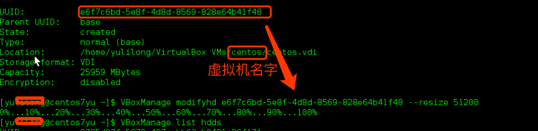

[TOC]

## 1. virtualBox语言设置

virtualbox -> file -> perferences -> language ->选择对应的语言 -> OK     
virtualbox -> 管理 -> 全局设定 -> 语言 -> 选择相应的语言 -> OK     


## 2. 设置终端启动快捷键

http://www.centoscn.com/CentOS/config/2015/0330/5044.html
```
1. 首先打开Applications,选择System Tools
2. 选择Setting进入下面界面
3. 选择Keyboard，进入下面界面，点击Shortcuts
4. 再点击+号，弹出对话框
5. 
Name：        Run a Terminal
Command:  /usr/bin/gnome-terminal (Terminal 程序的路径）
点击apply
6. 一开始是禁用（disabled）的,点击disabled出现下面情形,此时按下你喜欢的快捷键比如Ctrl+Alt+T,
```
在virtualbox虚拟机中，如果鼠标指针出不来， 按键盘上右边的 alt+ctrl。

## 3. 添加virtualbox 增强工具

http://www.tuicool.com/articles/VRbq2em
```
$ sudo yum update
$ sudo yum install gcc kernel-devel kernel-headers dkms make bzip2 
$ reboot
1.点击虚拟机左上角的 Devices ,选择：insert guest addition CD image
2.进入到虚拟机中运行这个镜像自动安装。
```

## 4. 设置共享文件夹

http://www.cnblogs.com/zqifa/p/linux-virtualbox-1.html
http://www.cnblogs.com/jenry/archive/2013/09/06/3305062.html
```
1.在VirtualBox的菜单点击"设备(Devices)" -> 分配数据空间(Shared Folders)菜单，添加一个共享文件夹，选项固定和临时是指该文件夹是否是持久的。尽量使用英文名称。我这里用winshare.
2. 重新进入虚拟CentOs5.5，在命令行终端下输入：
#sudo mkdir /mnt/share
#sudo mount -t vboxsf winshare /mnt/share
如果提示 /sbin/mount.vboxsf: mounting failed with the error: No such device
可能是没有载入内核模块 vboxfs ，先查看下：
#lsmod | grep vboxsf
如果没有结果返回，说明 vboxsf没有载入，执行
#sudo modprobe vboxsf
正常的话mount -t vboxsf winshare /mnt/share共享文件夹应该可以访问了
#cd /mnt/share
#ls -al
假如您不想每一次都手动挂载，可以在/etc/fstab中添加一项
share /mnt/share vboxsf rw,gid=100,uid=1000,auto 0 0
这样就能够自动挂载了。
```

* **ssh,IP地址可以访问虚拟机设置**

1.VirtualBox Version 5.1.8      
2.virtualbox -> file -> perferences -> network -> Host-only Network -> add new host only network   


http://blog.csdn.net/astrotycoon/article/details/8143146     

http://blog.csdn.net/ixidof/article/details/12685549     

* **虚拟机磁盘扩容**   

http://blog.csdn.net/ganshuyu/article/details/17954733     
```
$ VBoxManage list hdds 
# 在列出的信息中找到需要的虚拟机，复制UUID
$ VBoxManage modifyhd a0f06f66-f696-41dc-827a-e79bee50f65b   --resize 51200
# 操作成功后该虚拟的硬盘即增加了50G，但要注意了，此50G空间还没有分配.


```

