**目录**

[TOC]

------------
## 1. Homebrew

Mac下包管理工具，官方称之为 The missing package manager for OS X 。   

官网：https://brew.sh/index.html

安装步骤：先打开 Terminal 应用，输入： 

```bash
~ /usr/bin/ruby -e "$(curl -fsSL https://raw.githubusercontent.com/Homebrew/install/master/install)"
```

有了 brew 以后，要下载工具，比如 MySQL、Gradle、Maven、Node.js 等工具，就不需要去网上下载了，只要一行命令就能搞定：

```bash
~ brew install name
```

PS：安装 brew 的时候会自动下载和安装 Apple 的 Command Line Tools。      

卸载Homebrew：

```  bash
~ ruby -e "$(curl -fsSL https://raw.githubusercontent.com/Homebrew/install/master/uninstall)"     
```
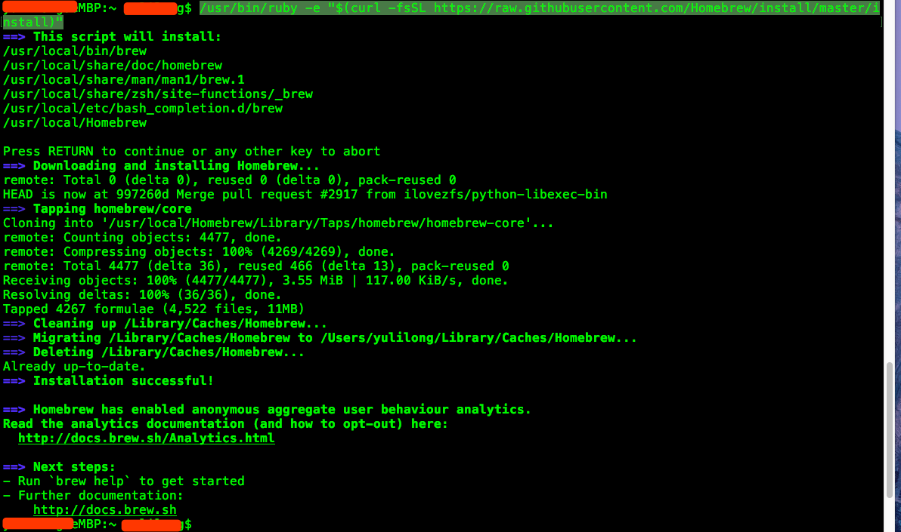

安装后，命令中使用`brew -v`命令出现版本号说明安装成功：

```bash
~ brew -v

Homebrew 3.0.10
Homebrew/homebrew-core (git revision f2f80f72d5; last commit 2021-04-04)
Homebrew/homebrew-cask (git revision 9169a5fc30; last commit 2021-04-04)
```

注意：

Homebrew 3.0.10 版本 已经不需要再安装 Cask了，可以直接安装软件了。

## 2. Homebrew Cask

***注意***：Homebrew 3.0.10 版本 已经不需要再安装 Cask了，可以直接安装软件了。


`brew cask` 允许你使用命令行安装 OS X 应用。比如你可以这样安装 Chrome： `brew cask install google-chrome` 。还有 Evernote、Skype、Sublime Text、VirtualBox 等都可以用 `brew cask` 安装。      
`brew-cask` 是社区驱动的，如果你发现 `brew cask` 上的应用不是最新版本，或者缺少你某个应用，你可以自己提交 pull request。  
应用也可以通过 App Store 安装，而且有些应用只能通过 App Store 安装，比如 Xcode 等一些 Apple 的应用。App Store 没有对应的命令行工具，还需要 Apple ID。倒是更新起来很方便。     
几乎所有常用的应用都可以通过 `brew cask` 安装，而且是从应用的官网上下载，所以你要安装新的应用时，建议用 `brew cask` 安装。如果你不知道应用在 `brew cask` 中的 ID，可以先用 `brew cask search` 命令搜索。    

```bash
# 安装cask
~ brew install caskroom/cask/brew-cask    
# 如果上面命令失败了，则用下面的命令安装：http://www.cnblogs.com/dayou123123/p/6867936.html
~ brew install brew-cask-completion
# 搜索软件
~ brew cask search chrome
# 安装软件
~ brew cask install chrome   
# 卸载软件
~ brew cask uninstall chrome
```
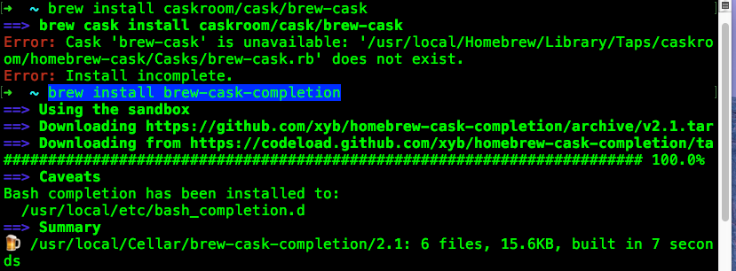

 

### 2.1 安装cask提示：Error: Unknown command: cask

homebrew 从 2.5.11 后，cask 就取消了，可以直接通过brew安装了：

```bash
~ brew search iterm2
==> Casks
iterm2 ✔                                     homebrew/cask-versions/iterm2-legacy
homebrew/cask-versions/iterm2-beta           homebrew/cask-versions/iterm2-nightly

~ brew install iterm2
```


## 3. 替换系统默认Shell — Oh My ZSH!    

Bash作为大多数系统默认安装的Shell，大家都多少有所接触，Zsh和Bash类似都是一个Shell，但是Zsh更注重用户体验和与人的交互，OS X默认也安装好了Zsh，然而你想自己从头开始配置一个顺手的Zsh是比较浪费时间的，有人已经帮我们配置好了，这个流行的Zsh配置叫—Oh My ZSH!，直观的效果如下图所示，代码开源在[github](https://github.com/robbyrussell/oh-my-zsh)。  
```bash
# Mac OS X默认已经安装好了Zsh，你可以打开终端，输入zsh --version来确认
~ zsh --version    
# 切换默认Shell为Zsh, 成功后需要重启终端
~ chsh -s /bin/zsh
# 切换Zsh为Shell， 成功后需要重启终端
~ chsh -s /bin/bash  
# 查看zsh配置的环境变量：
~ cat ~/.zshrc
# 此时还没有酷炫的效果，需要安装插件
# 安装Oh My ZSH!
~ sh -c "$(curl -fsSL https://raw.github.com/robbyrussell/oh-my-zsh/master/tools/install.sh)"
# 卸载Oh My ZSH，注意：卸载后，.zshrc文件还在
~ uninstall_oh_my_zsh
```
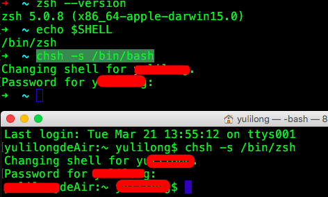

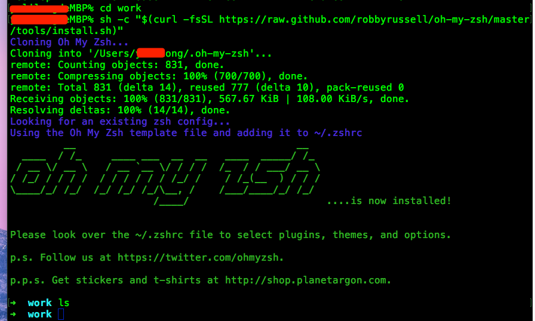

   

https://www.jianshu.com/p/d194d29e488c

遇到的问题解决：

在安装好后，打开终端出现

```bash
执行.sh脚本，异常/bin/sh^M: bad interpreter: No such file or directory
```

注意，提示中出现了`^m`符号，这是不同系统编码格式引起的，^M在Linux/Unix中是非常常见的，也就是我们在Win中见过的\r回车符号，可使用vim编辑器打开脚本文件，在命令行模式下，输入下面命令来删除^M:

```bash
:%s/\r//g
:wq
```

这句命令的意思是：％指匹配整个文件，s是指置换的意思，\r代表^M（或者可以使用Ctrl+V Ctrl +M来输入^M，即也可以使用命令:/s^M$//g来达到同样的目的），M后面的$代表匹配行尾的内容，最后的g表示每行中匹配的内容都要进行替换

Unix系统里，每行结尾只有**“<换行>”，即"\n"**；Windows系统里面，每行结尾是“**<回车><换行>”，即“\r\n”**；Mac系统里，每行结尾是**“<回车>”，即"\r"**；。一个直接后果是，Unix/Mac系统下的文件在Windows里打开的话，所有文字会变成一行；而Windows里的文件在Unix/Mac下打开的话，在每行的结尾可能会多出一个^M符号。

## 4. 窗口管理软件 – SizeUp  

SizeUp快速移动软件窗口在屏幕之间，可以在一个屏幕中上下左右移动，也可以在2个显示器之间移动，该软件可以永久免费试用。    

sizeup网站介绍： http://www.irradiatedsoftware.com/sizeup/

SizeUp需要你的授权才能控制窗口， 打开‘系统与偏好设置’ -> ‘安全与隐私’ -> '隐私' -> '辅助功能'，把sizeup前面打上对号。

```bash
# 使用brew cask安装
~ brew cask install sizeup
```
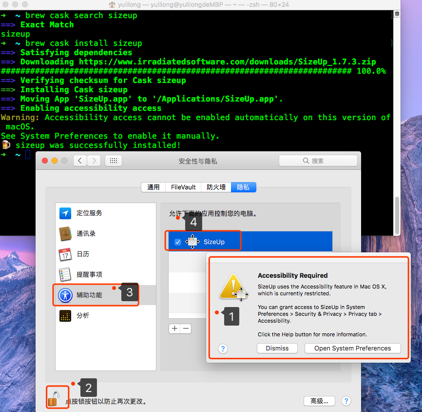


## 5. 快速切换和打开应用程序 — Manico 

MacBook系统默认设置了一个快捷键来显示当前运行中的应用程序，同时按下tab + command.     
Manico 是一个为 OS X 设计的快速的 App 启动和切换工具。

manico网站：https://manico.im/

```bash
# 使用brew cask安装,也可以去网站上下载后安装
~ brew cask install manico
```

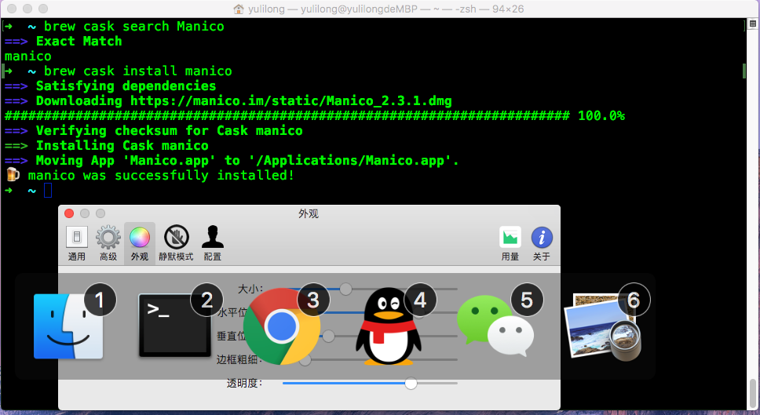


## 6. FileZilla

这个软件可以连接远程电脑并且可以上传下载文件，并且在线编辑文件。这个软件在Windows，Linux，Mac OS 都有客户端，下载地址：    
https://filezilla-project.org/download.php?type=client     

##  7. keyCue     

安装后，只要按住cmd键，就可以显示当前所有可用快捷键，放开后恢复，非常方便。效率生活必备。     
http://www.yxdown.com/soft/247108.html      
注册码： KC-FMO-032015-S-426-631227-819538-50    

## 8. CheatSheet   
CheatSheet 能够显示当前程序的快捷键列表，默认的快捷键是长按 ⌘ 。     
安装：    

```bash
~ brew cask install cheatsheet  
```

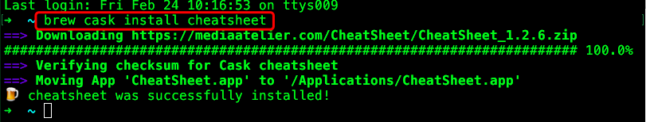

​     

## 9. IINA视频播放器

https://lhc70000.github.io/iina/     
https://github.com/lhc70000/iina    
终端： brew cask install iina    

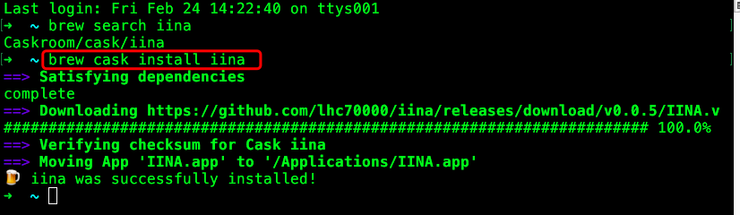

​       

## 10. Office 2016 for Mac

http://bbs.feng.com/read-htm-tid-10868252.html      
安装完后不要打开office软件，打开破解补丁.dmg，里面有把蓝色的钥匙，双击，出现一把黑色的锁，点击，输入系统密码，OK~搞定Office 2016 for Mac破解版（含破解补丁）     
百度盘下载链接: https://pan.baidu.com/s/1c1HIrks 密码: r9kh    
http://jingyan.baidu.com/article/ce09321b7478072bff858f03.html          
pc6下载：http://www.pc6.com/mac/137931.html

##  11. install gadmin3

```bash
# 终端，已经安装了brew ，cask
~ brew search pgadmin3
Caskroom/versions/pgadmin3
~ brew install Caskroom/versions/pgadmin3
```


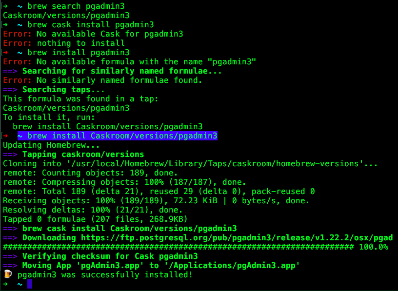          

## 12. caffeine 防止mac电脑休眠软件    
```bash
#终端，已经安装了brew ，cask
~ brew search caffeine
Caskroom/cask/caffeine
~ brew cask install caffeine     
# 还可以网站下载后安装：http://lightheadsw.com/caffeine/
```
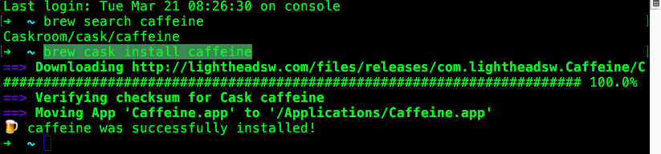      

## 13. 好用的截屏工具-Snip     

使用过QQ的朋友肯定用过上面的自带截图功能,非常好用, 支持添加圈,点,箭头甚至文字, 只要打开QQ, 任何时候都可以通过Ctrl+Command+a来截图, 但是本人平时不太常使用QQ, 截屏功能又非常常用，怎么办呢? 腾讯很贴心地把QQ里的截图功能完整地拆了出来, 成了一个新的App–Snip.      

```bash
~ brew search snip
esniper
Caskroom/cask/snip                       Caskroom/cask/snippets
Caskroom/cask/snippet-edit
~ brew cask install snip
```


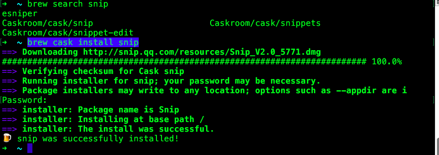        

## 14. go2shell  快速进入Shell

go2shell是一个对开发者来说非常有用的app, 使用它可以在Finder里快速进入shell环境. 

1. 在 App Store中搜索go2shell，点击安装
2. 安装go2shell后，打开finder的application文件夹，找到go2shell      
3. 按住command，用鼠标将go2shell拖到finder的toolbar上    
4. 在打开的terminal中，输入： `open -a Go2Shell --args config`命令来修改go2shell的配置     
安装好以后, 打开Finder, 点击Finder上的图标即可进入terminal:      
```bash
~ brew search go2shell
Caskroom/cask/go2shell
# 安装
~ brew cask install go2shell
# 配置文件
~ open -a Go2Shell --args config
# 卸载，仅适用于用cask命令安装的
~ brew cask uninstall go2shell
```
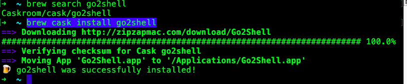   

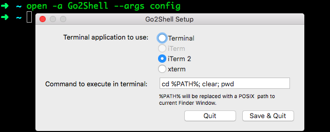 


## 15. 增强资源管理器 — XtraFinder     

MacBook自带的资源管理器(Finder)已经可以满足一般的需要，但是当你有大量文件维护操作后，你就需要一个更强大的Finder。XtraFinder完全集成到Finder里面，你根本感觉不出它是一个第三方的应用程序，同时还提供很多增强特性，比如：

像浏览器那样的标签页(Tab)     
支持双操作面板(Panel)       
增强的全局快捷键，例如新建文件(New File)等        
多彩的侧边栏图标        
快速在当前文件夹打开终端        
快速在当前文件夹新建文件          
```bash
~ brew search XtraFinder
Caskroom/cask/xtrafinder
~ brew cask install xtrafinder
~ brew cask uninstall xtrafinder
```


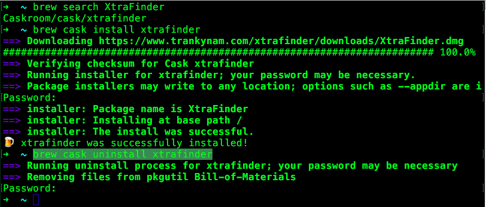      

## 16. 替换系统默认终端 — iTerm 2

如果你经常使用终端，那么推荐你使用iTerm 2来替代系统自带的终端。关于iTerm 2的特性，请[**看这里**](https://www.iterm2.com/features.html)。      
iterm2的介绍：    
http://www.cnblogs.com/theswiftworld/p/4679010.html      
https://www.iterm2.com/features.html       

设置 F12 启动iterm2：   

1.打开System Preferences，选择Keyboard，切换到Shortcuts这个Tab下，点击Mission Control，取消对应F12的快捷键。     
2.打开iTerm的Preferences...， 在ProfilesTab里面，点击下面的[+]添加一个新的profile，为什么要新建一个profile？答案是为了定制将来弹出的终端样式和大小等等参数。新的profile假设命名为guake，(注：guake这个名称是为了向Linux下的Guake终端致敬)，你可以自己任意起个名称，下面会用到。      
3.再切换到WindowTab下，将Style，Screen和Space这3个值设置一下。     
4.再切换到KeysTab下，设置如下图所示的HotkeyF12。     
5.现在你按下F12，就立即得到一个占满全屏的黑色命令行终端，再按一下F12隐藏终端，非常的方便。        
6.iterm2终端透明度设置 profile -> 点中profile名字 -> window -> transparency   

```bash
~ brew cask search iterm2
# 安装 iterm2
~ brew cask install iterm2
```

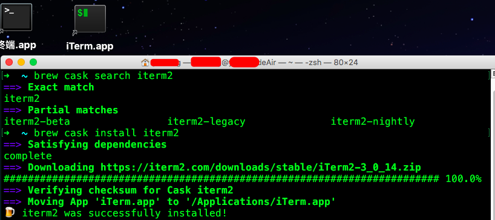

​       

## 17. 有道词典Mac版本

官网下载：http://cidian.youdao.com/index-mac.html        
取词方便，打开后，可使用快捷键唤起界面进行查词(alt + cmd + X)      

## mac 右上角菜单栏时间显示点击出现日历    

https://shauninman.com/archive/2016/10/20/day_o_2_mac_menu_bar_clock      

## 18. Bandwidth+ Mac上免费流量监测软件     

款可以实时查看网络流量的小软件，支持对 Mac 连接的无线 Wi-Fi 以及移动热点上下行流量进行实时监控记载，而且还能对网络流量进行定额记录，就在 Menubar 下可以看到流量的消耗，并且能够以天为单位将每个网络流量记录导出称 csv 文件。     

在 `App Store`  中搜索 `Bandwidth+`, 点击安装。      

## 19. MagicanLite 流量监控，CPU,内存使用 温度监控    

http://www.magicansoft.com.cn/       
这款软件免费，可以监控流量， cup的使用率温度，GPU温度， 内存的使用率等。      

在 `App Store`  中搜索 `MagicanLite`, 点击安装。     

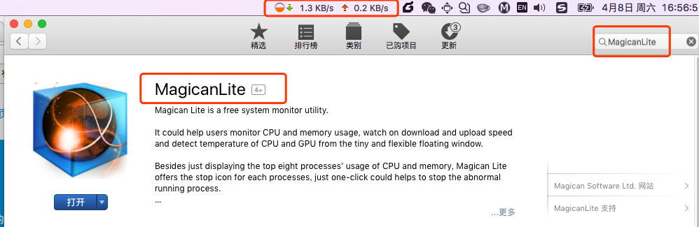


## 20. CHM View  .chm格式文件阅读器    

免费的.chm文件阅读器。  

在 `App Store`  中搜索 `CHM View`, 点击安装。    

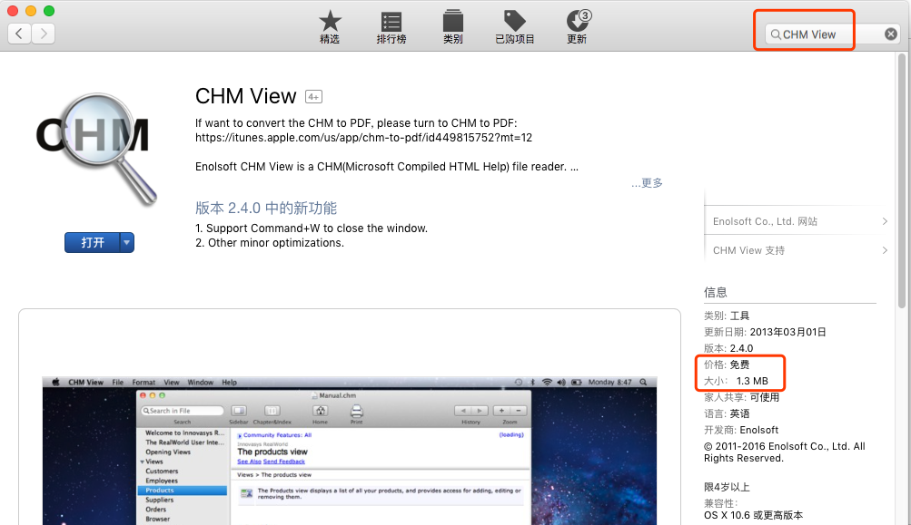      

## 21. Foxmail 邮件客户端   

http://www.foxmail.com/mac/        

## 22. lantern 蓝灯翻墙软件     
https://github.com/getlantern/forum        
https://www.getlantern.org/    
点击下载安装就好， 每月免费500MB流量。     

## 23. paintbrush 类似Windows画图板的软件    

http://mac.brothersoft.com/paintbrush-download.html     
http://mac.brothersoft.com/paintbrush.html      
Paintbrush的按钮布局和功能与PC电脑Windows自带的画图都很接近，基本不用介绍了。注意那个地雷按钮！他的作用是清除整个画面---没错，炸成白板---我已经中招了（囧），还好后悔操作的快捷键和系统默认的“后退”键一样：“CMD+Z”。安装后，右键的打开方式菜单里会有用paintbrush打开这一项。   

### Paintbrush  version:2.1.1 类似于Windows下面的画板

Paintbrush-2.1.1
http://mac.brothersoft.com/paintbrush-download.html
链接: https://pan.baidu.com/s/1miObeac 密码: qikg

## 24. fHash 计算 MD5、SHA1文件校验软件

https://itunes.apple.com/cn/app/fhash/id1055555711?l=en&mt=12     
app Store 软件中搜索`fHash` 安装即可。    


## 25. Kill Mouse Accel 关闭mac下鼠标加速

用于罗技等无线鼠标卡顿解决的小插件。
移的越快，鼠标移动距离就越大，这就是鼠标加速度。  
http://bbs.feng.com/read-htm-tid-445826.html        

## 26. MagicPrefs 苹果鼠标的多手势辅助软件  

下载地址： http://magicprefs.com/    

***注意：这个软件会是系统的快速移动鼠标以定位鼠标位置***         


## 27. Hostbuddy修改host地址的软件

[官网地址](https://clickontyler.com/hostbuddy/)

Hostbuddy 是Mac里最简单的方法来管理和更新的 /etc/hosts 文件。添加新条目，打开和关闭现有的通过一次单击。这是完美的临时和生产服务器间进行切换，或只是为了测试你的新网站在上线之前。

快速而无需使用命令行添加主机条目
打开/关闭主机组通过一次单击
不会覆盖现有的 /etc/hosts 文件
与 VirtualHostX 兼容
自动刷新 DNS 缓存


## 28. FOLX 5Downloader for Mac

https://mac.eltima.com/download-manager.html

mac 下下载工具，有免费版。

## 29. Charles 抓包工具 

[Charles](http://www.charlesproxy.com/) 是在 Mac 下常用的网络封包截取工具，在做 [移动开发](http://lib.csdn.net/base/wechat)时，我们为了调试与服务器端的网络通讯协议，常常需要截取网络封包来分析。

Charles 通过将自己设置成系统的网络访问代理服务器，使得所有的网络访问请求都通过它来完成，从而实现了网络封包的截取和分析。

除了在做[移动开发](http://lib.csdn.net/base/android)中调试端口外，Charles 也可以用于分析第三方应用的通讯协议。配合 Charles 的 SSL 功能，Charles 还可以分析 Https 协议。

 使用注意事项：

1. 如果没有抓取到数据，尝试关闭代理或浏览器的代理。

2. 选择菜单中的 “Proxy” –> “Mac OS X Proxy” 来将 Charles 设置成系统代理

3. “Proxy” –> “Proxy Settings” -> "macOS" 要把 里面选项都勾选上

   Enable macOS proxy

   ​	Use HTTP proxy

   Enable macOS proxy on launch

   如果不勾选上面选项，则不能抓取到包


使用教程： https://www.cnblogs.com/mawenqiangios/p/8270238.html


## 30. duet 扩展屏软件

https://www.duetdisplay.com/

**Duet Display** 就可以把 iPad 或 iPhone 变成你电脑的第二台显示器！相对于通过「网络[远程](https://www.iplaysoft.com/tag/%E8%BF%9C%E7%A8%8B)控制」实现屏幕扩展的同类 APP，Duet 通过 [USB](https://www.iplaysoft.com/tag/usb) 数据线传输画面，无论清晰度、稳定性还是流畅度都完胜。即使开启 Retina 视网膜分辨率，仍能保持 60 FPS 低延迟不卡顿，实际体验相当好     

**DuetDisplay** 电脑端支持 [macOS](https://www.iplaysoft.com/macos-sierra.html) 和 Windows，也就是说，无论是 PC 台式机、笔记本还是 [Macbook](https://www.iplaysoft.com/go/mac)、iMac 等设备通通都能用它来扩展[桌面](https://www.iplaysoft.com/tag/%E6%A1%8C%E9%9D%A2)！而且不仅仅是显示内容，Duet 还可以让这块 “扩展屏幕” 增加「触摸和手势操作」、支持 [Apple Pencil](https://www.iplaysoft.com/go/applepencil) 数字笔、以及增加 TouchBar 等特性的支持。

## 31. sublime text 3

http://www.sublimetext.com/     
官网下载后直接安装      

## 32. expect 可以与终端交互的脚本语言

```bash
~ brew search expect
~ brew install expect
```

## 33. 文件恢复软件TestDisk

http://www.cgsecurity.org/wiki/下载_TestDisk    
下载 Mac OS X Intel  的版本。       

1. 解压软件       
2. 终端进入软件目录， 运行`./photorec`    
3. 进入界面后上下键 选择 磁盘， 左右键选择下方的 `search` 按钮进行搜索     
4. 选择磁盘系统的类型       
5. 选择恢复文件存储的目录。 
6.   按C键开始恢复。

## 34. Mac下 罗技G602无线鼠标驱动下载

http://support.logitech.com.cn/zh_cn/product/g602-wireless-gaming-mouse#imagegallery     

http://support.logitech.com.cn/zh_cn/product/g602-wireless-gaming-mouse/downloads

## 35. 解压工具

### 7z : `brew install p7zip`

```bash
~ brew search 7z   
~ brew install p7zip   
Downloading https://homebrew.bintray.com/bottles/p7zip-16.02.high_sierra.bot
######################################################################## 100.0%
==> Pouring p7zip-16.02.high_sierra.bottle.tar.gz
🍺  /usr/local/Cellar/p7zip/16.02: 103 files, 4.7MB

# 解压命令 解压 演讲稿.7z 
7z e 演讲稿.7z 
```

## 36. typora: Markdown编辑器

https://www.typora.io/     
这个 Mac、Windows 都有，可以显示编辑软件，下载相应版本后安装就可以了。  

这个编辑器的好处是可以显示 `[TOC]`目录结构在左边，方便预览查看。     
详细介绍： https://www.jianshu.com/p/5256ecc06eec       


注意下载安装更新科学上网速度快，否则下载速度很慢。

## 37. PS6 安装

软件下载： 
https://pan.baidu.com/s/1boZWCzH       
https://pan.baidu.com/s/1boZWCzH     

* 安装     

1. 断开网络。     
2. 双击安装程序，选择试用(try)，然后点击安装。    
3. 在应用程序文件夹里面找到PS6，右键显示包内容(show package content), 然后找到contents/framework文件夹，把amtlib.framework文件拷贝到里面，OK。

参考链接： https://www.jianshu.com/p/097353202b66      


## 38. gif截图工具：Gifox

下载地址：https://gifox.io/， 也可以在 App Store中搜索`Gifox`来下载。

该软件是收费的，不过有免费版的，经过使用，发现免费版最多录制10秒，不知道是不是由于是免费的原因。

还可以使用QQ的截图，里面有录屏然后转成gif就可以。

## 39. Mac 下载软件

https://www.zhihu.com/question/19552868

下载工具：

FOLX 5：https://mac.eltima.com/download-manager.html

## 40. Itsycal: 工具栏上显示日历

Mac 的工具栏上的时间，真的只是时间，如果想看日历，只能打开日历应用，很不方便。

Itsycal 可以将日历放到工具栏上，并且支持展示日历时间。

当然也以通过 Itsycal 快速的添加你的日程，而不需要再打开你的日历。

下载地址：https://www.mowglii.com/itsycal/

下载后， 解压，把软件拖到Applications文件夹中

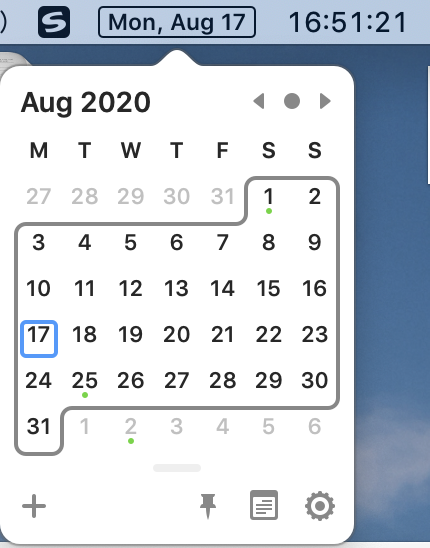

## 41 工具栏流量监视工具

https://github.com/yujitach/MenuMeters


## 42 在Mac下启动Tomcat

1.  将加压好的 Tomcat 安装包放在某个路径下，重命名为 Tomcat 。
2.  终端 进到 Tomcat 的 bin 目录下
3.  输入 `sudo chmod 755 *.sh` 设置权限
4.  输入 `sudo sh startup.sh` 启动 Tomcat。在浏览器中输入` localhost:8080` 看到 Tomcat 主页即为成功。
5.  输入 `sudo sh shutdown.sh` 关闭 Tomcat。

参考资料：https://blog.csdn.net/u011886447/article/details/69361711

## 43 在文件夹里面鼠标右键新建文件

mac系统自身不支持在文件夹中鼠标右键创建文件，需要安装第三方插件：

1、[**New File Menu Free**](https://apps.apple.com/cn/app/new-file-menu-free/id1066302071?l=en&mt=12)：在 App Store 上搜索，这个是免费版的，只能创建txt文件

2、[GMRightMouse](https://apps.apple.com/cn/app/gmrightmouse/id1551462255?l=en&mt=12)：在 App Store 上搜索。