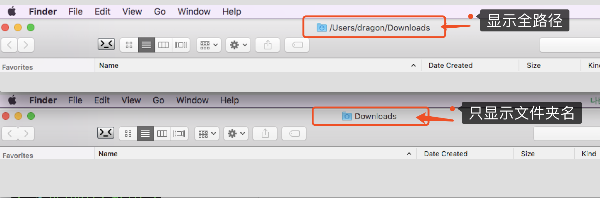

[TOC]

# Mac系统操作习惯设置

OS X EI Capitan Version 10.11.6 (15G31)   

## 0. 关于操作系统升级

注意： intel的机器无论是2020还是2019还是再往前 请停留在Catalina。

升级系统版本的时候，需要使用时间机器老保存一下当前系统，如果新系统有问题，可以用时间机器来恢复旧版本。

macOS 每一代系统的“变化”程度不一样。即使是同一个版本的 macOS 系统，在不同年代、不同型号的 Mac 上，运行表现也会有差异。甚至同一型号的 Mac，因为不同的硬件配置也可能会导致升级后体验有差异。

如果你的 Mac 是 M1 系列芯片，可以放心升级到当前最新的 macOS Monterey 版本。

如果是 Intel 处理器的 Mac，就要看情况了。

我在网上看到不少 2019 款 MacBook Pro，升级了 Monterey 后甚至感觉比 Big Sur 更流畅一些，续航也略有提升。但是也有不少很老的 Mac，升级后既卡顿，电池又变得不耐用。

我今天还特地把家里那台 2016 年 13 英寸低配的 MacBook Pro 从 Catalina 升级到最新的 Monterey 12.2.1。操作了一会发现居然运行起来还挺流畅，甚至比之前用 Catalina 还更顺畅一些。这让我感觉还挺意外的。记得去年我有一次把这台 Mac 升级到刚发布的 Big Sur，就卡得不行，后来又降回 Catalina。

**小版本推荐升级，大版本谨慎升级**：小版本更新一般都是针对当前系统版本的优化和问题、漏洞修复。**比如今天早上的 12.2.1 小更新就解决了一个导致连接到 Mac 的蓝牙设备消耗过多电池的错误，Monterey 用户还没更新的赶快去。**所以一般都**推荐及时更新小版本**。比如从 12.2.0 更新到 12.2.1。

大的系统升级，比如从 Big Sur 升级到 Monterey，或者从 Mojave 升级到 Catalina，就需要谨慎。如果你又想尝试新系统带来的新功能，又不想冒险。要么在**升级前用外置存储做一次彻底的时间机器备份**。要么等系统版本经过几次小更新比较稳定后再考虑升级，比如你想体验 Monterey，可以等更新到 Monterey 12.2.x 以上的时候再考虑升级。

### 0.1 **我想升级到某个旧版本怎么办？**

用 Safari 浏览器打开以下旧版系统对应链接，然后会自动在 App Store 中打开旧版安装器。下载安装器后，安装器会自动打开。

macOS Ventura(13.6.1)：https://apps.apple.com/cn/app/macos-ventura/id1638787999?mt=12

macos monterey (12.7.1)：https://apps.apple.com/cn/app/macos-monterey/id1576738294?mt=12

下载安装 macOS Big Sur：https://apps.apple.com/cn/app/macos-big-sur/id1526878132?mt=12

下载安装 macOS Catalina：https://apps.apple.com/cn/app/macos-catalina/id1466841314?mt=12

下载安装 macOS Mojave：https://apps.apple.com/cn/app/macos-mojave/id1398502828?mt=12

下载安装 macOS High Sierra：https://apps.apple.com/cn/app/macos-high-sierra/id1246284741?mt=12

**Mac 可以降到的最低系统版本是新机出厂预装的那个版本。**比如我的 iMac M1 购买时预装版本是 Big Sur，现在用的是最新的 Monterey。如果我想降级，也只能降到 Big Sur 的版本，更老的版本是无法安装的。

## 0.2 **升级完后悔了怎么办？**

macOS 系统降级永远比升级麻烦得多，通常需要抹盘重装。所以大版本升级建议一定做好重要数据的备份。最好做「时间机器」备份。


## 1. finder与文件相关操作

### 1.1 finder 进入特定目录

finder左上角的菜单中
finder -> 前往(go) -> 前往文件夹(go to folder)，输入路径即可：     

   

### 1.2 finder中标题栏显示全路径

打开终端输入如下命令：  

```bash
# finder中标题栏显示全路径
~ defaults write com.apple.finder _FXShowPosixPathInTitle -bool TRUE;killall Finder
# finder中标题栏只显示文件夹名字
~ defaults delete com.apple.finder _FXShowPosixPathInTitle;killall Finder
```



### 1.3 .DS_Store文件(禁止自动生成、删除、取消禁止生成)

.DS_Store是Mac OS保存文件夹的自定义属性的隐藏文件，如文件的图标位置或背景色，相当于Windows的desktop.ini。     

- 3.1. 禁止 .DS_Store 生成

打开 “终端” ，复制黏贴下面的命令，回车执行，重启Mac即可生效。    

```bash
defaults write com.apple.desktopservices DSDontWriteNetworkStores -bool TRUE
```

- 3.2. 恢复 .DS_Store 生成

终端输入下面命令： 

```bash
defaults delete com.apple.desktopservices DSDontWriteNetworkStores
```

- 3.3. 删除所有的 .DS_Store 文件

在terminal中输入以下代码，可以删除所有.DS_Store文件      

```bash
sudo find / -name ".DS_Store" -depth -exec rm {} \;

# 命令在10.14.2系统中，已经失效
sudo find / -name .DS_Store -exec rm {} +
```

- 3.4. 上面命令不管用，安装 App 解决 .DS_Store 污染问题

安装 Asepsis (https://asepsis.binaryage.com/) 可以解决这个问题，不过该 App 目前不开发了。      
ASEPSIS 会把所有的.DS_Store重定向到 /usr/local/.dscage 内。    

### 1.4 把应用程序图标放在finder上

按住 cmd键，鼠标拖动应用即可。   

### 1.5 一次性修改finder文件夹显示选项

由于修改了Mac屏幕的分辨率，在打开finder查看文件的时候发现文件图标和文件名大小不合适了，需要修改。

在当前finder文件夹下，右上角的View -> show view options, 或者直接使用快捷键`cmd + J`来直接打开，在打开的界面中：

> Icon Size: 此选项是设置文件图标的大小，可选择适应的大小
>
> Text Size:此选项是设置文件名字体大小的，选择对应的大小
>
> Use as Defaults: （可能是）如果勾选了此选项则字文件夹及子文件夹内容都会应用此选项

此设置只在当前目录设置有效。如果想要所有目录都生效，则使用如下方式：

1、打开finder，连续使用快捷键`Command + ↑方向箭头上`，直到目录不在动为止，把目录切换到顶级目录(磁盘图标)，不要选择任何文件。

2、按`Command + J`或者点击工具栏的小齿轮，打开“查看显示选项(show view options)”；

3、在显示选项内调整好自己想要的效果，图标大小、文件名字体大小等。

4、打开终端，输入如下命令：

```bash
sudo find / -name .DS_Store -exec rm {} +
```

注意此命令在MacOS 10.14.2系统版本中，已经失效。可试一下如下命令：

```bash
sudo find / -name ".DS_Store" -depth -exec rm {} \;
```

此命令目的是删除所有文件夹下的`.DS_Store`文件，此文件会记录文件夹选项。

5、等待第 4 步完成后，点击屏幕左上角的小苹果图标选择“强制退出(Force Quit)”；

6、在强制退出应用程序窗口中选择“Finder”后点击“重新开启”即可完成。

参考资料：https://bbs.feng.com/mobile-news-read-0-688186.html

### 1.6. 修改Mac文件默认打开方式

参考：https://www.cnblogs.com/junstudys/p/12198092.html

右键->显示简介->打开方式->全部更改

1、在需要操作的文件上右键，选择`Get Info(显示简介)`


2、在出现的弹窗中，找到`Open with(打开方式)`选项，选择需要设置默认的程序，然后点击`Change All(全部更改)`，然后就修改成功了。


### 1.7 finder中显示与隐藏文件

1、使用快捷键：`shift + command + .`

2、使用终端命令：

```bash
~ defaults write com.apple.finder AppleShowAllFiles Yes && killall Finder # 显示隐藏文件
~ defaults write com.apple.finder AppleShowAllFiles No && killall Finder # 不显示隐藏文件
```


## 2. Mac系统相关

### 2.1 鼠标、触模板相关

#### 2.1.1 鼠标滚轮跟windos统一

1. 首先打开左上角全局菜单中的“偏好设置”     
2. 然后在偏好设置中找到“鼠标”点击进去     
3. 最后在“鼠标”设置中把“滚动方向：自然”前面的勾去掉就和windows中一样了。   

#### 2.1.2 触摸板设置三指选则文本

系统偏好设置-->辅助功能--->鼠标与触控板--->触控板选项 启用拖移 三指拖移

System Preferences -> Accessibility -> Mouse & Trackpad -> Trackpad Options 

-> 勾选 Enable Dragging -> 选择 three finger drag

***注意：***勾选此选项后，使用三指在触摸板上滑触发的Mission Control 就自动改成使用四指触发

### 2.2 mac关闭开机声音

```bash
# 打开终端
# 关闭声音
$ sudo nvram SystemAudioVolume=%80
# 如果想要恢复正常的开机生硬，只要在终端中再次输入如下命令即可：
$ sudo nvram -d SystemAudioVolume
```

### 2.4 右上角顶级菜单中图标管理

#### 2.4.1. 图标顺序管理

按下Command然后用鼠标拖动图标即可调整顺序。   

#### 2.4.2. 删除无用的图标

搜狗输入法中有一个语音输入，导致在右上角有个 话筒的图标， 可在 搜狗输入法设置里把语音输入取消即可。     

 

### 2.5 隐藏docker中正在运行的应用图标

终端下进入该应用的目录中，使用`sudo vi`命令打开`Info.plist`

```bash
# 进入APP目录
cd /Applications/
# 查看目录下安装的软件
ls
# 假设你的软件名字是 YouAppName
cd YouAppName/Contents
# 编辑配置文件
vim Info.plist
```

进入编辑器之后，找到<dict>的部分节点，插入下面红框内的内容 :   

```bash
<key>LSUIElement</key>
<true/>
```

保存之后，退出相关程序，再次打开，DOCK栏上就没有这个软件的图标了。

    

参考链接:http://blog.csdn.net/fungleo/article/details/52262315         

### 2.6 Dashboard

偏好设置 --> Mission Control --> Dashboard      
不是所有 Mac 上的工作都需要使用大型应用程式，有些简单的工作不妨让 [tiger] 上的新功能 Dashboard 来为您完成。只要按下一个键，半透明的 Dashboard 就会浮现在电脑桌面上，供您快速取用多种有趣又实用的迷你应用程式 widget。需要加减乘除吗？交给“计算机”widget 吧！想知道心爱的人所坐的班机飞到哪了吗？请看看 Flight Tracker widget。办公室没有窗户让您一窥外头的情况吗？打开 Weather widget 就知道现在窗外是什么天气。     
http://jingyan.baidu.com/article/066074d6910570c3c21cb0d9.html       


### 2.9 读写mac格式的移动硬盘（去掉写入权限提示）

右键移动硬盘，最下面的 `共享与权限`，点开，把锁打开，然后把当前的用户添加上就可以写入的时候不用输入管理员密码了。


### 2.10 系统桌面背景图片位置

/Library/Desktop Pictures/    

### 2.11 去掉屏幕右上角的用户名

系统偏好设置－－用户与群组－－左侧菜单栏选择登陆选项－－右侧“将快速用户切换菜单显示为...”左边的勾去掉就行了

system preferences -> user and groups -> login options，有一条show fast user switching menu as，有三个选项可以设置。不想要勾掉就好了     

### 2.12 英文输入时，单词首字母自动大写关闭

System Preferences -> Keyboard -> Text:     Capitalize words automatically(去掉前面的对号即可)

### 2.13 设置外接显示器为主屏幕

1.  选取苹果菜单 >“系统偏好**设置**”，然后点按“显示器”。
2.  点按“排列”标签页。
3.  确保“镜像显示器”复选框处于未选中状态。
4.  排列您的显示器，以便与您办公桌上的布置保持一致。 要更改显示器的位置，请将它拖移到所需位置。 ...
5.  要将另一台显示器**设置**为**主**显示器，请将菜单栏拖移到另一台显示器。


### 2.14 查看已连接的WIFI密码

1、打开`launchpad`找到 Keychain Access(钥匙串访问) 软件,

2、软件左上角点击 System(系统) ，然后找到要查看的WIFI名字，右键，选择Get Info(显示简介)

3、在出现的弹窗中，在attributes(属性) tab中， 勾选上Show password(显示密码)，然后会出现输入操作系统账号、密码。然后就可以看到WiFi密码了。

参考：http://www.xitongcheng.com/jiaocheng/dnrj_article_48495.html

### 2.15 关闭dock中 系统更新提示小红点

取消小红点：

```bash
defaults write com.apple.systempreferences AttentionPrefBundleIDs 0
killall Dock
```

运行`killall Dock`后，dock会重新启动，然后系统更新提示的小红点就消失了。

恢复小红点显示:

```bash
sudo softwareupdate --reset-ignored
```

其他操作：

查看可更新列表：

```bash
sudo softwareupdate -l 

Software Update Tool

Finding available software
Software Update found the following new or updated software:
   * Safari14.0MojaveAuto-10.14.6
	macOS Supplemental Update (10.14.6), 67310K [recommended] [restart]
   * macOS Mojave Security Update 2021-003-10.14.6
	macOS Mojave Security Update 2021-003 (10.14.6), 1733666K [recommended] [restart]
   * Safari14.0.3MojaveAuto-14.0.3
	Safari (14.0.3), 83320K [recommended]
```

忽略某个版本的更新：

```bash
sudo softwareupdate --ignore "XXX"
```

例如：

```bash
sudo softwareupdate --ignore "macOS Catalina"
sudo softwareupdate --ignore "macOS Catalina 10.15.4 Update"
```

### 2.16 调整Mac桌面图标大小

1、桌面空白处右键，选择`Show View Options(查看显示选项)`，或者按快捷键`cmd + J`。

2、出现的弹窗中，在`Icon size(图标大小)`选线下面滑动，选择合适的大小。

### 2.17 软件无法打开：因为它可能损坏或不完整


1、首先查看这个软件，看软件大小，有的软件在更新的时候中断，大小变为0或者就是损坏了。  

2、可以按照2.18的操作尝试，如果还不行那就只能从新下载。

### 2.18 软件打不开：来自身份不明开发者

1、打开系统偏好设置界面，进入安全性与隐私

2、在通用里面，点按左下角的锁头图标，解锁更改权限

3、将允许从以下位置下载的应用，更改为 “ 任何来源 ” ，然后再打开应用即可

**若没有“任何来源”这个选项，按以下步骤执行**：

1、打开终端（Terminal.app）

2、拷贝粘贴**sudo spctl --master-disable**按回车键

3、输入你的账户密码，按回车键确认执行（输入密码不会显示，直接输入确定正确即可）

参考：https://new.qq.com/rain/a/20220427A08O0H00.html

### 2.19 windows系统的TXT文件在mac中打开显示乱码

在Mac下打开“文本编辑”程序之后，选择菜单“文本编辑” -> “偏好设置”。2）在“偏好设置”中选择第二个标签页“打开和存储”，选择“纯文本文件编码”中的“打开文件”和“存储文件”修改成为“中文（GB 18030）”。3）退出“文本编辑”程序，再次打开时，就OK啦！

TextEdit -> Preferences -> Open and Save -> Plain Text File Encoding:

Opening files: Chinese(GB 18030) （默认选项是Automatic）

Saving files: Chinese(GB 18030) （默认选项是Automatic， 这个可以不修改）

如果想恢复，可以点击 Restore All Defaults 按钮来恢复默认选项

### 2.20 将搜狗输入法设置为默认输入法

系统版本：13.6.3 (22G436)

1、打开设置，点击键盘，找到文字输入，输入法中选择编辑

2、点击左下角的`+`加号，然后拉倒最下面，在其他选项里面找到`Unicode十六进制输入`，点击添加，Unicode输入法切换后尝试后和「ABC」是一样的

3、这个时候选择ABC输入法，然后点左下角的`-`减号就能删除了

恢复ABC输入法：

1、点击➕，左侧选择「英语」，右侧你会找到「ABC」，点击添加即可，然后再移除Unicode输入法

## 3. Mac下一些软件配置

### 3.1 app Store相关

#### 3.1.1 关闭自动更新app Store

1. 用户必须先进入“系统偏好设置”，找到Mac app store。
2. 点击进去之后就就能看到Mac App Store的更新设置，这个时候只需要把自动更新设置去掉即可。

#### 3.1.2 删除正在从app store下载的应用程序

1. 打开Launchpad, 点击一下正在下载的程序暂停。
2. Launchpad里面，按住option 这个按键，应用图标左上角就会出现X按钮，点击，会出现问你是否删除，点击删除， 完成

### 3.2 应用程序安装目录

硬盘名称(如macintoch HD) /Applications 硬盘点开就能看到一个叫应用程序的文件夹，直接安装或拖拽过去就可以了，   
http://jingyan.baidu.com/article/363872ecd5b8406e4aa16f5e.html     

### 3.3 创建 APP/文件夹 桌面快捷方式

1、在 Finder 中的应用程序中，找到想要创建快捷图标的应用程序。

2、按住键盘上的 option+command 键。

3、把想要在桌面上创建快捷方式的应用程序拖到桌面，先松鼠标，当看到有一个快捷箭头以后再把 option+command 键松开。

创建 文件夹 桌面快捷方式 跟APP创建快捷方式一样

### 3.4 允许第三方软件运行:开启任何来源选项

Mac在macOS Sierra系统下，系统偏好设置中的“安全与隐私”默认已经去除了允许“任何来源”App的选项，如果不开启会直接影响到无法运行一些第三方应用。

- 查看是否开启

  打开系统偏好设置 -> 点击“安全与隐私” -> 如果没有“任何来源”这个选项就是没有开启。

- 开启任何来源选项

  打开终端, 输入下面命令：

  ```bash
  sudo spctl --master-disable
  ```

  然后输入管理员密码后关闭终端，再次打开系统设置-> 安全与隐私 即可开启。

参考资料：https://jingyan.baidu.com/article/9f63fb9162e3e6c8400f0e30.html


### 3.5 ShadowSocks 自定义代理规则

ShadowSocks 默认使用的是 adblock plus 的引擎，要想自己添加规则最好熟悉一下其规则，下面是ShadowSocks 的 pac 规则。

规则大概描述如下

1. 通配符支持，如 `*.example.com/*` 实际书写时可省略 * 如 `.example.com/` 意即 `*.example.com/*`
2. 正则表达式支持，以\开始和结束， 如 `\[\w]+:\/\/example.com\`
3. 例外规则 @@，如 `@@*.example.com/*` 满足@@后规则的地址不使用代理
4. 匹配地址开始和结尾 |，如 `|http://example.com、example.com|` 分别表示以 `http://example.com` 开始和以 `example.com`结束的地址
5. || 标记，如 `||example.com` 则 `http://example.com` 、`https://example.com` 、`ftp://example.com` 等地址均满足条件，只用于匹配地址开头
6. 注释 ! 如 ! Comment
7. 分隔符^，表示除了字母、数字或者 _ - . % 之外的任何字符。如 `http://example.com^` ，`http://example.com/` 和 `http://example.com:8000/` 均满足条件，而 `http://example.com.ar/` 不满足条件

- 如何使用自定义规则

  点击ShadowSocks  -> proxy Setting -> Edit User Rules For PAC

- 参考资料

  https://adblockplus.org/zh_CN/filters

  [ShadowSocks 自定义规则](http://honglu.me/2015/06/26/ShadowSocks%E8%87%AA%E5%AE%9A%E4%B9%89%E8%A7%84%E5%88%99/)

### 3.6 ssh远程连接mac

mac 默认安装了openssh。    
依次代开系统设置－－共享，把remote login勾上，选择允许的用户，就ok了   
在共享里面可以看见ssh命令，看这个命令就可以了。    

* **终端无法使用小键盘**    

终端：偏好设置-->描述文件-->高级-->（去掉勾选）允许VT100应用程序小键盘模式    

### 3.7 完全删除garageband音乐创作软件

garageband是Mac下的制作音乐的软件，如果不用可以删除，需要的时候在下载。
删除软件后在磁盘管理还能看见这个软件的一些占用的空间，经过在网上查找资料，可用如下方法彻底删除。      

终端下运行如下命令：     

```bash
rm -rf /Library/Application\ Support/GarageBand
rm -rf /Library/Application\ Support/Logic
rm -rf /Library/Audio/Apple\ Loops
```

Macintosh HD/Applications/GarageBand.app (1.16GB)       
Macintosh HD/Library/Application Support/GarageBand (995MB)       
Macintosh HD/Library/Application Support/Logic (880MB)        
Macintosh HD/Library/Audio/Apple Loops (up to 10GB)*xx       

### 3.8 使用Mail绑定outlook邮箱

1. 打开Mail， 左上角菜单中， mail -> add account(邮件 -> 添加账户)
2. 选择 Exchange > 继续
3. 输入Exchange账户的名称、电子邮件地址和密码 > 登陆
4. 选择想要使用此账户Mac应用程序
5. 单击完成

如果邮件程序不能自动设置您的帐户，请稍等几分钟或几小时，然后重复这些步骤。如果重复步骤之后，邮件仍不能自动设置帐户，请参阅本文中的[我还需了解哪些信息？](https://support.office.com/zh-cn/article/%E5%9C%A8-Mac-OS-X-%E9%82%AE%E4%BB%B6%E4%B8%AD%E8%AE%BE%E7%BD%AE%E7%94%B5%E5%AD%90%E9%82%AE%E4%BB%B6-de372dc4-9648-4044-a76c-e8a60e178d54#__toc325987771)。

[mac 支持](https://support.office.com/zh-cn/article/%E5%9C%A8-Mac-OS-X-%E9%82%AE%E4%BB%B6%E4%B8%AD%E8%AE%BE%E7%BD%AE%E7%94%B5%E5%AD%90%E9%82%AE%E4%BB%B6-de372dc4-9648-4044-a76c-e8a60e178d54)

#### 3.8.1 Mail设置邮件到一个文件夹中

https://jingyan.baidu.com/article/363872ec11d4046e4ba16fb2.html

1、 创建一个文件夹： 打开mail，鼠标移到邮箱(Mailboxes)右边出现一个加号，点击，输入一个名字后创建一个文件夹。

2、创建邮件规则：

中文版：菜单（邮件）→偏好设置→添加规则，根据实际需要建立规则就可以了。

英文版：右上角Mail -> Preferences -> 出现的弹窗中选择Rules -> Add Rule


### 3.9  腾讯视频.app应用下载的视频存放位置

/Users/*****(用户名文件）/Library/Containers/com.tencent.tenvideo/Data/Library/Application Support/Download/video        

里面视频是被分开截的，所以要用腾讯的播放器才能看，其他mac下播放器离线缓存视频同理只能用对应的播放器看。      
其他播放器（优酷、iqiyi等）路径也在Containers对应的播放器文件目录的/Data/Library/Application Support/Download/video里（也是被截成的片段）

删除视频的时候注意看看这里是否也被删除了。

## 4. Mac下的 tree 命令 终端展示你的目录树结构

```bash
find . -print | sed -e 's;[^/]*/;|____;g;s;____|; |;g'
```

打开 bash 配置文件,把上面命令拷贝粘贴进去   

```bash
vi ~/.bash_profile
# 把下面命令复制到.bash_profile
alias tree="find . -print | sed -e 's;[^/]*/;|____;g;s;____|; |;g'"   
# 保存后执行下面命令
source .bash_profile
```

直接安装tree工具：    
```bash
~ brew install tree

  /Users/zhangzhi/code/angular-phonecat git:(master) >brew install tree
==> Downloading http://mama.indstate.edu/users/ice/tree/src/tree-1.6.0.tgz
Already downloaded: /Library/Caches/Homebrew/tree-1.6.0.tgz
==> make prefix=/usr/local/Cellar/tree/1.6.0 MANDIR=/usr/local/Cellar/tree/1.6.0/share/man/man1 CC=c
🍺  /usr/local/Cellar/tree/1.6.0: 7 files, 140K, built in 2 seconds   

# 帮助查看
~ tree --help
```


## 5. Mac 了解应用安装后占用的磁盘空间

https://segmentfault.com/a/1190000005035742     

### 5.1 App最喜欢的几个目录

Mac和Windows操作系统有一个很大的不同，大部分App是没有安装程序的，一般下载下来就是一个dmg文件，     
解开之后直接将App拖到应用程序目录下就可以了，所以给人感觉卸载也就是将App拖到废纸篓然后清空。     
如果真这样做就大错特错，即使一个最简单的App都会在下面几个目录中或多或少留下纪念，这些目录一般有：   

```bash
~/Library
~/Library/Application Support
~/Library/Application Support/CrashReporter
~/Library/Caches
~/Library/Containers
~/Library/LaunchAgents
~/Library/Preferences
~/Library/PreferencePanes
```

如果一个程序是通过pkg方式安装，或者是在第一次运行时请求管理员权限，那一般还会在如下几个目录中留点纪念：    

```bash
/Library
/Library/Application Support
/Library/Extensions
/Library/LaunchAgents
/Library/LaunchDaemons
/Library/PreferencePanes
/Library/Preferences
```

以上都还是只是列出了部分，不同的App由于需要还会在其他目录中安装一些文件，比如字处理软件一般会在/Library/Fonts下面安装字体，  
有些扩展组件会放在/Library/ScriptingAdditions下面。     

### 5.2 ~/Library/Application Support

这个目录可以说是App最重要的文件目录，一些App本身并不大，但是需要的支持组件和内容非常多，     
特别是采用第三方插件和缓存网络内容的软件，例如我用的Dash，本身的大小只有24MB左右，但是由于经常浏览资料，     
所以缓存了很多网络内容，使得它的Support目录达到了1.37GB！可想而知，如果只是将App扔到废纸篓，几乎不会节省任何空间。    

### 5.3 ~/Library/Preferences

这个目录下保存的是App设置，一般来说，稍微有点规模的软件都有自己的配置信息，放在这里的文件虽然占空间不多，      
但是清理掉还是有好处的，例如有些App不能正常工作，即使卸载重装也不行，往往就是配置文件出错了，     
把这里清理掉之后再重装就会有比较好的效果。     

### 5.4 ~/Library/Containers

这个目录对于App Store上下载的软件来说，是最重要的一个目录，由于Apple的限制，AppStore的软件都在沙箱中运行，     
每个软件在沙箱都有自己的一个完整空间，对于App来说，它以为自己在一个正常的目录系统中运行，但实际上不是，      
操作系统重定位了读写位置到沙箱之中。      
要是卸载软件的时候，只是简单的在Launchpad中点一下叉来删除，那不知道又有多少空间莫名其妙地消失了，     
我曾经用这种方式卸载了网易云音乐，结果后来才发现，整整417MB的空间不见了……      

### 5.5 ~/Library/LaunchAgents

Mac上的随机启动方式之一，熟悉OS X操作系统的同学应该立刻想到了launchctl，这里就是存放启动配置文件的地方，     
大部分App只会往这里写启动信息，请神容易送神难，要送神，只有用第三方工具或是自己手动清理了，     
还有，LaunchAgents 和 LaunchDaemons 是有一些区别的，两者虽然都是随机启动，     


## 6. Mac 清理磁盘空间

除资源库（Library）没用的大东西可删。电脑固定自带的文件夹（资源库、图片、桌面、音乐、下载、影片、公共、文稿、应用程序）和应用程序不删。

Library清理指南：

一、Caches
该缓存占很大的空间，可删除

二、Applications Support
应用软件的支持，可删除已经卸载的软件文件

三、Applications Script
应用软件的脚本，可删除已经卸载的软件文件

四、Containers
可删除已经卸载的软件文件
可卸载重装以删除数据

五、Preferences
软件的配置，可删除已经卸载的软件文件

六、Logs
日志文件，可删除


