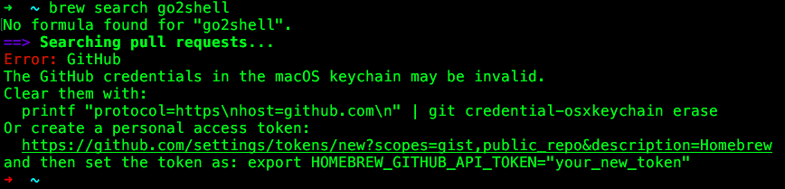
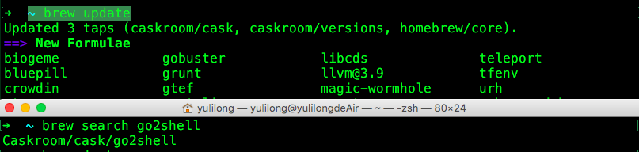
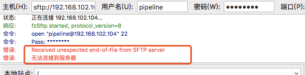

[TOC]

# Mac中常见错误及处理方法

## 1. The GitHub credentials in the macOS keychain may be invalid.

错误信息：     

      

解决方法：  
```    bash
# 终端命令,https://github.com/Homebrew/brew/issues/93
~ brew update
# 这个命令执行时间有点长要耐心等待
```


## 2. ftp Received unexpected end-of-file from SFTP server



https://superuser.com/questions/901992/filezilla-does-not-open-connection-putty-does       

https://www.digitalocean.com/community/questions/sftp-connection-error-received-unexpected-end-of-file-from-sftp-server

## 3. 键盘大小写切换灯不亮，但是可以切换大小写

可能是QQ音乐播放器导致的，退出QQ音乐就好了。

## 4. Mac右上角导航栏WiFi图标点击后卡死

在Mac10.14版本，电脑右上角导航栏，WiFi图标有的时候点击会卡死，重启就好了。

后来Mac系统升级到了Mojave 10.14.6版本， 有几次发现WiFi图标又有好几次卡死现象，然后去网络上查找解决办法。

经过我的尝试，发现终端输入如下命令解决了问题：

```bash
sudo killall airportd
```

输入密码后， WiFi就好了。

killall 命令用于终止某个指定名称的服务所对应的全部进程，格式为：“killall [参数] [服务名称]”。

这个命令终止airportd。airportd会重启，在Mac任务管理其中，搜索airportd可以查看到airportd

网络上还有的说终止`SystemUIServer`顶部菜单栏程序，但是我终止后，并没有解决WiFi卡死问题。

https://blog.csdn.net/yanglei3kyou/article/details/101708837

关于Mac进程的介绍：https://www.cnblogs.com/jinjiangongzuoshi/p/5373711.html