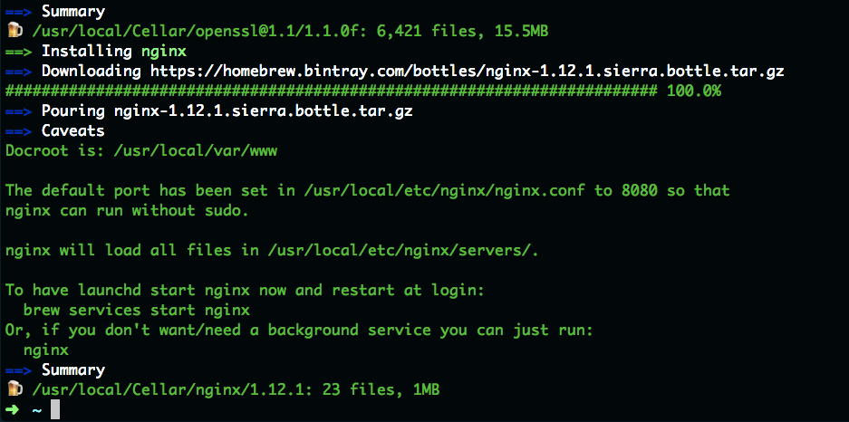
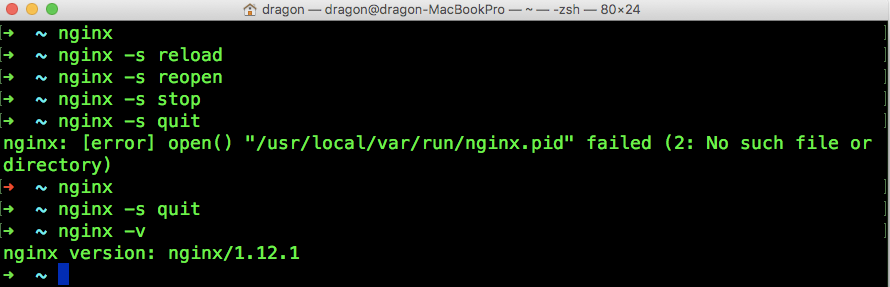
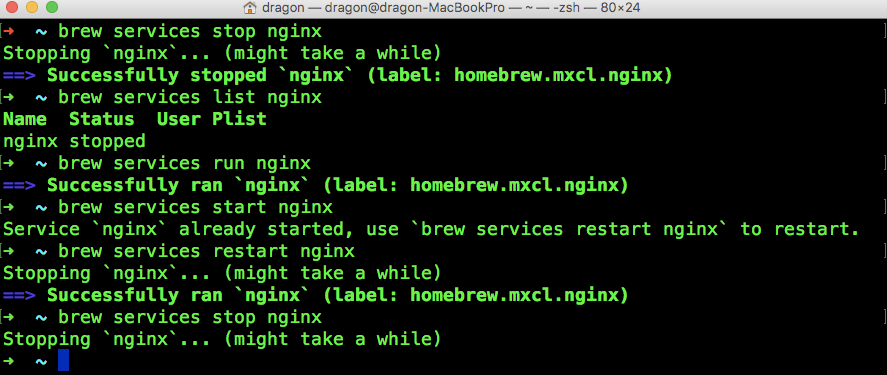

[TOC]    

## **一. 安装Nginx**   

打开终端
```bash
~ brew install nginx
```



安装好后，默认HTML文件存放路径：

```bash
/usr/local/var/www
```

这个路径重定向到了:

```bash
/usr/local/Cellar/nginx/1.12.1/html
```

nginx的安装路径：

```bash
/usr/local/Cellar/nginx/1.12.1
```


## **二. 配置Nginx配置文件**  

根据安装的提示，配置文件的路径：`/usr/local/etc/nginx/nginx.conf`     
打开文件编辑里面的内容：      

```bash
user  nginx;
worker_processes  1;

#error_log  /var/log/nginx/error.log warn;
#pid        /var/run/nginx.pid;

events {
    worker_connections  1024;
}

http {
    include       /etc/nginx/mime.types;
    default_type  application/octet-stream;
    
    #access_log  /var/log/nginx/access.log  main;
    sendfile        on;
    #tcp_nopush     on;

    keepalive_timeout  65;

    server {
        listen       8080;                             #服务的端口号
        server_name  localhost;
        location / {
            root   /www/cloudlink;                     #访问的项目目录
            index  index.html index.htm;               #访问的文件名
        }
		
    	location ^~ /cloudlink/v1/ {
    	    proxy_pass http://192.168.100.92:8050/;    #项目需要的代理地址
    	}
        location ^~ /cloudlink/zipkin/ {
            proxy_pass http://192.168.100.90:9411/;    #项目需要的代理地址
    
        }
        error_page   500 502 503 504  /50x.html;
        location = /50x.html {
            root   html;
        }
    }
}
```

保存后从新加载配置文件： `nginx -s reload`    

## **三. Nginx的一些命令**    

### **1. Nginx自己的命令**   

```bash
# 打开终端运行命令
~ nginx             # 启动Nginx
# 执行该命令之后，nginx 会在 /usr/local/var/run/ 路径下创建一个名为nginx.pid 的文件
~ nginx -s reload   # 重新加载配置
# 执行该命令之后，nginx会重新启动，但前提是/usr/local/var/run/ 路径下必须存在 nginx.pid 文件
~ nginx -s reopen   # 重启
~ nginx -s stop     # 停止
# 执行该命令之后，nginx 会将 /usr/local/var/run/ 路径下名为nginx.pid 的文件删除掉。但前提是/usr/local/var/run/ 路径下必须存在 nginx.pid 文件
~ nginx -s quit     # 退出 nginx
~ nginx -V          # 查看版本，以及配置文件地址
~ nginx -v          # 查看版本
~ nginx -c filename # 指定配置文件
~ nginx -h          # 帮助    
~ nginx -t          # 测试配置是否有语法错误 
```



### **2. 使用brew services 命令**

```bash
# brew services [-v|--verbose] [list | run | start | stop | restart | cleanup] [...]
~ brew services start nginx    # 启动Nginx服务
~ brew services stop nginx     # 停止Nginx服务
~ brew services restart nginx  # 重启Nginx服务
```



## **四. Nginx一些常见错误**

**1、重启nginx 报错**   

```bash
~ sudo nginx -s reload

nginx: [error] open() "/usr/local/var/run/nginx.pid" failed (2: No such file or directory)
```

出现该问题的原因是没有nginx.pid 这个文件,    

***解决方法：重启一下Nginx就好了。***   

**2、启动nginx报错**   

```bash
~ nginx

nginx: [emerg] bind() to 0.0.0.0:80 failed (48: Address already in use)
nginx: [emerg] bind() to 0.0.0.0:80 failed (48: Address already in use)
nginx: [emerg] bind() to 0.0.0.0:80 failed (48: Address already in use)
nginx: [emerg] bind() to 0.0.0.0:80 failed (48: Address already in use)
nginx: [emerg] bind() to 0.0.0.0:80 failed (48: Address already in use)
nginx: [emerg] still could not bind()
```

出现该问题的原因是/usr/local/var/run/nginx.pid  文件已经存在，也就是说nginx已经启动了，再次执行启动nginx，就会出现这种问题了，接口被占用了      

***解决方法：重启nginx，而不是启动nginx***     


## **参考链接**    

* http://www.jianshu.com/p/918eb337a206     

* http://blog.csdn.net/dracotianlong/article/details/21817097