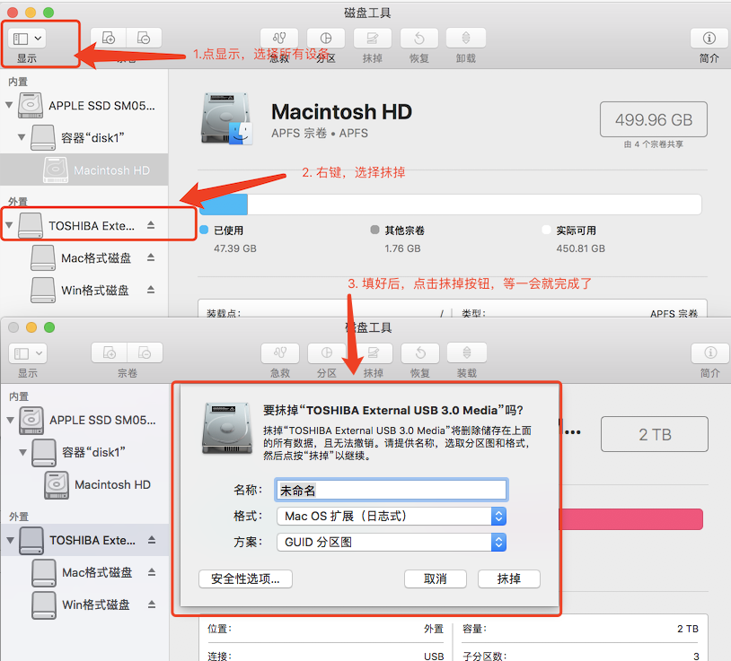

[TOC]  

## 1. 说明

新买了一块移动硬盘打算做存储和苹果系统的备份用，苹果系统的备份需要苹果系统的专用格式，    
如果单独买一块用于苹果系统备份不划算，所以买了一块容量2TB的移动硬盘分区成2块，一块用存储，一块用备份，完美。    
之前在Windows电脑上先分区，然后在Mac下把其中一个区格式化成苹果格式，但是这种方法imeMachine不识别。      
在网络上找了一些资料，看见了下面的介绍：     
http://www.jianshu.com/p/5f8b4d9a8922       

原来在window下面把移动硬盘分区后，在Mac下TimeMachine备份磁盘中是找不到的，      
只有在Mac下把硬盘格式化后在分区，TimeMachine才能识别出分区的2块盘，上面链接的教程现在操作有点改变，     
现在记录一下（Mac系统： macOS High Sierra 10.13.2）：     

## 2. 格式化移动硬盘

1. 打开commmand+空格打开你的Spotlight，搜索disk Utility.app,也就是苹果的磁盘工具，    
2. 点击左上角的显示，选择显示所有设备(Show All Devices)。     
3. 在左边外置中选择移动硬盘， 右键抹掉(Erase)，在出现的弹窗中：    

```
名称可以忽略
格式选择`Mac OS 扩展（日志式）`
方案选择`GUID 分区图`
```

然后点击抹掉，等一会就完成了格式化。    



​    

## 3. 分区

### 3.1 分 Mac格式的区

1. 右键移动硬盘，选择分区(Partition device)：

```
名称： Mac格式磁盘
格式：Mac OS 扩展（日志式）
大小： 填写合适的大小
```

然后点一下左边饼图下面的 加号，然后点击应用等一会就可以了。

### 3.2 分 win下格式的区

步骤与上面的一样， 但是在格式里面选择`Windows NT 文件系统(Tuxera NTFS)` 其它的一样。等一会就可以了


经过上面的操作后，就能在Mac电脑里TimeMachine里识别出分区的2块盘了

## 4. TimeMachine

打开系统偏好设置，点击TimeMachine，选择那个你刚刚分区成功容量为300GB格式为MAC OS X的硬盘，经过蛮久的等待，就备份成功喽，

​    

## 5. 关于硬盘的文件格式

exfat格式：mac、windows、android 都能够读取的格式，这个格式的硬盘，每个系统都是可以直接读取，不会影响硬盘读取速度。

NTFS格式：window系统专用格式， 如果固态硬盘使用了这个格式，由于mac电脑不支持这种格式，使用第三方软件支持读写(tuxerantfs)，那么会影响固态硬盘的读写速度，比如固态硬盘正常读(1000MB/s)、写(1000MB/s),  修改硬盘为NTFS格式后，读(192MB/s)、写(386MB/s)，原因是，这个格式读写要经过第三方软件转化，使得速度变慢了，而在window系统里面则不会影响速度。

所以如果是固态硬盘，那么建议文件格式写成EXFAT格式，以免影响文件读写速度。机械硬盘不受影响(机械硬盘速度慢)。