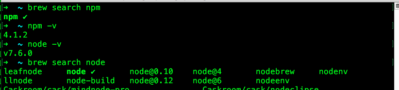
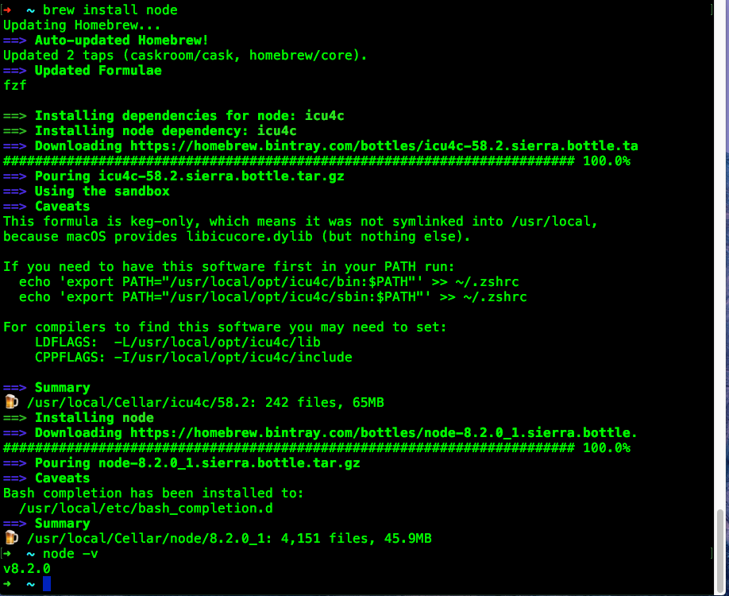
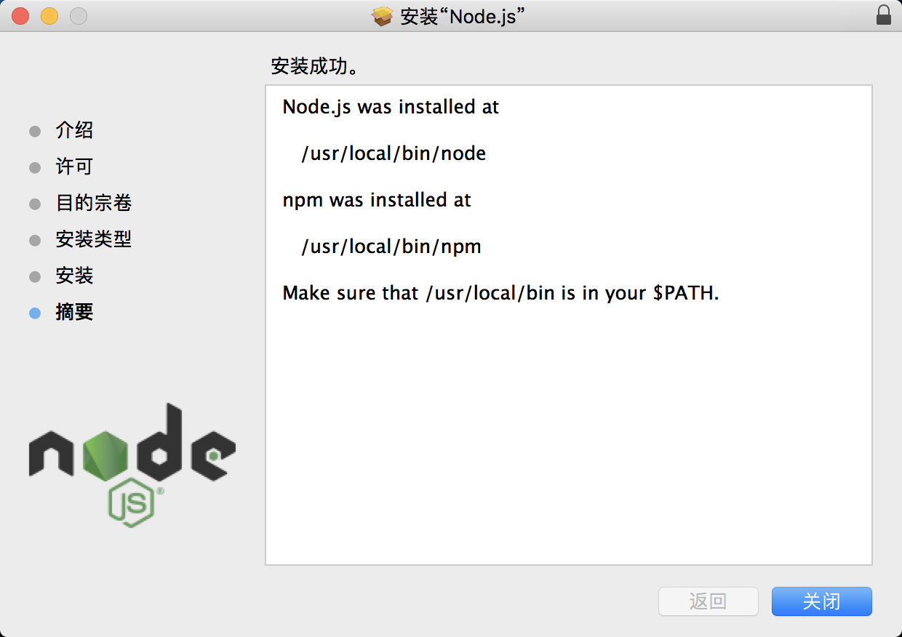
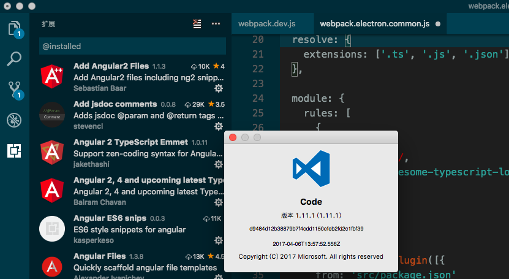

[TOC]

## 1. install node

```  bash
# 需要事先安装好 brew
~ brew install node
~ npm -v
~ node -v
```
  

   

```    bash
# 使用brew安装的node版本太高了，告知angular2 里面`.sass`文件`node-sass`包不兼容
# 卸载node最新版本
brew uninstall node 
# node官网： https://nodejs.org/en/download/    打开网站选择 LTS 版本的。下载mac版本的，然后店家安装
```



## 2. 编辑器安装 VScode免费

下载地址： 
https://code.visualstudio.com/  
选择一个Mac版本的，下载后，解压，把程序拖到 应用程序目录中.     

一些angularJS开发需要安装的插件：  
Add Angular2 Files : https://marketplace.visualstudio.com/items?itemName=sebastianbaar.vscode-add-angular2-files     
Angular 2, 4 and upcoming latest TypeScript HTML Snippets : https://marketplace.visualstudio.com/items?itemName=UVBrain.Angular2     
Angular ES6 snips : https://marketplace.visualstudio.com/items?itemName=kasperkeso.es6-angular-snips   
Angular Files : https://marketplace.visualstudio.com/items?itemName=alexiv.vscode-angular2-files    
Angular v4 TypeScript Snippets : https://marketplace.visualstudio.com/items?itemName=johnpapa.Angular2    
angular2-useful-dev-extensions : https://marketplace.visualstudio.com/items?itemName=boastr.angular2-useful-dev-extensions    
Atom One Dark Theme: https://marketplace.visualstudio.com/items?itemName=freebroccolo.theme-atom-one-dark    
Auto Import : https://marketplace.visualstudio.com/items?itemName=steoates.autoimport      
Autolinting for Javascript : https://marketplace.visualstudio.com/items?itemName=t-sauer.autolinting-for-javascript     
background  : https://marketplace.visualstudio.com/items?itemName=shalldie.background     
Class autocomplete for HTML : https://marketplace.visualstudio.com/items?itemName=AESSoft.aessoft-class-autocomplete     
CSS Auto Prefix : https://marketplace.visualstudio.com/items?itemName=sporiley.css-auto-prefix     
CSS Peek  : https://marketplace.visualstudio.com/items?itemName=pranaygp.vscode-css-peek     
Dark+ Material : https://marketplace.visualstudio.com/items?itemName=vangware.dark-plus-material    
Ember JS (ES6) and Handlebars code snippets : https://marketplace.visualstudio.com/items?itemName=phanitejakomaravolu.EmberES6Snippets     
Extension Manifest Editor : https://marketplace.visualstudio.com/items?itemName=ms-devlabs.extension-manifest-editor    
File Peek : https://marketplace.visualstudio.com/items?itemName=abierbaum.vscode-file-peek     
Flatland_Dark Theme : https://marketplace.visualstudio.com/items?itemName=gerane.Theme-FlatlandDark    
HTML CSS Class Completion : https://marketplace.visualstudio.com/items?itemName=Zignd.html-css-class-completion    
HTML CSS Support : https://marketplace.visualstudio.com/items?itemName=ecmel.vscode-html-css    
HTML SCSS Support : https://marketplace.visualstudio.com/items?itemName=P-de-Jong.vscode-html-scss    
HTML Snippets : https://marketplace.visualstudio.com/items?itemName=abusaidm.html-snippets   
JavaScript (ES6) code snippets : https://marketplace.visualstudio.com/items?itemName=xabikos.JavaScriptSnippets    
JavaScript snippets for Dynamics 365/CRM 2011/2013/2015/2016 : https://marketplace.visualstudio.com/items?itemName=JLattimer.dynamics-crm-js     
JS-CSS-HTML Formatter : https://marketplace.visualstudio.com/items?itemName=lonefy.vscode-JS-CSS-HTML-formatter    
JSFiddle Like Syntax Theme : https://marketplace.visualstudio.com/items?itemName=davidmart.theme-jsfiddle-like-syntax-vscode       

