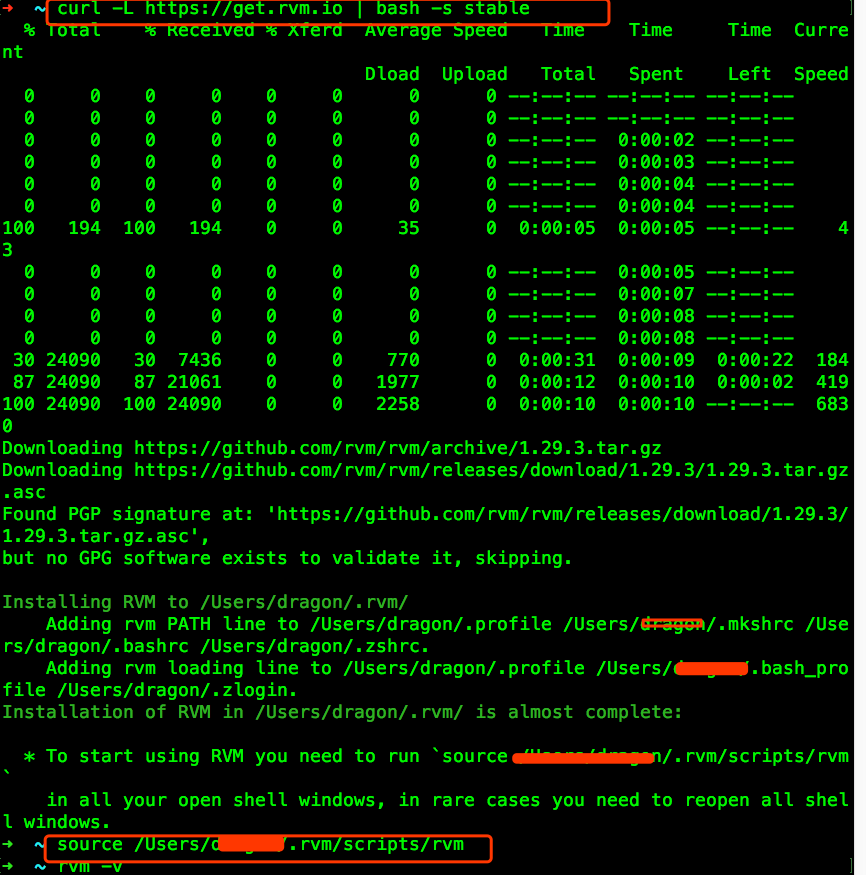

[TOC]

## 1. install RVM

1.未装homebrew先装homebrew，否则报错：     
```bash
$ ruby -e "$(curl -fsSL https://raw.githubusercontent.com/Homebrew/install/master/install)"
```
如果有安装homebrew，但是在后面的ruby安装过程中出现如下错误,        
有可能是你更新mac系统造成的，我是通过卸载重装homebrew来解决这个问题的.       

```bash
$ ruby -e "$(curl -fsSL https://raw.githubusercontent.com/Homebrew/install/master/uninstall)"
$ ruby -e "$(curl -fsSL https://raw.githubusercontent.com/Homebrew/install/master/install)"
```
2.安装rvm    

```bash
$ curl -L https://get.rvm.io | bash -s stable
# 启用RVM
$ source ~/.rvm/scripts/rvm   
# 检查一下是否安装正确命令
$ rvm -v
# 如果出现邦本则说明安装成功
```



## 2. rubymine 2017安装

1. 在官网下载最新安装包：  https://www.jetbrains.com/ruby/download/#section=mac     
2. 下载完成安装包后，安装程序（双击打开，将左侧拖拽至右侧应用程序，默认安装）。      
3. 打开软件，在注册中选择‘License server’， 在 ‘License server address’ 中输入：`http://xidea.online`,然后点击Activate即可

## 3. Mac install pgadmin3

```bash
# 终端，已经安装了brew ，cask
~ brew search pgadmin3
Caskroom/versions/pgadmin3
~ brew install Caskroom/versions/pgadmin3 
```


修改数据库配置文件，允许连接

```bash
~ vi /usr/local/var/postgres/pg_hba.conf
```
找到下面的内容：
```bash
# IPv4 local connections:
host    all             all             127.0.0.1/32            ident
# IPv6 local connections:
host    all             all             ::1/128                 ident
```
把ident修改为 trust

并在下面添加一行：
```bash
host	all 		all 		192.168.0.0/24 		trust
```

保存后重起数据库：
```bash
# 没试过，
~ pg_ctl start -D /usr/local/var/postgres/data -l /usr/local/var/log/postgres/log.log
# 停止的话把后面的start换成stop即可。 如果不想每次都指定数据目录，可以创建保存该地址的环境变量PGDATA
# export PGDATA=/usr/local/var/postgres/data
```
查看数据库的运行：

```bash
# 亲测有效
$ lsof -i:5432
```