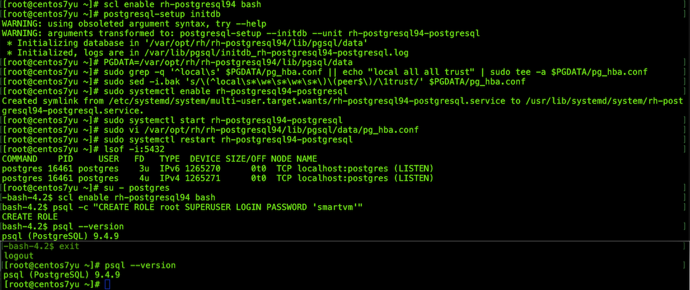

[TOC]

以下所有操作都不能在root用户操作，要用你登陆电脑的用户来操作

https://bitbucket.org/yulilong/my_wiki/wiki/Home

##  1. manqgeiq官方的安装文档

链接：  
http://manageiq.org/docs/guides/developer_setup.html  
你可以看这个官方的安装文档，这里面依赖环境安装是使用dnf管理其来安装的，我个人安装的时候会有点问题，你可以先尝试安装，如果有问题不能解决，那么可以看下面的安装教程。如果按照官方文档安装了，则下面的可以忽略了。

## 2.  manageiq自定义安装

这个是文档是从一个空白电脑开始安装，如果你哪一步已经存在，请略过

### 2.1 操作系统安装

manageiq要求是 centos的 linux，所以请安装centos版linux，不会请找运维的同事或者网管安装。
推荐centos7

### 2.2 git安装

一般git linux系统自带，可在终端运行如下命令查看系统是否安装了git：
```bash
$ git --version
```
如果出来版本号则说明已经安装了，如果没有安装请看如下教程安装：  

* [git安装,配置](git%E5%AE%89%E8%A3%85,%E9%85%8D%E7%BD%AE)  

这里面描写了git的安装、git命令的别名、以及拉取代码时自动验证用户名密码设置。

### 2.3 manageiq依赖安装

官方文档使用的是dnf包管理器来安装的，但是我安装时发现有的包使用dnf找不到，只好全部用yum来安装了。

* Install packages
```bash
sudo yum -y install memcached                          
sudo yum -y install bzip2 libffi-devel readline-devel  
sudo yum -y install libxml2-devel libxslt-devel patch  
sudo yum -y install sqlite-devel                       
sudo yum -y install nodejs                             
sudo yum -y install gcc-c++                            
sudo yum -y install libcurl-devel                     
rpm -q --whatprovides npm || sudo yum -y install npm   
sudo yum -y install openssl-devel                     
sudo yum -y install cmake                              
```
* Install the Bower package manager
```bash
sudo npm install -g bower
```
* Enable Memcached
```bash
sudo systemctl enable memcached
sudo systemctl start memcached
```
*  PostgreSQL version is 9.4+ 的安装

postgres数据库官方推荐使用9.4+的版本，如果系统没有安装那么直接安装这个版本以上的，如果有旧的版本则先卸载在安装新的。
manageiq官方postgres9.4+的安装文档：  
http://manageiq.org/docs/guides/developer_setup/postgresql_software_collection  

```bash
# 您需要做的第一件事是启用SoftwareCollections.org包存储库。如果你使用CentOS，那么命令如下：
$ sudo yum -y install centos-release-scl
# 查看postgres是否已经安装了了低版本的，如果已经安装了高版本的，或者没安装在不需卸载，直接安装
$ psql --version
$ sudo systemctl stop postgresql-server    # 停止psotgres服务
$ sudo systemctl disable postgresql-server # 关掉postgres
$ sudo yum -y remove 'postgresql-*'        # 卸载postgres
```

* 卸载ruby 链接postgres 的gem包 pg，如果没有安装则略过：
```bash
$ gem uninstall pg
```

* Install the PostgreSQL 9.4 collection

```bash
$ sudo yum -y install \
rh-postgresql94-postgresql-server \
rh-postgresql94-postgresql-devel
```
This will install the required files under /opt/rh/rh-postgresql94, so each time you need to use a command like pgsql you will have to use the complete path. Alternatively, you can enable that collection:  
```bash
$ scl enable rh-postgresql94 bash
$ source /opt/rh/rh-postgresql94/enable
```
注意！！！下面这步会把～/.bash_profile 文件里面所有内容清空，使用前请备份注意：
```bash
# 这条命令可以不用执行，后期经实测不影响manageIQ的使用
$ cat > $HOME/.bash_profile <<.
source /opt/rh/rh-postgresql94/enable
.

[@centos ~]$ cat $HOME/.bash_profile
# .bash_profile

# Get the aliases and functions
if [ -f ~/.bashrc ]; then
	. ~/.bashrc
fi

# User specific environment and startup programs

PATH=$PATH:$HOME/.local/bin:$HOME/bin

export PATH
#source /opt/rh/rh-postgresql94/enable
```

```bash
在$HOME/.bash_profile文件加了这句话后，如果你重新登陆，会导致当前用户图形界面登陆不上。
两种解决方法：
1. 把这句注销调，后期经实测，没有这条语句对于rails开发没有影响，数据库能打开就好。
2. 打开/opt/rh/rh-postgresql94/enable，把如下三条语句注释掉：
export XDG_CONFIG_DIRS="/etc/opt/rh/rh-postgresql94/xdg:${XDG_CONFIG_DIRS:-/etc/xdg}"
export XDG_DATA_DIRS="/opt/rh/rh-postgresql94/root/usr/share${XDG_DATA_DIRS:+:${XDG_DATA_DIRS}}"
export PKG_CONFIG_PATH="/opt/rh/rh-postgresql94/root/usr/lib64/pkgconfig${PKG_CONFIG_PATH:+:${PKG_CONFIG_PATH}}"

```

* Create and configure the database  

By default the database directory used by the software collection is /var/opt/rh/rh-postgresql94/lib/pgsql/data, but the ManageIQ instructions assume it to be /var/lib/pgsql/data. The name of the service is also different. Make sure to take these differences into account when creating and configure the database. For example, to initially create the database you will need to do the following:  
```bash
$ su - root
$ scl enable rh-postgresql94 bash
$ postgresql-setup initdb
```
To setup authentication you will need to modify the pg_hba.conf file, as described in the instructions, but taking into account the different location:  
```bash
$ PGDATA=/var/opt/rh/rh-postgresql94/lib/pgsql/data
$ sudo grep -q '^local\s' $PGDATA/pg_hba.conf || echo "local all all trust" | sudo tee -a $PGDATA/pg_hba.conf
$ sudo sed -i.bak 's/\(^local\s*\w*\s*\w*\s*\)\(peer$\)/\1trust/' $PGDATA/pg_hba.conf
```
To enable and start the server:
```bash
$ sudo systemctl enable rh-postgresql94-postgresql
$ sudo systemctl start rh-postgresql94-postgresql
```
* 修改数据库配置文件，允许连接  
```bash
$ sudo vi /var/opt/rh/rh-postgresql94/lib/pgsql/data/pg_hba.conf
```
找到下面的内容：
```bash
# IPv4 local connections:
host    all             all             127.0.0.1/32            ident
# IPv6 local connections:
host    all             all             ::1/128                 ident
```
**把ident修改为 trust** 

并在下面添加一行：
```bash
host	all 		all 		192.168.0.0/24 		trust
```

保存后重起数据库：
```bash
$ sudo systemctl restart rh-postgresql94-postgresql
```
* 查看数据库的运行：
```bash
$ lsof -i:5432
```

And, finally, to create the database user:  
```bash
$ su - postgres
-bash-4.2$ scl enable rh-postgresql94 bash
bash-4.2$ psql -c "CREATE ROLE root SUPERUSER LOGIN PASSWORD 'smartvm'"
```



-   rvm,ruby,gems,rails,pqadmin3,rubymine,isntall

这里是rails开发的必要插件，具体安装看如下**链接**：  

[***centos7,rvm,ruby,gems,rails,pqadmin3,rubymine,isntall***](./012-centos7,rvm,ruby,gems,rails,pqadmin3,rubymine,isntall.html)

### 2.4 clone ManageIQ 代码

```bash
git clone https://github.com/ManageIQ/manageiq
```

### 2.5 Installs dependencies, config, prepares database, etc

```bash
$ bin/setup
```

### 2.6 Starts the ManageIQ EVM Application in the background

下面的命令是开始启动服务，这个是正常的启动。  
```bash
# 启动manageIQ服务，网站
$ rails server
# 这个是后台处理程序，读取虚拟机信息，读取镜像信息等，如果只是网站则不需要运行这个
$ bundle exec rake evm:start
```
### 2.7 开发环境最小配置运行

```bash
$ MIQ_SPARTAN=minimal rake evm:start
$ rails server
```