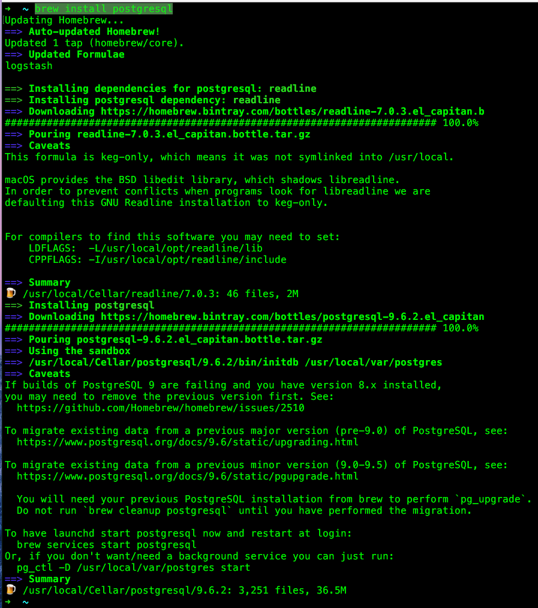
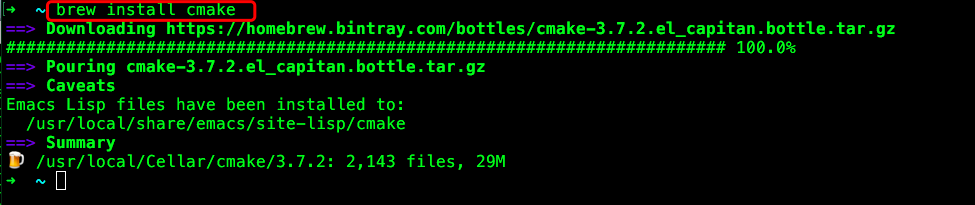
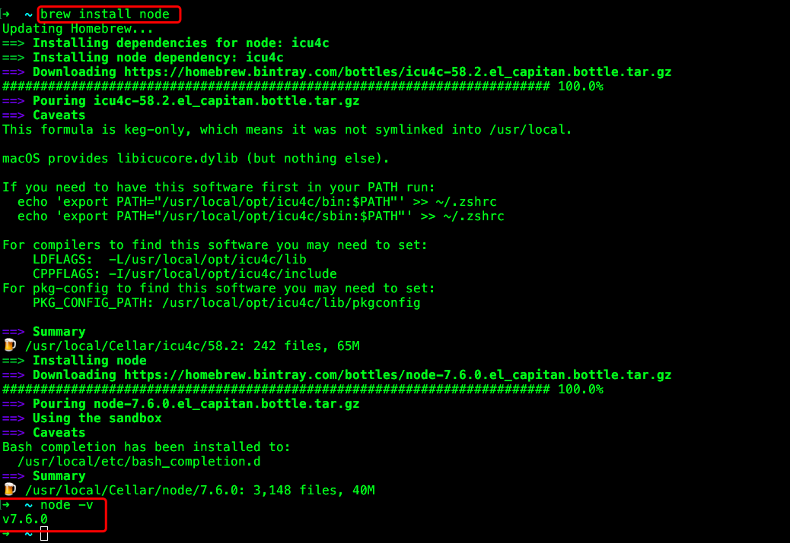
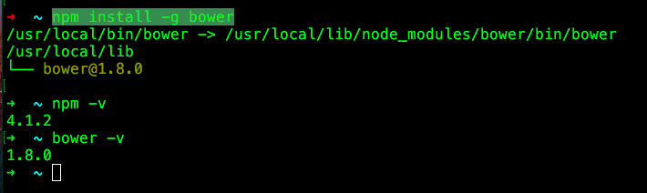
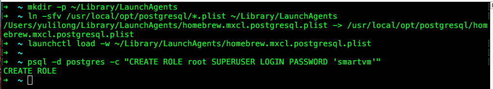

* **manageIQ官方安装文档**    
http://manageiq.org/docs/guides/developer_setup    
Mac 安装在中间

* **Install Homebrew**    
下面的安装都要brew，如果没有brew需要第一个安装
```
# https://brew.sh/
$ /usr/bin/ruby -e "$(curl -fsSL https://raw.githubusercontent.com/Homebrew/install/master/install)"
```

* **Install Packages**     

```
brew install git
brew install memcached
brew install postgresql
brew install cmake
brew install node
```

* **Install the Bower package manager**     

```
npm install -g bower
```

* **Configure and start PostgreSQL**    

Required PostgreSQL version is 9.4+     
```
# Enable PostgreSQL on boot
mkdir -p ~/Library/LaunchAgents
ln -sfv /usr/local/opt/postgresql/*.plist ~/Library/LaunchAgents
launchctl load -w ~/Library/LaunchAgents/homebrew.mxcl.postgresql.plist
# Create the ManageIQ superuser
psql -d postgres -c "CREATE ROLE root SUPERUSER LOGIN PASSWORD 'smartvm'"
```

* **Start memcached**    

```
# Enable Memcached on boot
ln -sfv /usr/local/opt/memcached/homebrew.mxcl.memcached.plist ~/Library/LaunchAgents
launchctl load -w ~/Library/LaunchAgents/homebrew.mxcl.memcached.plist
```
```
Memcached 是一个高性能的分布式内存对象缓存系统，用于动态Web应用以减轻数据库负载。
它通过在内存中缓存数据和对象来减少读取数据库的次数，从而提高动态、数据库驱动网站的速度。
Memcached基于一个存储键/值对的hashmap。其守护进程（daemon ）是用C写的，
但是客户端可以用任何语言来编写，并通过memcached协议与守护进程通信。
```

     

      

    

     

