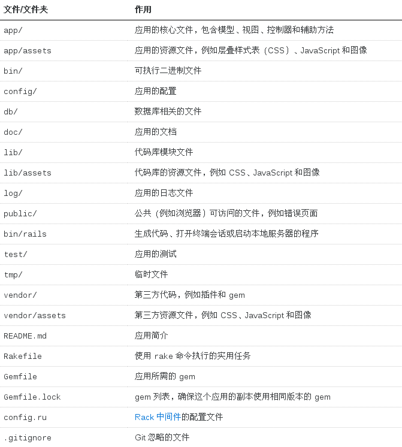
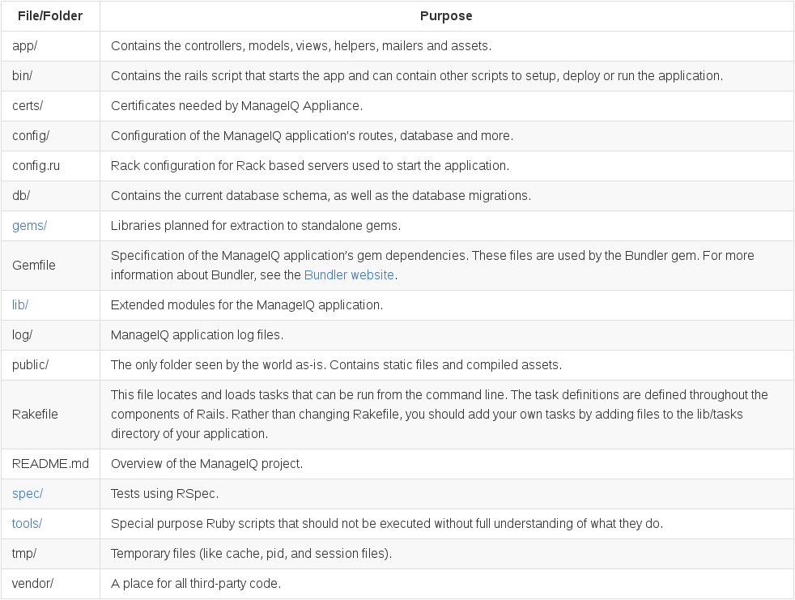
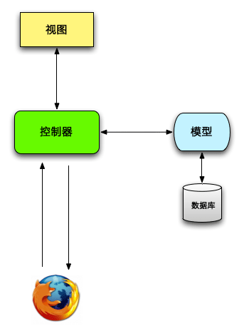
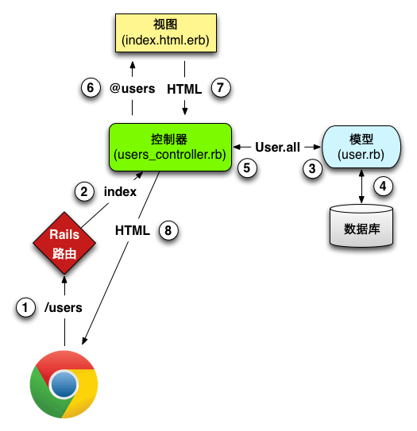
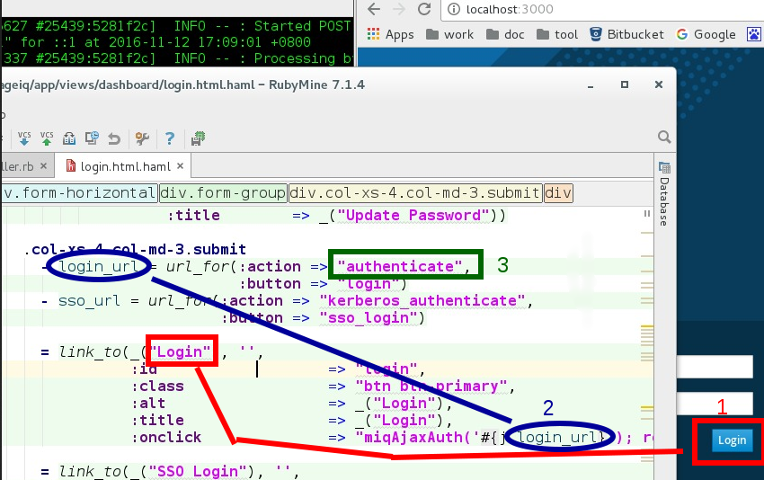

[TOC]

## 1. 概述

  由于manageiq是使用rails编写的，所以manageiq的源代码目录结构是标准的rails的目录结构，rails开发语言是ruby，框架是mvc模式的。

## 2. manageiq代码的目录结构

1、首先了解一下标准的rails目录结构，如下图：  



2、ManageIQ的代码目录结构:  
ManageIQ is a Rails application with the following standard layout:  



详细介绍请看manageiq的官方文档介绍：  
http://manageiq.org/docs/guides/architecture/source_code_layout

## 3. rais 程序架构、执行流程

  Rails 采用了“模型-视图-控制器”（简称 MVC）架构模式。这种模式把应用中的数据（例如用户信息）与显示数据的代码分开，这是图形用户界面（Graphical User Interface，简称 GUI）常用的架构方式。 
MVC 架构图解：  

  

与 Rails 应用交互时，浏览器发出一个请求（request），Web 服务器收到请求之后将其传给 Rails 应用的控制器，决定下一步做什么。某些情况下，控制器会立即渲染视图（view），生成 HTML，然后发送给浏览器。在动态网站中，更常见的是控制器与模型（model）交互。模型是一个 Ruby 对象，表示网站中的一个元素（例如一个用户），并且负责与数据库通信。与模型交互后，控制器再渲染视图，把生成的 HTML 返回给浏览器。  

程序执行流程：  

  

*  图中各步的说明如下：  
1. 浏览器向 /users 发送请求；  
2. Rails 的路由把 /users 交给 Users 控制器的 index 动作处理；  
3. index 动作要求 User 模型读取所有用户（User.all）；  
4. User 模型从数据库中读取所有用户；  
5. User 模型把所有用户组成的列表返回给控制器；  
6. 控制器把所有用户赋值给 @users 变量，然后传入 index 视图；  
7. 视图使用嵌入式 Ruby 把页面渲染成 HTML；  
8. 控制器把 HTML 送回浏览器。 

* 关于rails的资料请看如下链接：  
[Ruby on Rails 教程](https://railstutorial-china.org/book/)  
[Ruby on Rails 指南](http://guides.ruby-china.org/)  

## 4. manageiq代码执行过程展示

看过上面的介绍后，如果想要了解manageiq的代码可根据如下方法来查找：

* 浏览器发送一个链接请求，  
* 去config/routes.rb里面， 根据链接来确定这个请求由哪个controller的action来处理， 这里找到了controller。  
* cotroller调用model来处理请求，然后调用view来对结果进行渲染， 这里找到了model与view。  
* 浏览器接收结果，对结果进行展示，  一次请求结束。  、

根据上面的执行流程，如果想知道manageiq某一个网页的代码，以及修改某一部分，就可以按照上面的过程来查找。  

## 5. manageiq登陆过程分析

* 启动服务

在此之前需要先安装好环境，并下载代码，进入代码目录并执行下面命令：
```
rails server
```
* 浏览器输入地址：http://localhost:3000

此时浏览器已经向rails服务发送了请求，请求的是默认地址。 

* 去路由中需要默认地址负责处理的controller

路由文件位置：  
https://github.com/ManageIQ/manageiq/blob/darga-4/config/routes.rb  

在里面找到默认路由设置代码  
https://github.com/ManageIQ/manageiq/blob/darga-4/config/routes.rb#L2623
```
root :to => 'dashboard#login'
```
从这段代码可以看到处理默认访问的controller是 dashboard里面的login方法，去 controller里面找到dashboard控制器。

* controllers/dashboard_controller.rb对请求进行处理

controller文件位置：  
https://github.com/ManageIQ/manageiq/blob/darga-4/app/controllers/dashboard_controller.rb  
在里面找到login方法：  
https://github.com/ManageIQ/manageiq/blob/darga-4/app/controllers/dashboard_controller.rb#L347  
这个方法执行完毕后，如果在方法里面没有指定执行的view，那么则默认去view里面找到同名的文件夹，在里面找到跟这个方法名同名的文件。

* views/dashboard/login.html.haml对网页进行渲染

view文件位置：  
https://github.com/ManageIQ/manageiq/blob/darga-4/app/views/dashboard/login.html.haml  
在里面找到登陆按钮的位置：  
https://github.com/ManageIQ/manageiq/blob/darga-4/app/views/dashboard/login.html.haml#L91 

如下图所示：  

  

当在浏览器中输入用户名、密码后点击 login 按钮后，如上图 1、2、3 过程所示，会从新回到 controller里面去验证用户名密码。

* controllers/dashboard_controller.rb 的authenticate方法对密码进行验证

代码位置：  
https://github.com/ManageIQ/manageiq/blob/darga-4/app/controllers/dashboard_controller.rb#L433
如果验证成功，则会指向一个新的url地址，代码如下：  
page.redirect_to(validation.url)

* 登陆过程结束，此时进入到了网站页面。

## 7. providers 部分代码启动流程

服务启动后，选择 Compute -> Clouds -> Providers, 此时网页链接： http://localhost:3000/ems_cloud/show_list ，然后在齿轮图标那里选择 Add a New Cloud Provider，这里就是添加aliyun代码的部分了，此时网页链接：http://localhost:3000/ems_cloud/new   

* 根据链接http://localhost:3000/ems_cloud/new去路由中寻找处理此请求的controllers

路由位置：https://github.com/ManageIQ/manageiq/blob/darga-4/config/routes.rb#L906  ，在里面没有找到new，但是控制代码里面有new方法。

* controllers/ems_cloud_controller.rb对请求进行处理

controller文件位置：  
https://github.com/ManageIQ/manageiq/blob/darga-4/app/controllers/ems_cloud_controller.rb  
在这个文件里面没有new方法，但是在include 里面找到了new：  
https://github.com/ManageIQ/manageiq/blob/darga-4/app/controllers/ems_common.rb#L131  
在这个方法里面设置了有哪些providers，并把结果传给view。

* views/ems_cloud/new.html.haml对网页进行渲染  

view文件位置：  
https://github.com/ManageIQ/manageiq/blob/darga-4/app/views/ems_cloud/new.html.haml  
这里面在基本渲染后，又调用的局部渲染：  
```
  = render :partial => "shared/views/ems_common/angular/form"
```
文件位置：  
https://github.com/ManageIQ/manageiq/blob/darga-4/app/views/shared/views/ems_common/angular/_form.html.haml  
这里面是选择providers的位置：  
https://github.com/ManageIQ/manageiq/blob/darga-4/app/views/shared/views/ems_common/angular/_form.html.haml#L27

* view处理结束后把结果返回给网页，这次请求将结束。

## 8. rails是如何加载的

http://blog.csdn.net/cloudcraft/article/details/7654118  
https://ruby-china.org/topics/23588  
http://www.oschina.net/question/136896_166772?sort=time