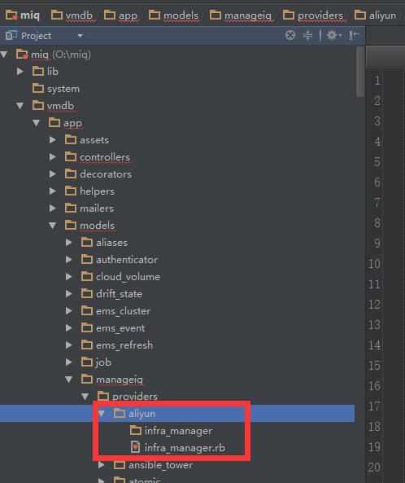
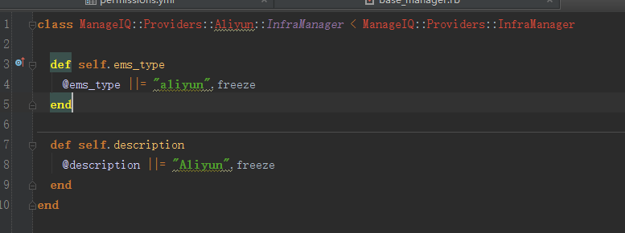
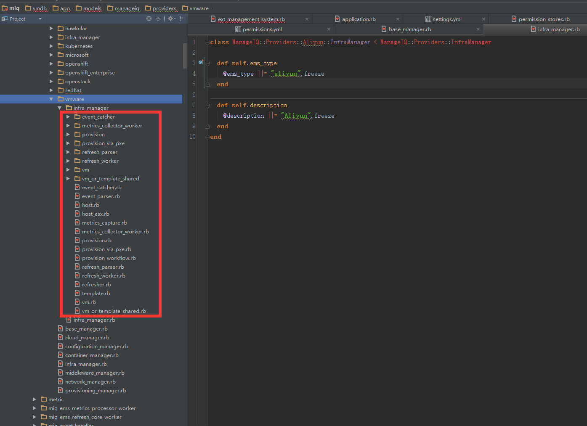
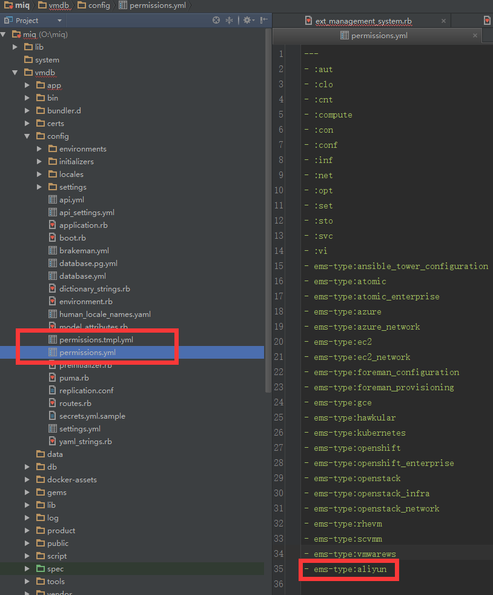
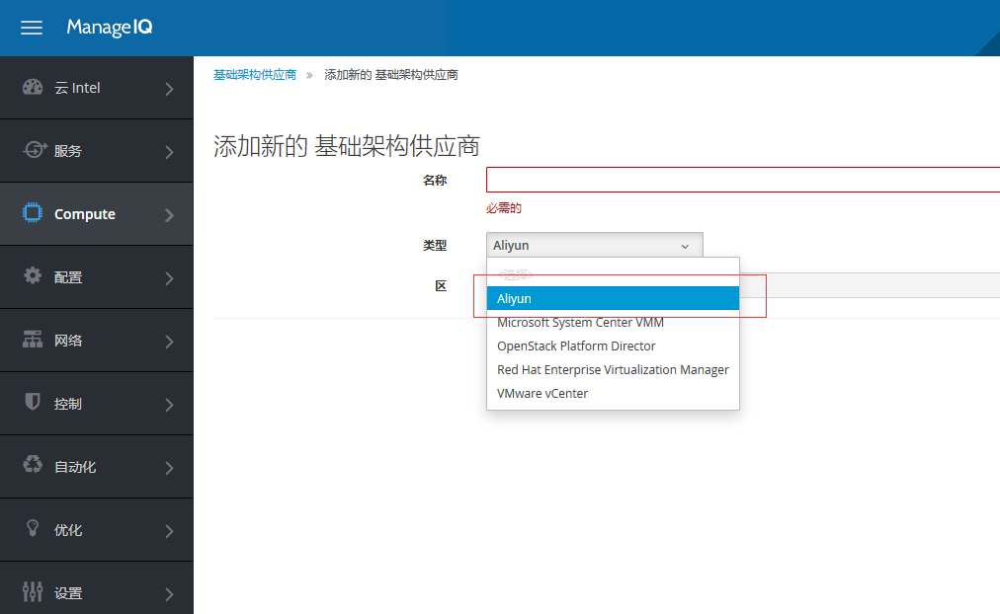

[TOC]

原版地址

http://note.youdao.com/noteshare?id=9428c64abd08efc359f5b7eb9bda7e28

##   1. MIQ新增提供者方式 ##

MIQ在D版新增的功能就是把所有的提供者所需要用到的类文件进行了按目录分割，这样的好处就是在以后增加一个新的提供者时，不需要对其他的类文件产生任何影响。不好的地方就是，相同的代码可能会存在多份，不过可以通过抽象共通的逻辑到model中来减少重复代码。

##  2. 新增提供者目录 ##

以下操作按照新增一个阿里云提供者为例来说明如何添加新的提供者。  

*  首先需要在model下的提供者目录下新增自己要添加的提供者目录  

  

*  新建一个类infra_manager.rb（名称无所谓，也可以叫aliyun_manager.rb），类里信息：  

 

*  在阿里云目录下新建一个infra_manager目录（该目录必须和上一个类的名字一致），该目录中存放的文件都是这个提供者所需要使用到的类，我们可以参考vmware的目录，具体的还是要根据实际情况来决定，目前因为我还没完全做完，仅做个提示。  

    

*  配置展示提供者权限  

仅仅增加了提供者目录还不足够让MIQ显示咱们的新的提供者，还必须设置展示权限才可以。权限设置文件为：miq\vmdb\config\permissions.yml，在文件最后一行增加新的提供者，其中有个permissions.tmpl.yml文件也许也要添加，我添加的时候这两个文件都添加了，所以不敢保证只添加一个是否会成功，但是两个都添加肯定可以成功。  

* fog的配置以及连接  

 未开始

*  配置workers  

未开始

* 界面配置  

未开始

* 自动化引擎配置  

未开始

* 界面显示效果  

