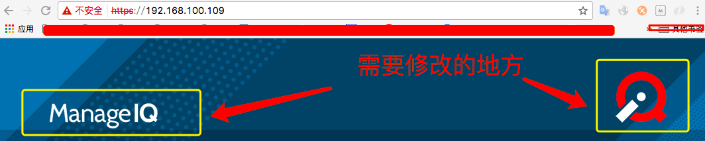

[TOC]


代码版本
https://github.com/ManageIQ/manageiq/tree/euwe-1       

修改后的生产环境需要从新编译js文件

```
###### 下面命令不管用再用： bin/update
$ bin/rails evm:compile_assets
```

## 1. 登录首页图标的修改

    

* 1.查找相关信息
打开网站后，网页右键-->inspect(检查) --> select an element in the page to inspect it -->    
然后把鼠标放到图标那里，点击一下，就会看见定义信息，

右上角图标信息：       
``   
用户名上面的图标：   
``         

* **右上角图标的修改**    

```
# manageiq官网镜像下载后虚拟机中代码位置
$ cd /var/www/miq/vmdb
$ find ./ -name "login-screen-logo*" #查找图标信息

# 源代码中定义的图标
./app/assets/images/login-screen-logo.png  #源代码中修改此处就可以，图片替换

# 为了加快网页速度，生成的js共有资源的位置，网页中真实的访问图片位置，
# 官网镜像中为了快速修改，可以直接修改此处
./public/assets/login-screen-logo-cd43380036fc96964823fd8d6d7486fe9bcfcce1498daf0c41d8bc94385511da.png

./public/self_service/images/login-screen-logo.png
```

* **用户名上面的图片(manageIQ)修改**  

```
# manageiq官网镜像下载后虚拟机中代码位置
$ cd /var/www/miq/vmdb
$ find ./ -name "brand*" #查找图标(manageIQ)位置

# 源代码中定义的图标
./app/assets/images/brand.svg  #源代码中修改此处就可以，图片替换
./public/assets/brand-7005158295b20605eae00a080448d69a9c7b541ee3f99469b86e1bae955b0e89.svg.gz

# 为了加快网页速度，生成的js共有资源的位置，网页中真实的访问图片位置，名字要一样。
./public/assets/brand-7005158295b20605eae00a080448d69a9c7b541ee3f99469b86e1bae955b0e89.svg

./public/self_service/images/brand.svg
./public/self_service/img/brand-alt.svg
./public/self_service/img/brand.svg
./vendor/assets/bower_components/patternfly-sass/assets/images/patternfly/brand-alt.svg
./vendor/assets/bower_components/patternfly-sass/assets/images/patternfly/brand.svg
```

* **网页标题(title)更改**      

1.这个是文字不是图片，查找定义处：     
```    
# 这里是首页登录的控制器处理部分，在这一喊显示了调用了哪部分视图
https://github.com/ManageIQ/manageiq/blob/euwe-1/app/controllers/dashboard_controller.rb#L357
# 这里是网页渲染，这一行显示了title处理部分， -->title_from_layout 这个方法返回title是什么
https://github.com/ManageIQ/manageiq/blob/euwe-1/app/views/layouts/login.html.haml#L6     
# title_from_layout 方法定义处，这里用I18n来自动转换语言，在语言里写着标题
https://github.com/ManageIQ/manageiq/blob/euwe-1/app/helpers/application_helper.rb#L443   

#最后，这里就是标题定义处，这个有几种语言(汉语，英语等)，别的代码版本不是这个路径，不过还是local这个目录里面，
# 别的版本只要找这个local目录就好了，例如：/var/www/miq/vmdb/config/locales
manageIQ/locale
```

2.修改标题    
https://github.com/ManageIQ/manageiq/blob/euwe-1/locale/zh_CN.yml      
```
zh-CN:
  product:
    name: ManageIQ   # 这个是网页title名字
    name_full: ManageIQ                                  #这个是登录后右上角 问号按钮的字段    (关于页面)about
    copyright: "Copyright (c) 2016 ManageIQ。由红帽赞助."  #这个是登录后右上角 问号按钮的字段    (关于页面)about
    support_website: "http://www.manageiq.org"           #这个是登录后右上角 问号按钮的字段    (关于页面)about
    support_website_text: "ManageIQ.org"                 #这个是登录后右上角 问号按钮的字段    (关于页面)about

# 修改后
zh-CN:
  product:
    name: JasCloud
    name_full: JasCloud
    copyright: "Copyright (c) 2017 JasCloud。由中盈安信赞助。"
    support_website: "www.jasgroup.cn"
    support_website_text: "www.jasgroup.cn"
```
en.yml, es.yml, fr.yml, ja.yml 也需要做相应修改。     
修改好后需要重启服务。

## 2. 登录页面的中间部分的背景色修改

     

文件位置：   
app/assets/stylesheets/login.scss
app/assets/stylesheets/main.scss       

```    
# app/assets/stylesheets/login.scss 
&.login-pf {
    background-color: $login-bg-color !important;  # 这里设置背景色的地方
  }
@media (min-width: $screen-sm) {
    &.login-pf {
      background: image-url($img-bg-login-2); # 这是右下角的图片设置
      background-position: 100% 100%;
      background-repeat: no-repeat;
      background-size: 30%;
    }
  }
# app/assets/stylesheets/main.scss  
$login-bg-color: #083c5a; # 大约是在28行附近
$img-bg-login:  "bg-login.png"; # 左上角的图片 图片位置：app/assets/images/bg-login.png
$img-bg-login-2: "bg-login-2.png";#  右下角的图片

```

## 3. 登陆后页面上部(header)导航栏的背景色

 

文件位置：   
app/assets/stylesheets/header_background.scss       
app/assets/stylesheets/main.scss       

```
# app/assets/stylesheets/header_background.scss     
.navbar-pf-vertical {
  background: image-url($img-bg-navbar);  # 右边的图片
  background-repeat: no-repeat;
  background-position: 100% 0;
  background-color: $navbar-pf-alt-bg-color;  # 背景色设置
}
# app/assets/stylesheets/main.scss     
# 上面的背景色设置：
$navbar-pf-alt-bg-color: #0c69a5; //大约在第9行 sets backgound color of navigation bar
# 上面的图片设置：
$img-bg-navbar: "navbar.png"; //大约在第11行 sets a custom background image in the header
```

## 4. 登录后右上角 关于(about)页面的风格设置

       
文件位置：    
app/assets/stylesheets/about_modal_background.scss       

```
#app/assets/stylesheets/about_modal_background.scss
.about-modal-pf {
  background-color: $modal-about-pf-bg-color;           # 背景色的设置
  background-image: image-url($modal-about-pf-bg-img);  # 图片的设置
}

# app/assets/stylesheets/main.scss
$modal-about-pf-bg-img:  "bg-modal-about-pf.png"; // sets background image of 'About' modal
$modal-about-pf-bg-color:   #083c5a; // sets background color of 'About' modal
```

## 5. 登陆后，垂直导航栏的颜色设置

       

这个导航栏的风格是第三方插件：  
```
# Gemfile 文件
group :ui_dependencies do # Added to Bundler.require in config/application.rb
  ·········
  gem "patternfly-sass",  "~>3.12.0"   # 这个是垂直导航栏的风格，大约95行附近
  ·········
end
```
垂直导航栏颜色设置源码：    
https://github.com/patternfly/patternfly-sass/blob/v3.12.0/assets/stylesheets/patternfly/_vertical-nav.scss         

manageIQ文件可设置颜色参数，变量即上面的变量：      
```
# app/assets/stylesheets/main.scss
//手动添加的内容
$nav-pf-vertical-bg-color: #1770e6;           //垂直导航栏第一列背景色
$nav-pf-vertical-item-border-color: #f5ed3c;  //垂直导航栏第一列边栏的颜色
$nav-pf-vertical-color: #ffe015;              //垂直导航栏第一列字体颜色
$nav-pf-vertical-active-bg-color: #261ac0;    //垂直导航栏第一列鼠标选择按钮时候的颜色
$nav-pf-vertical-active-color: #d60116;       //垂直导航栏第一列鼠标选择时,字体的颜色
$nav-pf-vertical-icon-color: #fcfcfc;         //垂直导航栏第一列 图标颜色
$nav-pf-vertical-active-icon-color: #b22e23;  //垂直导航栏第一列鼠标选择时,图标的颜色
$nav-pf-vertical-active-before-color: #82237b;//垂直导航栏第一列鼠标选择后,左边多出来的一条颜色

$nav-pf-vertical-secondary-color: #fff717;            //垂直导航栏第二列导航标题字体颜色
//$nav-pf-vertical-secondary-bg-color: #7b22ff;       //垂直导航栏第二列背景色,如果这个不设置则跟鼠标选择第一列的颜色是一样的。
$nav-pf-vertical-secondary-item-color: #d60116;       //垂直导航栏第二列字体颜色,
$nav-pf-vertical-secondary-active-bg-color: #696fff;  //垂直导航栏第二列鼠标选择按钮时候的背景色
$nav-pf-vertical-secondary-active-color: #ffe015;     //垂直导航栏第二列鼠标选择按钮时 字体的颜色
$nav-pf-vertical-secondary-indicator-color: #ff03e8;  //垂直导航栏箭头颜色

$nav-pf-vertical-tertiary-bg-color: #696fff;          //垂直导航栏第三列的背景色
$nav-pf-vertical-tertiary-color: #b82433;             //垂直导航栏第三列标题字颜色
$nav-pf-vertical-tertiary-item-color: #db0921;        //垂直导航栏第三列字体的颜色
$nav-pf-vertical-tertiary-active-bg-color: #fef9ff;   //垂直导航栏第三列鼠标选择时的背景色
$nav-pf-vertical-tertiary-active-color: #000000;      //垂直导航栏第三列鼠标选择时的 字体颜色

```