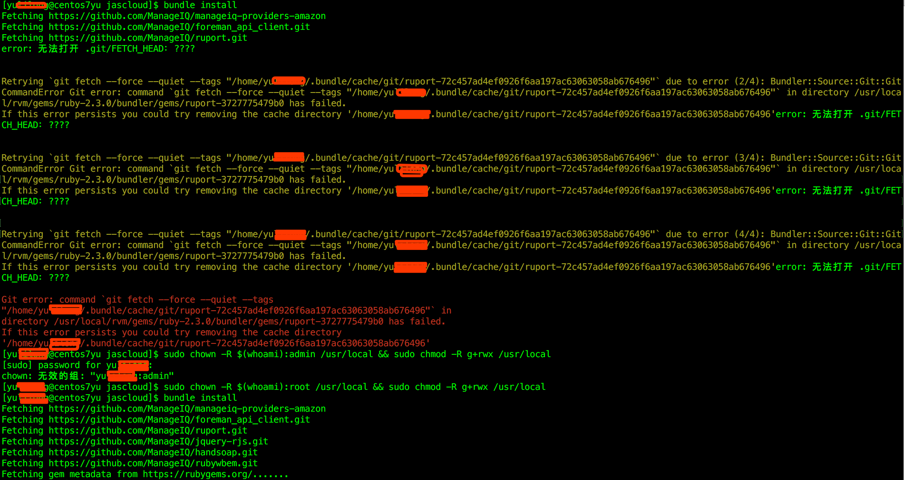
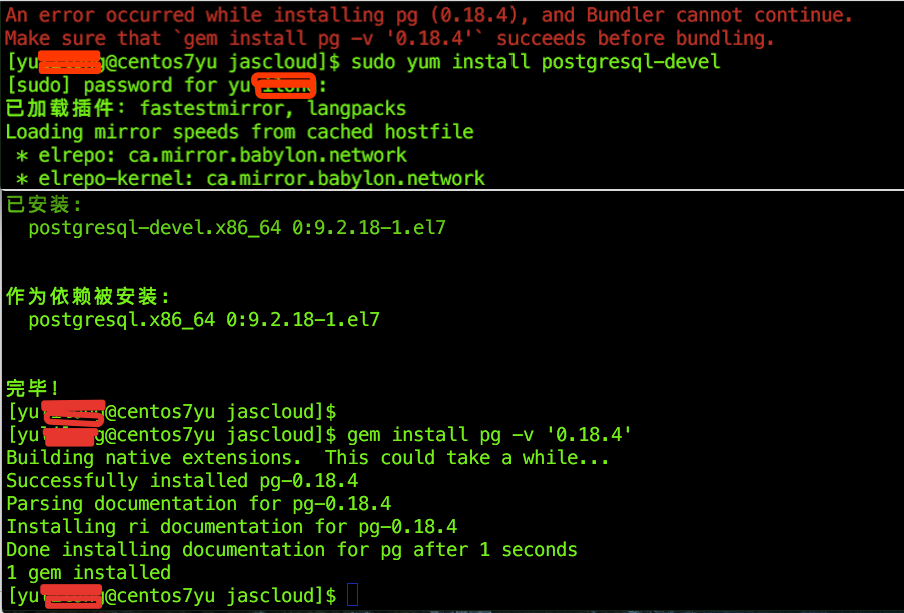
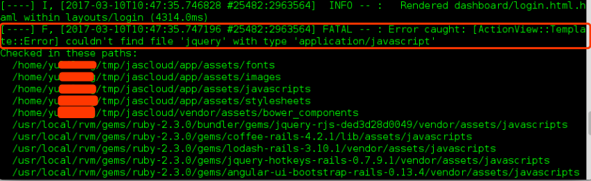
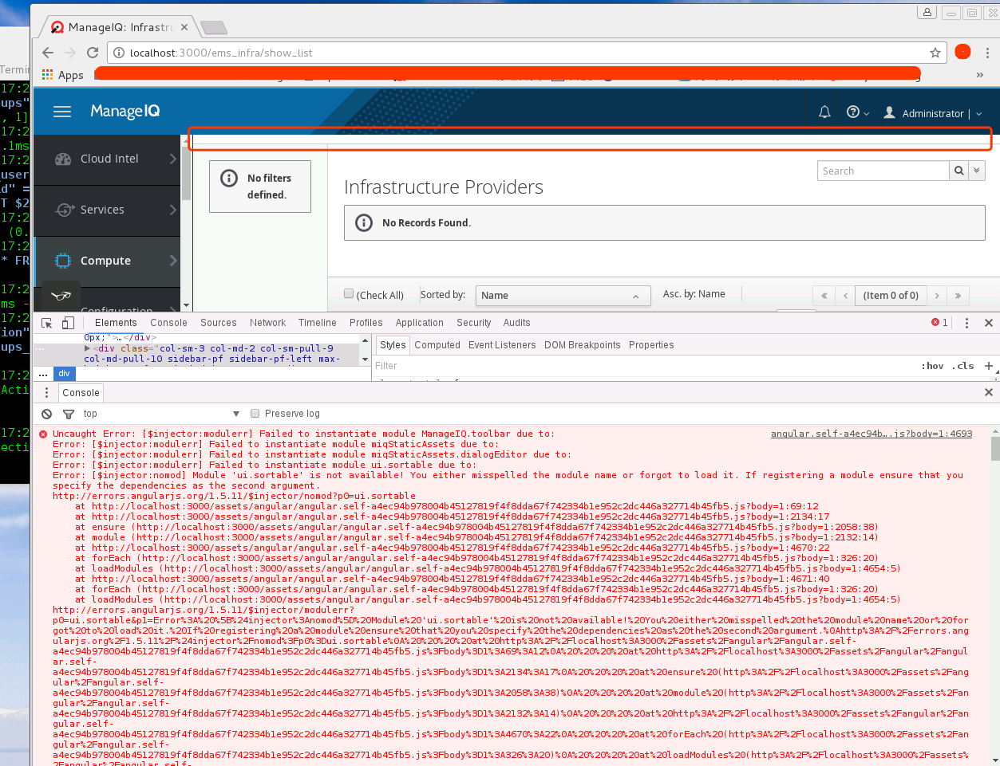

[TOC]

##  1. 运行`bin/setup`命令发生错误

当下载manageiq后运行：    
```bash
[manageiq]$ bin/setup 
== Seeding database ==
ActionCable version is 5.0.1 or newer, please see if we still need this patch: /home/yulilong/tmp/manageiq2016-12-30/config/initializers/action_cable_patch.rb!
** Using session_store: ActionDispatch::Session::MemCacheStore
rails aborted!
ActiveModel::MissingAttributeError: can't write unknown attribute `region_number`
/home/yulilong/.rvm/gems/ruby-2.3.0/gems/activerecord-5.0.1/lib/active_record/attribute.rb:182:in `with_value_from_database'
/home/yulilong/.rvm/gems/ruby-2.3.0/gems/activerecord-5.0.1/lib/active_record/attribute.rb:63:in `forgetting_assignment'
/home/yulilong/.rvm/gems/ruby-2.3.0/gems/activesupport-5.0.1/lib/active_support/core_ext/hash/transform_values.rb:16:in `block in transform_values'
/home/yulilong/.rvm/gems/ruby-2.3.0/gems/activesupport-5.0.1/lib/active_support/core_ext/hash/transform_values.rb:15:in `each'
/home/yulilong/.rvm/gems/ruby-2.3.0/gems/activesupport-5.0.1/lib/active_support/core_ext/hash/transform_values.rb:15:in `transform_values'
/home/yulilong/.rvm/gems/ruby-2.3.0/gems/activerecord-5.0.1/lib/active_record/attribute_set/builder.rb:26:in `transform_values'
```
查看rails版本：   
```bash
$ rails -v
Rails 5.0.0.1
```
在rails 版本是 5.0.0.1下，解决方法： 
打开Gemfile文件，修改如下：
```bash
-gem "rails",                          "~>5.0.0", ">= 5.0.0.1"
+gem "rails",                          "~>5.0.0", ">= 5.0.0.1", "< 5.0.1"
```
保存后，删除Gemfile.lock文件，然后从新运行命令即可解决问题。    

## 2. 修改官方虚拟机中的.js文件不起作用

下载： http://releases.manageiq.org/manageiq-ovirt-euwe-1-rc2.ova    
运行这个虚拟机后，修.rb文件时有效的，但是修改.js文件时不起作用的，经查找，虚拟机中.js文件已经编译了，
网页访问的资源(/var/www/miq/vmdb/public/assets). .js文件编译后都放在这个文件中了。
如果修改了.js文件，那么在虚拟机中运行:    

```bash
# bin/update
$ bin/rails evm:compile_assets
```
## 3. manageiq Gemfile 文件加载的不止一个

在根目录的Gemfile文件里面：    
```bash
# Load other additional Gemfiles
eval_gemfile(File.expand_path("gems/pending/Gemfile", __dir__))
Dir.glob("bundler.d/*.rb").each { |f| eval_gemfile(File.expand_path(f, __dir__)) }
```

## 4. bin/setup:26: warning: Insecure world writable dir /home/yu in PATH, mode 040777

```bash
$ sudo chmod go-w /home/yulilong
```

## 5. bundle install error:无法打开 .git/FETCH_HEAD：????

```bash
# https://github.com/Homebrew/legacy-homebrew/issues/43471
# centos 7.2的解决方案(亲测有效果)
sudo chown -R $(whoami):root /usr/local && sudo chmod -R g+rwx /usr/local
# Mac苹果系统的解决方式(没有试过)
sudo chown -R $(whoami):admin /usr/local && sudo chmod -R g+rwx /usr/local
```
      

## 6. gem install pg -v '0.18.4'  error

* description
```bash
ERROR:  Error installing pg:
	ERROR: Failed to build gem native extension.
.....
.....
.....
To see why this extension failed to compile, please check the mkmf.log which can be found here:
```
* solution:   
http://www.faqoverflow.com/serverfault/316703.html      
```bash
$ sudo yum install postgresql-devel

If you still encounter issues with pg_config, you may need to add it to your PATH, e.g.:
$ export PATH=$PATH:/usr/pgsql-x.x/bin
where x.x is your version, such as /usr/pgsql-9.2./bin.
```
    

## 7. Error caught: [ActionView::Template::Error] couldn't find file 'jquery' with type 'application/javascript'

     
解决方法：    

```bash
# 打开程序根目录bower.json,大约58到63行，
"resolutions": {
    "patternfly-bootstrap-treeview": "~2.1.1",
    "moment": ">=2.10.5",
    "d3": "~3.5.0",
    "jquery": ">1.8.*" # 改成"jquery": ">=1.7.1"，如果还出错，就把这一行删除然后在运行
  }
把"jquery": ">1.8.*"  改成"jquery": ">=1.7.1"
# 然后运行下面命令：
$ bower install 
# 如果这个命令运行后没有什么输出，那么运行 bower update 后再次运行这个命令
# 如果还是没有反应就看看是不是代理失效了，这个命令需要代理翻墙才可以，确认代理后从新运行这个命令
#或者使用下面命令
$ bin/update
```

## 8. Failed to instantiate module ManageIQ.toolbar due to:(头部工具栏消失)

       

解决方法：    
```     bash
# https://github.com/ManageIQ/manageiq/pull/13750
# http://talk.manageiq.org/t/failed-to-instantiate-module-manageiq-toolbar-due-to/2185/3
# 打开程序根目录bower.json,大约58到63行，
"dependencies": {
    "angular": "~1.5.8",
    "angular-animate": "~1.5.8",
    ········
    "manageiq-ui-components": "~0.0.9", # 这里改成"manageiq-ui-components": "0.0.11",
    ·······
  }
把"manageiq-ui-components": "~0.0.9",  改成 "manageiq-ui-components": "0.0.11",
# 然后运行下面命令：
$ bower update
$ bower install 
# 如果没有反应就看看是不是代理失效了，这个命令需要代理翻墙才可以，确认代理后从新运行这个命令
#或者使用下面命令
$ bin/update
```

## 9. run /opt/manageiq/manageiq/tools/ldap_ping.rb from command line

```bash
$ bundle exec rails r tools/ldap_ping.rb
```