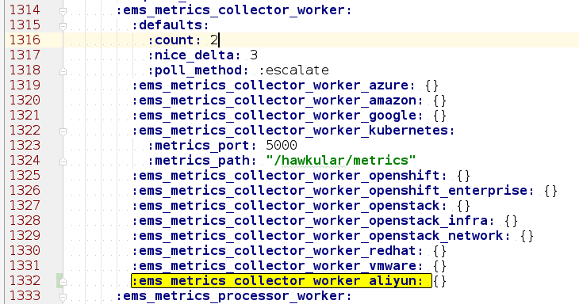
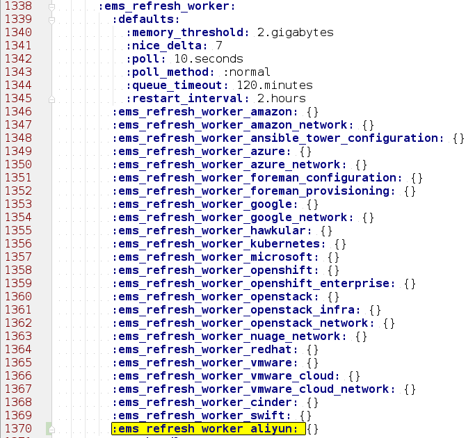
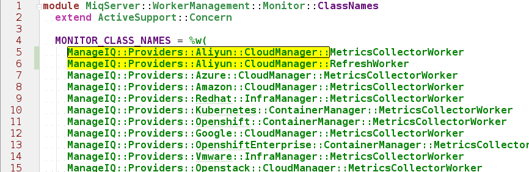
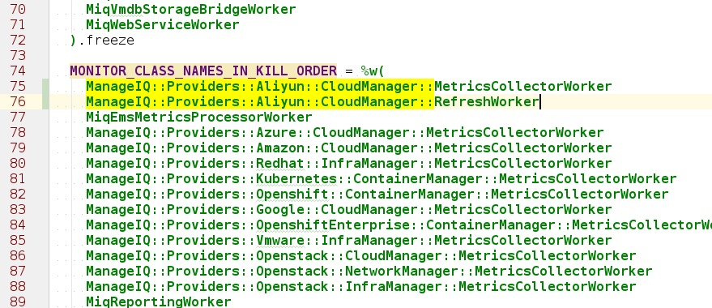
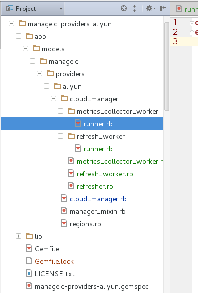

[TOC]

## 1. 添加一个新的providers代码目录

### 1.1 添加页面validate按钮可用设置

manageiq/app/assets/javascripts/controllers/ems_common/ems_common_form_controller.js  

在191行 附近如下代码处添加一行代码（$scope.emsCommonModel.emstype == "aliyun" ||）  
```bash
#!js

$scope.isBasicInfoValid = function() {
    if(($scope.currentTab == "default" && $scope.emsCommonModel.emstype != "azure") &&
      ($scope.emsCommonModel.emstype == "ec2" ||
      $scope.emsCommonModel.emstype == "aliyun" ||
       $scope.emsCommonModel.emstype == "openstack" && $scope.emsCommonModel.default_hostname ||
       $scope.emsCommonModel.emstype == "scvmm" && $scope.emsCommonModel.default_hostname ||
       $scope.emsCommonModel.emstype == "openstack_infra" && $scope.emsCommonModel.default_hostname ||
       $scope.emsCommonModel.emstype == "nuage_network"  && $scope.emsCommonModel.default_hostname ||
       $scope.emsCommonModel.emstype == "rhevm" && $scope.emsCommonModel.default_hostname ||
       $scope.emsCommonModel.emstype == "vmwarews" && $scope.emsCommonModel.default_hostname
```

## 2. 添加work

### 2.1 添加 ManageIQ::Providers::Aliyun::CloudManager::RefreshWorker

### 2.2 EVM CloudManager 启用监听

### 2.3 ManageIQ/manageiq/config/settings.yml

https://github.com/ManageIQ/manageiq/blob/euwe-1-rc2/config/settings.yml#L1258  
在这个配置文件里面添加：   
:ems_metrics_collector_worker_aliyun: {}  

  

https://github.com/ManageIQ/manageiq/blob/euwe-1-rc2/config/settings.yml#L1295  
添加如下代码：   
:ems_refresh_worker_aliyun: {}  

  

### 2.4 manageiq/app/models/miq_server/worker_management/monitor/class_names.rb

添加代码：  
ManageIQ::Providers::Aliyun::CloudManager::MetricsCollectorWorker      
ManageIQ::Providers::Aliyun::CloudManager::RefreshWorker     

  

   

### 2.5 providers中添加代码

可以参考其他providers，需要添加如下几个文件：   
manageiq-providers-aliyun/app/models/manageiq/providers/aliyun/cloud_manager/metrics_collector_worker/runner.rb     

manageiq-providers-aliyun/app/models/manageiq/providers/aliyun/cloud_manager/metrics_collector_worker.rb    

manageiq-providers-aliyun/app/models/manageiq/providers/aliyun/cloud_manager/refresh_worker.rb   

manageiq-providers-aliyun/app/models/manageiq/providers/aliyun/cloud_manager/refresher.rb

    

--------------------------------------------------------------------------------------------------------------
## 3. aliyun providers 读取信息

在显示套餐详细信息页面中添加aliyun providers 图标 (http://localhost:3000/flavor/show/15)###

图标存放位置：   
manageiq/app/assets/images/100   

图片名字：  
vendor-aliyun.png   

## 4. 添加自动监视

manageiq/lib/miq_automation_engine/service_models

在运行我worker时候，查看evm.log文件的时候发现如下错误，
```
Error: [uninitialized constant MiqAeMethodService::MiqAeServiceManageIQ_Providers_Aliyun_CloudManager]
[NameError]: uninitialized constant MiqAeMethodService::MiqAeServiceManageIQ_Providers_Aliyun_CloudManager  Method:[rescue in deliver]
```
参考其他的provider的写法，把aliyun相关的类添加上，一个类一个文件：        
MiqAeServiceManageIQ_Providers_Aliyun_CloudManager       
在里面每个provider都有很多类，写到哪个类的时候可以手动添加上。    

## 5. 代码编写

manageiq-providers-aliyun/app/models/manageiq/providers/aliyun/cloud_manager/refresher.rb     
这个文件是provider worker工作的入口，这个文件里面先搜集信息，然后保存信息，相关写法可参考amazon、openstack providers的写法

```
def parse_legacy_inventory(ems) # 这个方法是搜集云服务的一些信息（套餐、可用区、安全组、镜像、实例等）

def save_inventory(ems, _targets, hashes) # 这个方法保存搜集到的信息，2中保存方法
```

manageiq-providers-aliyun/app/models/manageiq/providers/aliyun/cloud_manager/refresh_parser.rb     
这个文件是搜集信息的具体代码定义处。     
```
def ems_inv_to_hashes #这里就是每个信息的搜集处
```
## 6. 套餐(Flavors) 

manageiq-providers-aliyun/app/models/manageiq/providers/aliyun/cloud_manager/refresh_parser.rb   
```
def get_flavors # 具体实现参考amazon、openstack providers的写法
```
添加文件,可参考amazon、openstack providers的写法     
manageiq-providers-aliyun/app/models/manageiq/providers/aliyun/cloud_manager/flavor.rb     
添加类：     
manageiq/lib/miq_automation_engine/service_models   
MiqAeServiceManageIQ_Providers_Aliyun_CloudManager_Flavor 

## 7. 可用区(Availability Zones)

app/models/manageiq/providers/aliyun/cloud_manager/refresh_parser.rb   
```
def get_availability_zones # 具体实现参考amazon、openstack providers的写法
```
添加文件,可参考amazon、openstack providers的写法      
app/models/manageiq/providers/aliyun/cloud_manager/availability_zone.rb     
添加类：       
manageiq/lib/miq_automation_engine/service_models   
MiqAeServiceManageIQ_Providers_Aliyun_CloudManager_AvailabilityZone

安全组是在NetworkManager 模块里面的，所以先提阿加 NetworkManager   

## 8. 添加ManageIQ::Providers::Aliyun::NetworkManager::RefreshWorker ##

## 9. EVM NetworkManager 启用监听

### 9.1 ManageIQ/manageiq/config/settings.yml

这里与上边的设置一样，在相关位置添加如下代码(大约是第1370行附近)：    
```
:ems_refresh_worker_aliyun_network: {}
```

### 9.2 manageiq/app/models/miq_server/worker_management/monitor/class_names.rb

在2个数组中（MONITOR_CLASS_NAMES、MONITOR_CLASS_NAMES_IN_KILL_ORDER）添加如下代码：  
```
ManageIQ::Providers::Aliyun::NetworkManager::RefreshWorker
```

### 9.3 添加 networkmanager 图标

manageiq/app/assets/images/svg     
添加一个图片，名字： vendor-aliyun_network.svg   
manageiq/app/assets/images/100     
添加一个图片，名字： vendor-aliyun_network.png  

### 9.4 NetworkManager代码

app/models/manageiq/providers/aliyun/network_manager.rb   
app/models/manageiq/providers/aliyun/network_manager/refresher.rb     
app/models/manageiq/providers/aliyun/network_manager/refresh_worker.rb   
app/models/manageiq/providers/aliyun/network_manager/refresh_parser.rb    
app/models/manageiq/providers/aliyun/network_manager/metrics_collector_worker.rb    
app/models/manageiq/providers/aliyun/network_manager/refresh_worker/runner.rb    
app/models/manageiq/providers/aliyun/network_manager/metrics_collector_worker/runner.rb   

可以看到，Aliyun::NetworkManager 与 Aliyun::CloudManager 文件、代码结构差不多。具体实现也是一样的。     

### 9.5 添加安全组(security_groups) 

app/models/manageiq/providers/aliyun/network_manager/refresh_parser.rb   
```
def get_availability_zones # 具体实现参考amazon、openstack providers的写法     
```
添加文件,可参考amazon、openstack providers的写法     
app/models/manageiq/providers/aliyun/network_manager/security_group.rb      
添加类：      
manageiq/lib/miq_automation_engine/service_models   
MiqAeServiceManageIQ_Providers_Aliyun_NetworkManager_SecurityGroup   

### 9.6 添加实例(Instance)

app/models/manageiq/providers/aliyun/network_manager/refresh_parser.rb   
```
get_instances # 具体实现参考amazon、openstack providers的写法   
```
添加文件,可参考amazon、openstack providers的写法        
app/models/manageiq/providers/aliyun/cloud_manager/vm.rb 
添加类：      
manageiq/lib/miq_automation_engine/service_models   
MiqAeServiceManageIQ_Providers_Aliyun_CloudManager_Vm   

添加方法：      
 app/models/manageiq/providers/aliyun/cloud_manager/refresher.rb  
```
def post_process_refresh_classes #如果没有这个方法，vm.rb将不能执行
  [::Vm]
end
```
这里也添加一下：      
db/fixtures/miq_searches.yml   
```
# line:43
-attributes:
     name: default_Platform / Aliyun
     description: Platform / Aliyun
     filter: !ruby/object:MiqExpression
       exp:
         "=":
           field: Vm-type
           value: ManageIQ::Providers::Aliyun::CloudManager::Vm
     search_type: default
     search_key: _hidden_
     db: Vm

- attributes: # line:1020
     name: default_Platform / Aliyun
     description: Platform / Aliyun
     filter: !ruby/object:MiqExpression
       exp:
         "=":
           field: VmCloud-type
           value: ManageIQ::Providers::Aliyun::CloudManager::Vm
     search_type: default
     search_key: _hidden_
     db: ManageIQ::Providers::CloudManager::Vm
```
数据库中，vms表 vendor字段的aliyun支持：    
app/models/vm_or_template.rb   
```
VENDOR_TYPES = {  # 如果没有这个，数据库将不能存储实例，数据验证失败
     "google"    => "Google",
     "aliyun"    => "Aliyun",
     "unknown"   => "Unknown"}
```
### 9.7 添加实例的开机、关机、重启功能

当在网页点击开机后，rails 会给evm 服务发送消息，由EVM 服务来完成的，
* 添加电源操作Operations模块：    
app/models/manageiq/providers/aliyun/cloud_manager/vm/operations.rb 
```
module ManageIQ::Providers::Aliyun::CloudManager::Vm::Operations
  extend ActiveSupport::Concern
  include_concern 'Guest'
  include_concern 'Power'
end
```
* 添加Guest模块，这里是重启服务器的实现部分    
 app/models/manageiq/providers/aliyun/cloud_manager/vm/operations/guest.rb      
```
module ManageIQ::Providers::Aliyun::CloudManager::Vm::Operations::Guest
  extend ActiveSupport::Concern
  included do
    supports :reboot_guest do
      unsupported_reason_add(:reboot_guest, unsupported_reason(:control)) unless supports_control?
      unsupported_reason_add(:reboot_guest, _("The VM is not powered on")) unless current_state == "on"
    end
  end

  def raw_reboot_guest
    with_provider_connection { |connection|
      parameters = {:InstanceId => ems_ref}
      connection.RebootInstance(parameters) # retrun {"RequestId"=>"9585CF9B-9049-41A1-B42B-BE3867C26AAB"}
    }
    # Temporarily update state for quick UI response until refresh comes along
    self.update_attributes!(:raw_power_state => "reboot") # show state as suspended
  end
end
```
* 添加Power模块，这里是开机、关机实现部分   
app/models/manageiq/providers/aliyun/cloud_manager/vm/operations/power.rb     
```
module ManageIQ::Providers::Aliyun::CloudManager::Vm::Operations::Power
  extend ActiveSupport::Concern

  def raw_start
    with_provider_connection { |connection|
      parameters = {:InstanceId => ems_ref}
      connection.StartInstance(parameters)
    }
    # Temporarily update state for quick UI response until refresh comes along
    self.update_attributes!(:raw_power_state => "powering_up")
  end

  def raw_stop
    with_provider_connection { |connection|
      parameters = {:InstanceId => ems_ref}
      connection.StopInstance(parameters)
    }
    # Temporarily update state for quick UI response until refresh comes along
    self.update_attributes!(:raw_power_state => "shutting_down")
  end
end

```
* 最后在vm类中添加Operations的引用    
app/models/manageiq/providers/aliyun/cloud_manager/vm.rb     
```
include_concern 'Operations'
```