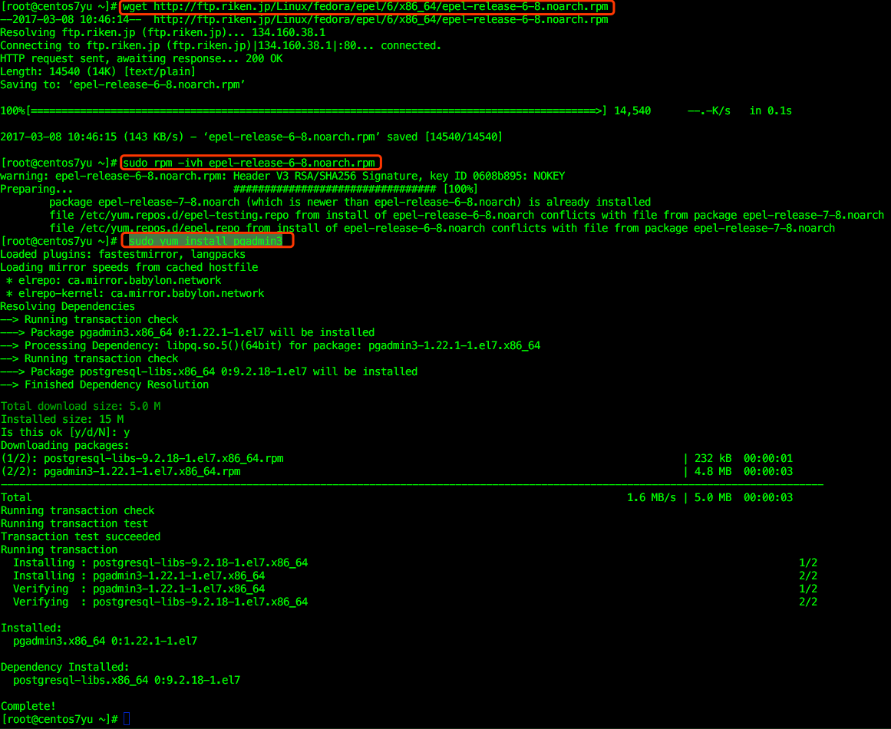

[TOC]

注意：要按照顺序安装

## 1. rvm ruby RubyGems Rails  isntall

https://www.digitalocean.com/community/tutorials/how-to-install-ruby-on-rails-on-centos-6-with-rvm  
* rvm install:
```bash
$ sudo yum update
$ sudo yum install curl
$ curl -L get.rvm.io | bash -s stable
如果提示缺少密钥，那么按照提示安装密钥
# If you ran the installer as root, run:
$ source /usr/local/rvm/rvm.sh
# If you installed it through a user with access to sudo:
$ source ~/.rvm/rvm.sh
$ source ~/.profile
$ rvm -v
如果出现版本，那么说明安装成功。
```
* ruby install:
```bash
$ rvm list known
选一个版本
$ rvm install 2.3.0
$ rvm use 2.3.0 --default
$ echo '[[ -s "$HOME/.rvm/scripts/rvm" ]] && . "$HOME/.rvm/scripts/rvm"' >>~/.bashrc
$ source ~/.bashrc
$ ruby -v
如果出现版本，那么说明安装成功。
```
```
ps:
/etc/profile:此文件为系统的每个用户设置环境信息,当用户第一次登录时,该文件被执行.并从/etc/profile.d目录的配置文件中搜集shell的设置.
/etc/bashrc:为每一个运行bash shell的用户执行此文件.当bash shell被打开时,该文件被读取.
~/.bash_profile:每个用户都可使用该文件输入专用于自己使用的shell信息,当用户登录时,该文件仅仅执行一次!默认情况下,他设置一些环境变量,执行用户的.bashrc文件.
~/.bashrc:该文件包含专用于你的bash shell的bash信息,当登录时以及每次打开新的shell时该文件被读取.
~/.bash_logout:当每次退出系统(退出bash shell)时,执行该文件.
```

* Install RubyGems:
```bash
$ rvm rubygems current
$ gem -v
如果出现版本，那么说明安装成功。
```
* Install Rails
```bash
$ gem install rails
$ rails -v
如果出现版本，那么说明安装成功。
```
## 2. 安装 pqadmin3

这里首先需要系统中已经安装了postgres，如果没有安装请先安装。  
* 查看linux中postgres 版本
```bash
$ psql --version
```
PostgreSQL是以加州大学伯克利分校计算机系开发的 POSTGRES，现在已经更名为PostgreSQL，版本 4.2为基础的对象关系型数据库管理系统（ORDBMS）。PostgreSQL支持大部分 SQL标准并且提供了许多其他现代特性：复杂查询、外键、触发器、视图、事务完整性、MVCC。同样，PostgreSQL 可以用许多方法扩展，比如， 通过增加新的数据类型、函数、操作符、聚集函数、索引。免费使用、修改、和分发 PostgreSQL，不管是私用、商用、还是学术研究使用。
```bash
$ su postgres
bash-4.2$ psql
postgres=# \du
$ sudo find / -name postgresql.conf
```
* 注：
* 1.如果postgres 没有设置密码则用如下命令设置：
$ sudo passwd postgres
* 2.如果psql notfound ，则 scl enable rh-postgresql94 bash，这个由于postgres升级导致的，http://manageiq.org/docs/guides/developer_setup/postgresql_software_collection

* centos7.2安装 pgadmin3       
https://yum.postgresql.org/       
http://www.voidcn.com/blog/houzhizhen/article/p-4388378.html        
```bash
$ wget http://ftp.riken.jp/Linux/fedora/epel/6/x86_64/epel-release-6-8.noarch.rpm
$ sudo rpm -ivh epel-release-6-8.noarch.rpm
$ sudo yum install pgadmin3
```


* 修改数据库配置文件，允许连接
```bash
$ sudo vi /var/opt/rh/rh-postgresql94/lib/pgsql/data/pg_hba.conf
```
找到下面的内容：
```bash
# IPv4 local connections:
host    all             all             127.0.0.1/32            ident
# IPv6 local connections:
host    all             all             ::1/128                 ident
```
**把ident修改为 trust** 

并在下面添加一行：
```bash
host	all 		all 		192.168.0.0/24 		trust
```

保存后重起数据库：
```bash
$ sudo systemctl restart rh-postgresql94-postgresql
```
* 查看数据库的运行：
```bash
$ lsof -i:5432
```

## 3. install rubymine

如果公司对版权有要求，请公司购买激活码，这时候请安装最新版。官网地址：https://www.jetbrains.com/ruby/

```
1. rubymine 最好是7.1.4版本的，这个网络上有激活码，此方法不建议。

个人网盘下载：
链接: https://pan.baidu.com/s/1o8PgQ50 密码: mk2q


2.下载后解压，进入bin目录，运行里面的rubymine.sh 即可安装。
使用中的问题：
3.rubymine安装后找不到ruby解释器位置：
http://stackoverflow.com/questions/17950288/rubymine-cant-find-sdk-where-is-it
* Windows - d:\dev\Ruby19\bin\ruby.exe
* Mac Brew - /usr/local/Cellar/ruby/2.0.0-p247/bin/ruby
* Ruby Version Manager - /Users/<user>/.rvm/rubies/ruby-1.9.3-p327/bin/ruby
* Linux/Mac Default - /usr/bin/ruby

```