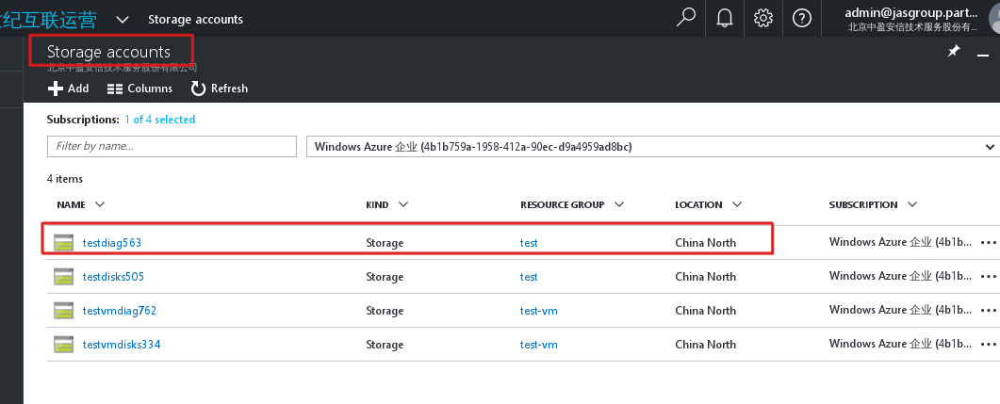

* **获得订阅下面所有Storage accounts信息**          
https://management.chinacloudapi.cn/subscriptions/4b1b759a-1958-412a-90ec-d9a4959ad8bc/providers/Microsoft.Storage/storageAccounts?api-version=2016-05-01      
返回信息：    
```
{"value":[{"id":"/subscriptions/4b1b759a-1958-412a-90ec-d9a4959ad8bc/resourceGroups/test/providers/Microsoft.Storage/storageAccounts/testdiag563","kind":"Storage","location":"chinanorth","name":"testdiag563","properties":{"creationTime":"2017-01-05T02:23:12.5759270Z","primaryEndpoints":{"blob":"https://testdiag563.blob.core.chinacloudapi.cn/","file":"https://testdiag563.file.core.chinacloudapi.cn/","queue":"https://testdiag563.queue.core.chinacloudapi.cn/","table":"https://testdiag563.table.core.chinacloudapi.cn/"},"primaryLocation":"chinanorth","provisioningState":"Succeeded","statusOfPrimary":"available"},"sku":{"name":"Standard_LRS","tier":"Standard"},
```
对应的网站信息：     

      

* **获取storageAccounts/testdiag563下key信息**      
https://management.chinacloudapi.cn/subscriptions/4b1b759a-1958-412a-90ec-d9a4959ad8bc/resourceGroups/test/providers/Microsoft.Storage/storageAccounts/testdiag563/listKeys?api-version=2016-05-01       
返回信息：    
```
NKxXLEqWH80FIReivSMGgNb8vwUHDl47UkeZ1Xm3LfPIazV+FhtRmTt56rTsy7EjhA9dVh0H+YrB5nZxBigMww==
```
这个应该查询存储账户下面的信息，知道后更新
```
{:url=>"https://testvmdisks334.blob.core.chinacloudapi.cn/?comp=list", :headers=>{"Content-Type"=>"", "x-ms-date"=>"Tue, 24 Jan 2017 01:35:14 GMT", "x-ms-version"=>"2015-12-11", :auth_string=>true, "content-type"=>"", "auth_string"=>true, "Authorization"=>"SharedKey testvmdisks334:0KTn90jFVVekdTyW/C4nMlw7wCditXSc7j+VFlfxSBU="}, :proxy=>nil, :ssl_version=>"TLSv1", :ssl_verify=>nil, :method=>:get}
{:url=>"https://testvmdisks334.blob.core.chinacloudapi.cn/vhds?restype=container&comp=list", :headers=>{"Content-Type"=>"", "x-ms-date"=>"Tue, 24 Jan 2017 01:35:14 GMT", "x-ms-version"=>"2015-12-11", :auth_string=>true, "content-type"=>"", "auth_string"=>true, "Authorization"=>"SharedKey testvmdisks334:2CRLCongUiRYOIUI6+DRJSuPDDLUDE0DQ3MiCkBg8us="}, :proxy=>nil, :ssl_version=>"TLSv1", :ssl_verify=>nil, :method=>:get}
```
返回结果：    
```
#<Azure::Armrest::StorageAccount::Blob:0x0000000368a1e8 name="centos7-base20170104130639.vhd", container="vhds", properties=#<Azure::Armrest::StorageAccount::Blob::Properties:0x00000003688fc8 last_modified="Wed, 04 Jan 2017 05:43:47 GMT", content_length="32212255232", content_type="application/octet-stream", content_encoding=nil, cache_control=nil, content_md5="DbNvfmFA1vHNiZdl1j8pnw==", lease_state="available", etag="0x8D43464A759CAEA", lease_status="unlocked", content_language=nil, content_disposition=nil, x_ms_blob_sequence_number="1", blob_type="PageBlob", server_encrypted="false">>
```
这个应该是 Blob 服务信息，以后更新：      
```
{:url=>"https://testvmdisks334.blob.core.chinacloudapi.cn/vhds/centos7-base20170104130639.vhd", :headers=>{"Content-Type"=>"", "x-ms-date"=>"Tue, 24 Jan 2017 01:35:14 GMT", "x-ms-version"=>"2015-12-11", :auth_string=>true, :verb=>"HEAD", "content-type"=>"", "auth_string"=>true, "verb"=>"HEAD", "Authorization"=>"SharedKey testvmdisks334:Z6j2M4pt8v+S7AvzgRL98a6bQMAdHglPp49/A+gNn+E="}, :proxy=>nil, :ssl_version=>"TLSv1", :ssl_verify=>nil, :method=>:head}
```
返回结果：    
```
#<Azure::Armrest::StorageAccount::BlobProperty:0x000000036562a8 name="centos7-base20170104130639.vhd", date="Tue, 24 Jan 2017 01:35:13 GMT", last_modified="Wed, 04 Jan 2017 05:43:47 GMT", content_length="32212255232", server="Windows-Azure-Blob/1.0 Microsoft-HTTPAPI/2.0", content_type="application/octet-stream", container="vhds", content_md5="DbNvfmFA1vHNiZdl1j8pnw==", x_ms_lease_status="unlocked", etag="\"0x8D43464A759CAEA\"", x_ms_blob_sequence_number="1", accept_ranges="bytes", x_ms_request_id="5151aca3-0001-0048-5ce2-75d6e7000000", x_ms_version="2015-12-11", x_ms_lease_state="available", x_ms_blob_type="PageBlob", x_ms_copy_id="adbfebef-a7fc-4d73-9d99-3dc410963fde", x_ms_copy_source="https://rdfepirv2bjbprdstr02.blob.core.chinacloudapi.cn/f1179221e23b4dbb89e39d70e5bc9e72/OpenLogic-CentOS-72-20161027?sv=2014-02-14&sr=b&si=PirCacheAccountPublisherContainerPolicy&sig=z263xtQMOGdgIbKykA3uXY07mB4k8DBJiyWwwkXcnIs%3D", x_ms_copy_status="success", x_ms_copy_progress="32212255232/32212255232", x_ms_copy_completion_time="Wed, 04 Jan 2017 05:08:16 GMT", x_ms_server_encrypted="false">
```