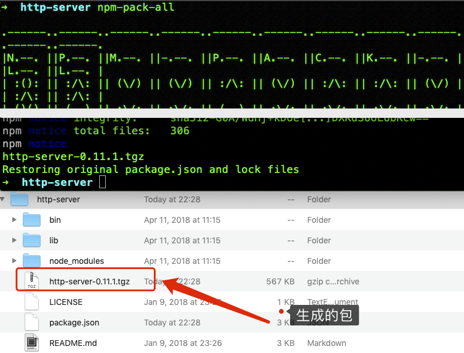

[TOC]

# npm使用介绍

## 1. 常用命令

npm 终端命令官方文档地址：https://docs.npmjs.com/cli/v10/commands，在这个文档里面可以选择不同的版本来查看npm命令

```bash
npm install express         # 安装express到项目中，安装的是最新版本
npm install express@3.0.6   # 安装express的3.0.6版本，  安装特定版本
npm install <name> -g       # 将包安装到全局环境中
npm install lodash --save   # save 在package.json文件的dependencies字段添加该package的名称和版本号
npm install lodash --save-dev # 在package.json文件的devDependencies字段添加该package的名称和版本号
npm i <name> -g             # 将包安装到全局环境中 i 是 install 的缩写，如果用i失败，则用install试试
npm init                    # 会引导你创建一个package.json文件，包括名称、版本、作者这些信息等
npm remove <name>           # 移除
npm uninstall lodash        # 卸载lodash
npm uninstall --save lodash # save 卸载的同时想把这个package包的信息从package.json文件的dependencies字段中也一并删除
npm update <name>           # 更新
npm root                    # 查看当前包的安装路径       
npm ls                      # 列出当前安装的了所有包
npm root                    # 查看当前包的安装路径
npm help                    # 帮助，如果要单独查看install命令的帮助，可以使用的npm help install
which npm                   # 确认我们现在用的npm是来自哪个目录
npm --version               # 查看版本
npm list                    # 列出自己项目已经安装过的模块
npm list --depth 1          # 列出已安装的包，深度1
npm list -g --depth 0       # 全局包
npm search mkdir            # 搜索mkdir是否存在
npm info express            # 查看包的信息
```
npm 命令参数：    
```bash
-g：全局安装。
--save：将保存配置信息至package.json（package.json是nodejs项目配置文件）；
-dev：保存至package.json的devDependencies节点，不指定-dev将保存至dependencies节点；
-D：保存至package.json的devDependencies节点下。
```

## 2. npm一些命令介绍

### 2.1 npm install 安装原理

npm install 命令用来安装模块到node_modules目录。     
安装之前，npm install会先检查，node_modules目录之中是否已经存在指定模块。如果存在，就不再重新安装了，即使远程仓库已经有了一个新版本，也是如此。          
如果你希望，一个模块不管是否安装过，npm 都要强制重新安装，可以使用-f或--force参数。

```bash
npm install <packageName> --force
```

### 2.2 npm update

如果想更新已安装模块，就要用到npm update命令。       
```bash
npm update <packageName> 
```
它会先到远程仓库查询最新版本，然后查询本地版本。如果本地版本不存在，或者远程版本较新，就会安装。      

### 2.3 registry

npm update命令怎么知道每个模块的最新版本呢？        
答案是 npm 模块仓库提供了一个查询服务，叫做 registry 。以 npmjs.org 为例，它的查询服务网址是 :      
https://registry.npmjs.org/        
这个网址后面跟上模块名，就会得到一个 JSON 对象，里面是该模块所有版本的信息。比如，访问https://registry.npmjs.org/react ，就会看到 react 模块所有版本的信息。         
它跟下面命令的效果是一样的。      

```bash
$ npm view react
# npm view 的别名
$ npm info react
$ npm show react
$ npm v react
```
registry 网址的模块名后面，还可以跟上版本号或者标签，用来查询某个具体版本的信息。比如， 访问 https://registry.npmjs.org/react/v0.14.6 ，就可以看到 React 的 0.14.6 版。      
返回的 JSON 对象里面，有一个dist.tarball属性，是该版本压缩包的网址。      
```js
dist: {
  shasum: '2a57c2cf8747b483759ad8de0fa47fb0c5cf5c6a',
  tarball: 'http://registry.npmjs.org/react/-/react-0.14.6.tgz' 
},
```
到这个网址下载压缩包，在本地解压，就得到了模块的源码。npm install和npm update命令，都是通过这种方式安装模块的。      

### 2.4 npm 的缓存目录

`npm install`或`npm update`命令，从 `registry` 下载压缩包之后，都存放在本地的缓存目录。         
这个缓存目录，在 Linux 或 Mac 默认是用户主目录下的`.npm`目录，在 Windows 默认是`%AppData%/npm-cache`。通过配置命令，可以查看这个目录的具体位置。        

```bash
$ npm config get cache
~/.npm

# 浏览这个目录
$ ls ~/.npm 
# 或者
$ npm cache ls
```
你会看到里面存放着大量的模块，储存结构是{cache}/{name}/{version}。        
```bash
$ npm cache ls react
~/.npm/react/react/0.14.6/
~/.npm/react/react/0.14.6/package.tgz
~/.npm/react/react/0.14.6/package/
~/.npm/react/react/0.14.6/package/package.json
```
每个模块的每个版本，都有一个自己的子目录，里面是代码的压缩包package.tgz文件，以及一个描述文件package/package.json。      
除此之外，还会生成一个{cache}/{hostname}/{path}/.cache.json文件。比如，从 npm 官方仓库下载 react 模块的时候，就会生成registry.npmjs.org/react/.cache.json文件。     
这个文件保存的是，所有版本的信息，以及该模块最近修改的时间和最新一次请求时服务器返回的 ETag 。      

```json
{
  "time":{
    "modified":"2016-01-06T23:52:45.571Z",
    // ...
  },
  "_etag":"\"7S37I0775YLURCFIO8N85FO0F\""
}
```
对于一些不是很关键的操作（比如npm search或npm view），npm会先查看.cache.json里面的模块最近更新时间，跟当前时间的差距，是不是在可接受的范围之内。如果是的，就不再向远程仓库发出请求，而是直接返回.cache.json的数据。       


### 2.5 清除npm缓存

需要清理缓存的情况：     
1、缓存占用磁盘空间比较大      
2、由于网络原因npm包下载终端，再次安装失败报错，可以尝试清理缓存

清除缓存命令：

```bash
# 注意：--force 参数是必需的，因为npm默认不允许你清除缓存，以防止不必要的网络流量和安装时间的增加。
~ npm cache clean --force
```

验证缓存是否已经被清除(或者从文件夹中查看cache是否已经删除)：

```bash
# 如果这个命令从远程仓库下载了包而不是从本地缓存中获取，那么说明缓存已经被成功清除。
npm install <package-name>
```

或者使用终端命令直接删除文件(实际中没尝试过，慎用)：

```bash
~ rm -rf ~/.npm/*
```

请注意，清除npm缓存可能会导致你在下次安装相同的包时需要重新从远程仓库下载，这可能会增加安装时间。因此，只有在确实需要清除缓存时才应该执行这个操作。

另外，如果你使用的是npm的较新版本（如npm 7及以上），npm已经对缓存管理进行了优化，因此你可能不需要经常手动清除缓存。在大多数情况下，npm会自动处理缓存的更新和清理工作。

### 2.6 其他与缓存相关的命令

- 查看缓存的状态：`npm cache verify` 
- 设置缓存的最大存储时间（以秒为单位）：`npm config set cache-max=<seconds>` 
- 设置缓存的存储路径：`npm config set cache=<path>`


### 2.7 模块的安装过程

Node模块的安装过程是这样的:      
```bash
1. 发出npm install命令
2. npm 向 registry 查询模块压缩包的网址
3. 下载压缩包，存放在~/.npm目录
4. 解压压缩包到当前项目的node_modules目录
```
注意，一个模块安装以后，本地其实保存了两份。一份是~/.npm目录下的压缩包，另一份是node_modules目录下解压后的代码。        
但是，运行npm install的时候，只会检查node_modules目录，而不会检查~/.npm目录。也就是说，如果一个模块在～/.npm下有压缩包，但是没有安装在node_modules目录中，npm 依然会从远程仓库下载一次新的压缩包。        
这种行为固然可以保证总是取得最新的代码，但有时并不是我们想要的。最大的问题是，它会极大地影响安装速度。即使某个模块的压缩包就在缓存目录中，也要去远程仓库下载，这怎么可能不慢呢？          
另外，有些场合没有网络（比如飞机上），但是你想安装的模块，明明就在缓存目录之中，这时也无法安装。              

### 2.8 --cache-min 参数

为了解决这些问题，npm 提供了一个--cache-min参数，用于从缓存目录安装模块。         
--cache-min参数指定一个时间（单位为分钟），只有超过这个时间的模块，才会从 registry 下载。            

```bash
$ npm install --cache-min 9999999 <package-name>
```
上面命令指定，只有超过999999分钟的模块，才从 registry 下载。实际上就是指定，所有模块都从缓存安装，这样就大大加快了下载速度。  
它还有另一种写法:    
```bash
$ npm install --cache-min Infinity <package-name>
```
但是，这并不等于离线模式，这时仍然需要网络连接。因为现在的--cache-min实现有一些问题。         
>   （1）如果指定模块不在缓存目录，那么 npm 会连接 registry，下载最新版本。这没有问题，但是如果指定模块在缓存目录之中，npm 也会连接 registry，发出指定模块的 etag ，服务器返回状态码304，表示不需要重新下载压缩包。
>   （2）如果某个模块已经在缓存之中，但是版本低于要求，npm会直接报错，而不是去 registry 下载最新版本。

npm 团队知道存在这些问题，正在重写 cache。并且，将来会提供一个--offline参数，使得 npm 可以在离线情况下使用。       
不过，这些改进没有日程表。所以，当前使用--cache-min改进安装速度，是有问题的。          

## 3. 更换npm的源地址:npm config set registry

查看npm包的源地址（包下载地址）：   

```bash
npm config get registry 
https://registry.npmjs.org/
```

更换npm的源地址:  

```bash
// 淘宝源
npm config set registry https://registry.npm.taobao.org  
// 自己本来的源
npm config set registry https://registry.npmjs.org/
```

参考链接：http://blog.csdn.net/v2810769/article/details/52585662

## 4. npm的其他配置:关闭进度条，显示每个请求

### 4.1 显示npm发的每一个请求

```bash
npm config set loglevel http
```

执行这个命令后，终端不会有任何显示。

### 4.2 关闭npm安装包时显示的进度条

```bash
npm config set progress false
```

执行这个命令后，终端不会有任何显示。

## 5. npm安装本地包离线包

### 5.1 从npm仓库获取离线包

***注意***：这个方式获取的包在安装的时候，这个包依赖的其他的包还是会需要从网络中的npm仓库冲拉取的。

在已经安装了包的项目里面，使用`npm info packageName`来获取包信息：

```bash
~ npm info http-server # 也是可以查看特定版本的：npm info http-server@0.11.1
npm http fetch GET 200 https://registry.npm.taobao.org/http-server 343ms

http-server@0.12.3 | MIT | deps: 10 | versions: 40
A simple zero-configuration command-line http server
https://github.com/http-party/http-server#readme

bin: http-server, hs

dist
.tarball: https://registry.npm.taobao.org/http-server/download/http-server-0.12.3.tgz
.shasum: ba0471d0ecc425886616cb35c4faf279140a0d37

dependencies:
basic-auth: ^1.0.3    minimist: ^1.2.5   colors: ^1.4.0        opener: ^1.5.1
```

其中`.tarball: https://registry.npm.taobao.org/http-server/download/http-server-0.12.3.tgz`，这行中的链接就是这个包的下载链接，在浏览器中打开这个链接下载包。

### 5.2 从本地已经安装的包中提取离线包

***注意***：这种方式把包和包的依赖包都打包了，做到了真正的离线安装这个包。

1、安装打包离线工具`npm-pack-all`：

```bash
~ npm install npm-pack-all -g 
```

2、全局安装需要打包的包，并进入到这个包的全局安装路径中，注意：只有安装在全局中，才能把这个包的依赖放到自己的文件夹中，这样打包就能全部打包了。

```bash
~ npm i http-server -g
```

然后打开npm全局安装的文件夹，终端中使用`npm root -g` 来查看npm全局的安装路径：

```bash
~ npm root -g

# Mac电脑的路径
/usr/local/lib/node_modules
# window电脑一般：C:\Users\用户名\AppData\Roaming\npm\node_modules
```

在全局安装路径中找到包后进入包中然后终端运行命令打包：

```bash
~ cd /usr/local/lib/node_modules/http-server
~ npm-pack-all

npm notice integrity:     sha512-G0A/WdHj+kDOe[...]DXKdS6OL6bKcw==
npm notice total files:   306                                     
npm notice 
http-server-0.11.1.tgz
Restoring original package.json and lock files
```

命令执行结束后，会在文件夹中生成一个`http-server-0.11.1.tgz`这个文件就是最终的离线包。把这个包拿出来即可。




### 5.3 安装离线npm包

把下载的包解压放到要安装的项目中，然后终端使用如下命令：

```bash
~ npm install http-server-0.11.1.tgz

+ http-server@0.11.1
added 1 package from 1 contributor in 0.879s

3 packages are looking for funding
  run `npm fund` for details
```


## cnpm 介绍

1. 说明：因为npm安装插件是从国外服务器下载，受网络影响大，可能出现异常，如果npm的服务器在中国就好了，所以我们乐于分享的淘宝团队干了这事。来自官网：“这是一个完整 npmjs.org 镜像，你可以用此代替官方版本(只读)，同步频率目前为 10分钟 一次以保证尽量与官方服务同步。” 这就是cnpm.       
2. 官方网址：http://npm.taobao.org       
3. 安装：命令提示符执行`npm install cnpm -g --registry=https://registry.npm.taobao.org`或`npm i -g cnpm`     
4. 安装完后最好查看其版本号cnpm -v或关闭命令提示符重新打开，安装完直接使用有可能会出现错误        

5. **cnpm跟npm用法完全一致，只是在执行命令时将npm改为cnpm。**


## 参考链接     

http://blog.csdn.net/haidaochen/article/details/8546796/       
http://www.nodeclass.com/articles/810142     
http://www.cnblogs.com/jiuyi/p/5353676.html