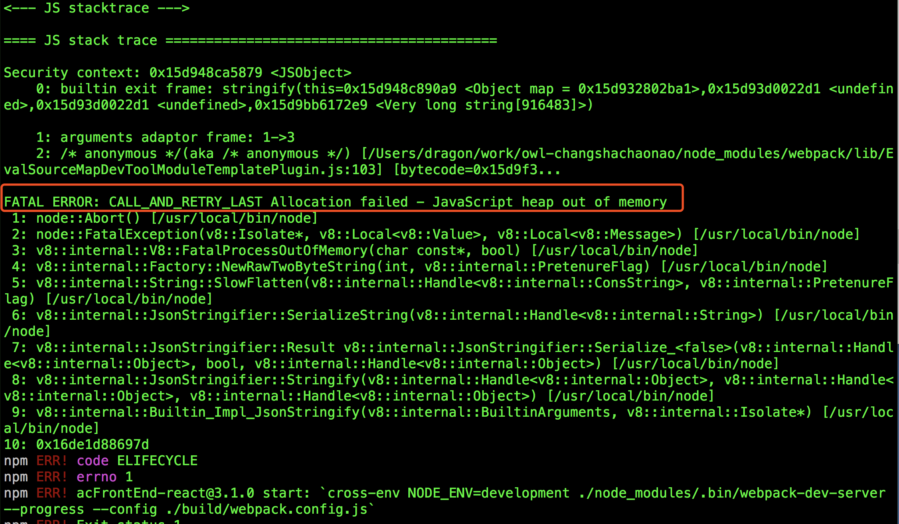
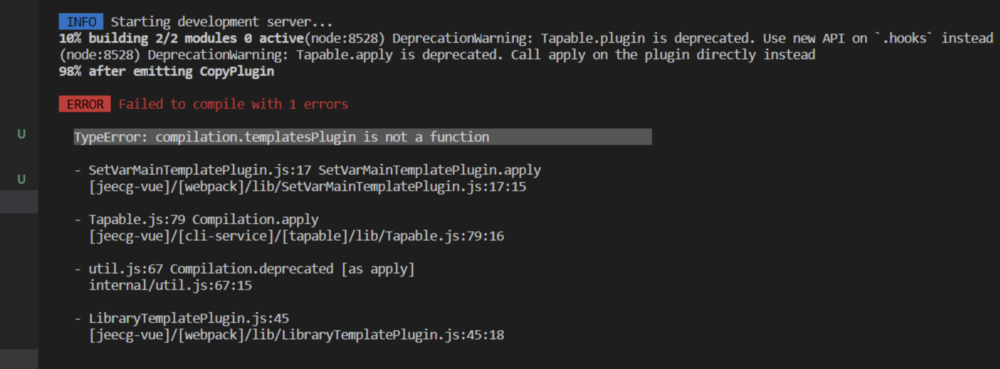
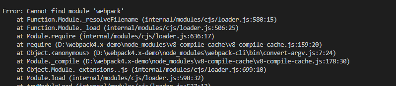
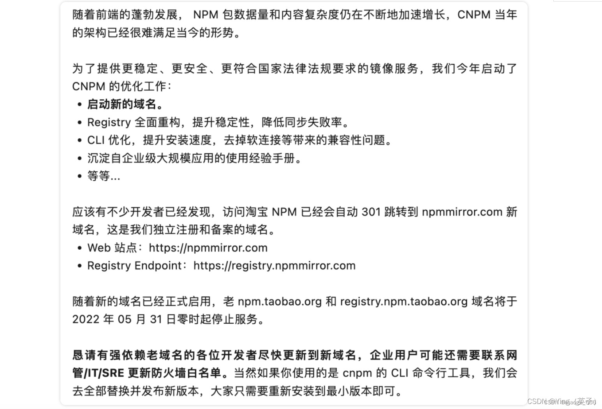
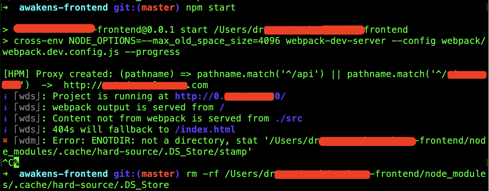

[TOC]

# NPM常见问题

## 1. 使用淘宝源安装包出错

使用npm安装`webpack`包的时候，发生了错误

```bash
npm install webpack --save-dev
   // 发生如下错误
   events.js:160░░░░░░⸩ ⠸ extract:repeat-string: sill extract remove-trailing-sepa
         throw er; // Unhandled 'error' event
         ^
   Error: write after end
       at writeAfterEnd (_stream_writable.js:193:12)
       at PassThrough.Writable.write (_stream_writable.js:240:5)
       at PassThrough.Writable.end (_stream_writable.js:477:10)
```

后来查看安装源是淘宝的，换源可以解决这个问题：

设置npmjs的源(可能需要VPN)，如果https不行就换成http的。

```bash
// 查看安装源
npm config get registry 	

// 设置npm自己的源
npm config set registry https://registry.npmjs.org/
npm config set registry http://registry.npmjs.org/

// 设置为淘宝源
npm config set registry https://registry.npm.taobao.org/
npm config set registry http://registry.npm.taobao.org/
```

这个问题有的时候会发生，有时没问题，看人品了。

还有一种情况，使用淘宝源： 使用公司网络安装失败，但是使用自己网络则安装成功。


## 2. listen EADDRINUSE 服务端口被占用报错

```bash
npm start

> webpack-dev-server --config ./config/webpack.config.dev.js

events.js:160
      throw er; // Unhandled 'error' event
      ^
Error: listen EADDRINUSE 127.0.0.1:8080
    at Object.exports._errnoException (util.js:1018:11)
    at exports._exceptionWithHostPort (util.js:1041:20)
    at Server._listen2 (net.js:1258:14)
    at listen (net.js:1294:10)
```

当使用`npm start`启动一个web开发服务时，显示上面错误，经查找是端口(8080)被占用了。

解决方法：

1. 换一个端口，重新运行即可。
2. 找到被占用的端口，关掉占用的端口，重新运行即可。

```bash
// 查看是哪个进程占用的端口
~ sudo lsof -n -P | grep :8080
node      6534             dragon   14u     IPv4 0x3cf6bb332552824d        0t0        TCP 127.0.0.1:8080 (LISTEN)

// 关闭这个服务
kill -9 6534
```

## 3. npm start 启动后过一会崩溃结束：内存溢出

当使用`npm start`启动服务后，由于修改代码，导致服务频繁编译，由此导致内存溢出错误：

```bash
==== JS stack trace =========================================

Security context: 0x15d948ca5879 <JSObject>
    0: builtin exit frame: stringify(this=0x15d948c890a9 <Object map = 0x15d932802ba1>,0x15d93d0022d1 <undefined>,0x15d93d0022d1 <undefined>,0x15d9bb6172e9 <Very long string[916483]>)

    1: arguments adaptor frame: 1->3
    2: /* anonymous */(aka /* anonymous */) [/Users/dragon/work/owl-changshachaonao/node_modules/webpack/lib/EvalSourceMapDevToolModuleTemplatePlugin.js:103] [bytecode=0x15d9f3...

FATAL ERROR: CALL_AND_RETRY_LAST Allocation failed - JavaScript heap out of memory
 1: node::Abort() [/usr/local/bin/node]
 2: node::FatalException(v8::Isolate*, v8::Local<v8::Value>, v8::Local<v8::Message>) [/usr/local/bin/node]
```



解决办法：

1、node v8.0以上版本支持在环境变量中设置最大内存：

```bash
export NODE_OPTIONS=--max_old_space_size=4096
```

如果是mac电脑，可在终端环境脚本中添加上面命令，然后重启终端：

```bash
vi .zshrc

export NODE_OPTIONS=--max_old_space_size=5120

# 或者运行命令立即生效：source .zshrc
```

2、安装`increase-memory-limit`npm包，使用该包增加运行内存：

```bash
# 全局安装increase-memory-limit
npm install -g increase-memory-limit
# 进入工程目录，执行：
increase-memory-limit
```

注意：`increase-memory-limit`命令会操作``node_modules``里面对应文件，可能会导致git提交命令冲突，解决方法是删除`node_modules`文件夹，重新安装一个就好。

Window 系统如果运行`npm start`命令报错：

```bash
"'node --max-old-space-size=10240"' 不是内部或外部命令,也不是可运行的程序
```


在 \node_modules.bin 下的 *.cmd 文件中，在 ENDLOCAL 语句的上边一句，修改【"%_prog%"】 为 【%_prog%】，即去掉双引号。

## 4. npm install的时候使用特定的源安装

有的时候，使用`npm config set registry https://registry.npm.taobao.org/`设置一个源后， 

有个别的npm包不是这个源里面的，如果在设置一下修改源，然后安装后，在改回来有点麻烦，可以在`npm i`的时候指定安装源，这样就不需要设置更换源了

使用方法：

```bash
npm i --registry=https://registry.npm.taobao.org/
```

在`--registry=`后面放入npm包的源即可

## 5. npm安装指定版本、最新版本

安装指定版本：

```bash
npm install npm@6.8.0
```

安装最新版本：

```bash
npm install package_name
# 执行上面命令后会安装最新版本npm包，等同于
npm install package_name@latest
```

安装未来版本

```bash
npm install package_name@next
```

这个是beta版本，还未正式发布，所以会有风险

## 6. npm ERR! cb() never called! 解决

当运行`npm install`的时候，终端出现如下报错：

```bash
npm ERR! cb() never called!

npm ERR! This is an error with npm itself. Please report this error at:
npm ERR!     <https://npm.community>

npm ERR! A complete log of this run can be found in:
npm ERR!     /Users/lenno/.npm/_logs/2021-04-04T08_14_08_150Z-debug.log
```

解决办法：

1、清除npm缓存：

```bash
sudo npm cache clean -f
```

一般来说已经解决问题了。

## 7. Unable to authenticate：认证失败

当运行`npm install`的时候，终端报错：

```bash
npm ERR! code E401
npm ERR! Unable to authenticate, need: BASIC realm="Sonatype Nexus Repository Manager"
```

大致的意思是认证失败，之前使用 `npm login`登陆过，现在需要从新登陆。

解决办法：

1、如果记得账号密码，那么使用`npm login`命令然后重新输入账号密码即可

2、如果忘记密码了，那么可以找到`.npmrc`配置文件删除登陆信息：

.npmrc存放路径：

```js
// windows电脑
C:\Users\user-name
// mac电脑
/Users/user-name
```

打开.npmrc文件后里面内容类似如下：

```bash
registry=https://registry.npm.taobao.org/
//registry.npm.taobao.org/:_authToken=NpmToken.7d2371ad-2e98-3d43-bd93-463f2d2cb2bb
loglevel=http
progress=false
```

把文件中的第二行内容删除(最终内容为如下)：

```bash
registry=https://registry.npm.taobao.org/
loglevel=http
progress=false
```

保存后，在运行`npm install`就可以正常安装包了。

## 8. 查看项目中是否安装了特定包

终端进入到项目中，然后使用`npm ls packageName`命令来查看思否安装了某个包：

项目中没有安装包：

```bash
~ npm ls react

basic-common@0.1.0 /Users/user/work/certificate
└── (empty)
```

项目中安装了包：

```bash
~ npm ls eslint

basic-common@0.1.0 /Users/user/work/certificate
└── eslint@6.8.0
```

## 9. TypeError: compilation. templatesPlugin is not a function

在一个vue 前端项目中，当安装好依赖包，启动服务后，发现报如下错误：



经过网上查找，发现是webpack版本问题，可以尝试如下几个方案

解决方案一：

```bash
 # 最新版本的 webpack 包
 npm add webpack@latest
```

解决方案二：

在方案一的基础上，删除`node_modules`文件夹后，重新安装依赖包`npm install`。

解决方案三(实测解决了)：

在方案一的基础上，安装html-webpack-plugin包

```bash
npm i --save-dev html-webpack-plugin

# 或者如下命令
npm i --save-dev html-webpack-plugin@next
```


## 10. npm install 报错：npm :this is an error with npm itself.

当使用`npm i` 命令安装依赖包的时候，报如下错误：

```bash
npm :this is an error with npm itself. Please report this error at: <https://github.com/npm/npm/issues>
```

解决方案：

```bash
# 清除npm缓存
npm cache clean --force

npm WARN using --force I sure hope you know what you are doing.
```

如果有`package-lock.json`文件，删除，然后从新`npm install`。

经实测这个方案可以解决。

## 11. Error: Cannot find module 'webpack' 问题解决办法

当启动本地前端服务的时候，发现终端报如下错误：



看报错是没有找到webpack模块，所以在项目中安装一下webpack：

```bash
npm install --save-dev webpack

npm WARN ttt No README data
npm WARN ttt No license field.

+ webpack@5.69.1
added 71 packages from 121 contributors in 9.761s

8 packages are looking for funding
  run `npm fund` for details
```

再次运行后就会解决问题，如果还不行，查看安装的webpack的版本：

```bash
npm info webpack
```

可尝试更换webpack版本：`webpack@5.69.1` 或者 `webpack@4.22.0`


安装上面的包后，如果报如下错误：

```bash
Syntax Error: Error: Cannot find module ‘cache-loader‘
```

解决方法：

进入项目目录，删除node_modules文件和package-lock.json文件，然后从新安装包`npm install`，然后重启项目就可以了。

## 12. request to https://registry.npm.taobao.org/antd failed, reason: certificate has expired

详情见：https://blog.csdn.net/maoge_666/article/details/136038003

在使用npm i 命令安装依赖包的时候，发现终端报错：

```bash
~ npm i
npm ERR! code CERT_HAS_EXPIRED
npm ERR! errno CERT_HAS_EXPIRED
npm ERR! request to https://registry.npm.taobao.org/antd failed, reason: certificate has expired

npm ERR! A complete log of this run can be found in:
npm ERR!     /Users/dragon/.npm/_logs/2024-10-31T07_22_08_061Z-debug.log
```

进过查找，使用的安装源是淘宝的`egistry.npm.taobao.org`。

早在 2021 年，淘宝就发文称，[npm 淘宝镜像](https://so.csdn.net/so/search?q=npm 淘宝镜像&spm=1001.2101.3001.7020)已经从 registry.npm.taobao.org 切换到了 registry.npmmirror.com。旧域名也将于 2022 年 5 月 31 日停止服务（不过，直到今天 HTTPS 证书到期才真正不能用了）



解决方案：

1、查看当前的npm镜像设置：`npm config list`

```bash
~ npm config list
; cli configs
metrics-registry = "https://registry.npm.taobao.org/"
scope = ""
user-agent = "npm/6.4.1 node/v8.16.0 darwin x64"

; project config /Users/dragon/work/awakens-frontend/.npmrc
scripts-prepend-node-path = true
```

2、清空缓存：`npm cache clean --force`

3、然后修改包下载地址：

```bash
# 淘宝源新地址，建议使用这个
npm config set registry https://registry.npmmirror.com

# npm官方地址
npm config set registry https://registry.npmjs.org/
```

5、再次运行： `npm config list`，查看 registry 已经被更改为默认的 npm 公共镜像地址


## 13. npm install遇到sha1认证失败问题

在执行`npm i`命令的时候，报如下错误：

```bash
verbose node v8.16.0
verbose npm  v6.14.18
error code EINTEGRITY
error sha1-iHs7qdhDk+h6CgufTLdWGYtTVIo= integrity checksum failed when using sha1: wanted sha1-iHs7qdhDk+h6CgufTLdWGYtTVIo= but got sha512-xIp7/apCFJuUHdDLWe8O1HIkb0kQrOMb/0u6FXQjemHn/ii5LrIzU6bdECnsiTF/GjZkMEKg1xdiZwNqDYlZ6g== sha1-XcB1Osv4Uhyi4PE3tFeLkXsQzyQ=. (7610 bytes)
verbose exit [ 1, true ]
```

**解决方案步骤如下：**

1. 删除 node_modules 文件夹。终端命令： rm -rf node_modules/
2. 删除 package-lock.json 文件。 终端命令：rm package-lock.json
3. 清除npm缓存。终端命令：npm cache verify
4. 重新安装依赖包。终端命令：npm install


## 14. npm start报错：Error: ENOTDIR......DS_Store/stamp

当使用`npm i`命令启动服务的时候，发现终端报错：

```bash
｢wdm｣: Error: ENOTDIR: not a directory, stat '/Users/dragon/aaa/t-frontend/node_modules/.cache/hard-source/.DS_Store/stamp'
```



解决办法：

终端删除.DS_Store

```bash
rm -rf /Users/dragon/aaa/t-frontend/node_modules/.cache/hard-source/.DS_Store
```

从新启动服务就没问题了。

参考资料：https://github.com/mzgoddard/hard-source-webpack-plugin/issues/456

上面的可能是临时的，有可能一段时间后还会出现问题。

如果可以的话，可以在webpack.config 配置文件里面，忽略.DS_Store文件：

```js
// 没有实际测试过不知道是否有用
plugins: [
    new HardSourceWebpackPlugin(),
    new HardSourceWebpackPlugin.ExcludeModulePlugin([
      {
        test: /.*\.DS_Store/
      }
    ]),
    new webpack.HotModuleReplacementPlugin(),
    ...
],
```

