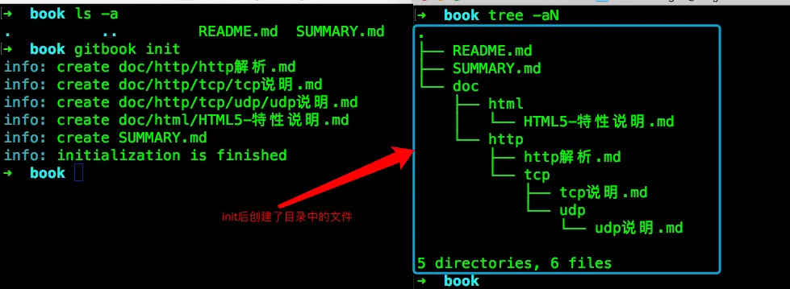

[TOC]

# gitbook使用教程

## 1. 说明

gitbook网站是一个简单的个人在线书籍网站，在这里可以把自己的文档整理成书籍发布出来，便于阅读。
gitbook网站：https://legacy.gitbook.com/

本文主要讲解在gitbook网站上发布一个书籍文档和使用gitbook提供的工具在本地开发一个书籍文档部署到自己的服务上

在此之前你需要会如下准备：

- 账号： github有账号，gitbook使用github账号注册
- git：代码管理工具
- Markdown：gitbook主要使用MD语法来编写书籍的
- gitbook工具：如果你在本地开发需要安装此插件，下面有介绍
- nodejs环境：gitbook插件需要的运行环境
- 一款Markdown编辑器：方便本地开发，推荐[Typora](https://typora.io/)或gitbook自己的编辑器[gitbook editor](https://legacy.gitbook.com/editor)

## 2. 在gitbook网站上创建一本文档书籍

此种方式是使用github网站加gitbook网站的方式来创建书籍的。
首先你要有一个github账号，然后在github网站中创建了一个repo仓库，用于存放书籍内容的仓库。
***注意：***gitbook网站有时需要使用代理才能打开。

### 2.1 登陆gitbook网站

gitbook网站支持直接使用github账号登陆的，推荐直接使用github账号登陆。
打开gitbook网站：https://legacy.gitbook.com/
点击右上角的`Sign In`登陆，然后选择`Sign in with GitHub`选择使用github账号进行登陆。
第一次登陆gitbook网站时，需要github网站的认证，还需要到注册github网站的邮箱中点击确认。


### 2.2 创建一本书

#### 2.2.1 点击新建一本书按钮

登陆网站后，点击右上角的用户图标，然后选择`Your Profile`。然后就会在右上角看见`+ new`按钮，点击此按钮就是创建一本书。

或者打开此链接，直接进入创建书籍页面：https://legacy.gitbook.com/new


#### 2.2.2 在创建书籍中选择github

进入新建页面后，在左边找到`GITHUB`选项。
第一次需要点击右边的`install github integration`。
此时会跳转到github页面去安装这个插件，可以选择所有仓库或者某个仓库，然后点击install安装,输入github密码后完成安装。
此时回到gitbook新建页面刷新，选择github后，会在右边会出现如下选项：

- `title` ： 书籍的标题
- `description`：对这本书的描述
- `Select a Repository`: 选择github中的仓库等
- `Public` or `Private`: 这本书是公开(Public)还是私有(Private)的

选项填好后，然后点击`create book`按钮。


**注意：**标题一定要是英文的，因为这要作为这本书籍的链接（创建成功后可修改名称）。

点击`create book`按钮后，会出现这本书籍页面，然后刷新页面，然后点击`ABOUT`。


然后点击右边的`Read`按钮即可阅读。


进入阅读后如下效果：


此时一本书籍已经在gitbook上创建完毕了。

### 2.3 创建书籍目录文件

经过上面的步骤后，只是创建了一本书籍，但是此时还不完整，因为缺少了书籍的目录。
首先需要在项目的根目录创建一个`SUMMARY.md`文件，此文件就是gitbook的目录，内容格式如下：

```markdown
* [说明](README.md)
* HTML
  - [测试连接1](/doc/a.md) 
* JAVASCRIPT
  - [b文件](/javascript/b.md) 
```

此时项目目录结构：

```markdown
.
├── README.md
├── SUMMARY.md
├── doc
│   └── a.md
└── javascript
    └── b.md
```

保存`SUMMARY.md`后，提交内容到github网站仓库中，需要等待一会才能在gitbook网站上看见更新内容，有时需要等很久才能更新，最终效果如下图所示：


## 3. 使用gitbook工具开发

上面说的在gitbook网站发布一本书虽然方便，但是有如下缺点：

> 1、gitbook网站经常打不开，需要使用代理才能访问
> 2、修改提交后有时需要很久才能显示更新

还好，gitbook还提供了基于`Node.js`的命令行工具，可使用 Github/Git 和 Markdown 来制作精美的电子书,然后部署到自己的网站上(或在github托管)。

`gitbook`命令行工具首先需要本地电脑有nodejs和终端。
一般linux系统和Mac系统自带nodejs和终端，Windows系统需要安装nodejs和终端。
windows系统推荐[cmder](http://cmder.net/)终端,安装和介绍请自行查找。
可使用如下命令在终端查看系统是否有nodejs：

```bash
node -v
v8.12.0
```

如果出现版本号，那么说明已经安装了，如果没找到这个命令，那么进入node官网：http://nodejs.cn/，选择下载，选择对应的操作系统后下载安装即可。

gitbook命令行工具推荐nodejs版本要v4.0.0以上，如果版本过低，可看如下教程将版本升级到v4.0.0以上：
[https://segmentfault.com/a/11...](https://segmentfault.com/a/1190000016956077)

### 3.1 安装gitbook-cli工具

gitbook-cli是一个在同一系统上安装和使用多个版本的GitBook的实用程序。它将自动安装所需版本的GitBook来构建一本书。
打开终端输入`npm install gitbook-cli -g`命令进行全局安装：

```bash
npm install gitbook-cli -g

npm http fetch GET 304 https://registry.npm.taobao.org/os-tmpdir 100ms (from cache)
npm http fetch GET 304 https://registry.npm.taobao.org/os-homedir 113ms (from cache)
/usr/local/bin/gitbook -> /usr/local/lib/node_modules/gitbook-cli/bin/gitbook.js
+ gitbook-cli@2.3.2
added 578 packages from 672 contributors in 17.806s
```


安装成功后可使用`gitbook --version`来查看是否安装成功：

```bash
gitbook --version
CLI version: 2.3.2
GitBook version: 3.2.3
```

**注意：**终端第一次运行`gitbook`命令，可能会自动安装`gitbook`，因为刚才安装的是CLI，此时CLI会自动安装`gitbook`。

如果想卸载CLI，可使用`npm uninstall gitbook-cli -g`来删除。

### 3.2 初始化一本书

初始化一本书的命令是`gitbook init`,

首先在终端创建一个项目目录，并进入这个目录：

```bash
mkdir book
cd book
```

然后使用`gitbook init`来初始化一本书：

```bash
~ gitbook init

warn: no summary file in this book 
info: create README.md 
info: create SUMMARY.md 
info: initialization is finished
```

`gitbook init`会在空项目中创建`README.md`和`SUMMARY.md`两个文件：
`README.md`文件是项目的介绍文件。
`SUMMARY.md`是gitbook书籍的目录。


如果`SUMMARY.md`文件里面有如下内容：

```markdown
* [项目介绍](README.md)
* http
    * [http说明](doc/http/http解析.md)
        * [tcp说明](doc/http/tcp/tcp说明.md)
            * [udp说明](doc/http/tcp/udp/udp说明.md)
* HTML
    * [HTML5-特性说明](doc/html/HTML5-特性说明.md)
```

那么在使用`gitbook init`时，如果目录里面的文件不存在，则会创建目录中的文件：

```bash
~ gitbook init

info: create doc/http/http解析.md 
info: create doc/http/tcp/tcp说明.md 
info: create doc/http/tcp/udp/udp说明.md 
info: create doc/html/HTML5-特性说明.md 
info: create SUMMARY.md 
info: initialization is finished 
```



### 3.3 启动服务查看效果

终端打开项目目录，使用`gitbook serve`启动服务：

```bash
~ gitbook serve

Live reload server started on port: 35729
Press CTRL+C to quit ...

info: 7 plugins are installed 
info: loading plugin "livereload"... OK 
……
info: loading plugin "theme-default"... OK 
info: found 5 pages 
info: found 0 asset files 
info: >> generation finished with success in 2.1s ! 

Starting server ...
Serving book on http://localhost:4000
```

然后根据终端的提示，在浏览器中打开`http://localhost:4000`查看书籍，效果如下图所示：


***注意：\***`gitbook serve`命令会在项目中生成一个`_book`的文件夹,此文件夹就是最终生成的项目。

### 3.4 打包生成网站书籍

可使用`gitbook build`命令来生成最终的项目：

```bash
~ gitbook build

info: 7 plugins are installed 
info: 6 explicitly listed 
info: loading plugin "highlight"... OK 
info: loading plugin "search"... OK 
info: loading plugin "lunr"... OK 
info: loading plugin "sharing"... OK 
info: loading plugin "fontsettings"... OK 
info: loading plugin "theme-default"... OK 
info: found 5 pages 
info: found 0 asset files 
info: >> generation finished with success in 1.0s !
```

命令执行结束后，会在项目下生成`_book`的文件夹,此文件夹就是最终生成的项目。
在`_book`文件夹里有一个`index.html`文件，这个文件就是文档网站的HTM入口，把`_book`文件夹复制到服务器，然后把web服务的入口引向`index.html`即可完成文档网站的部署。

如果你想查看输出目录详细的记录，可使用`gitbook build ./ --log=debug --debug`来构建查看。

### 3.5 生成其他格式的书籍

这里本人试了，没有成功，你可以尝试一下

GitBook 可以生成一个网站，但也可以输出内容作为电子书（ePub，Mobi，PDF）。

```bash
# Generate a PDF file
$ gitbook pdf ./ ./mybook.pdf

# Generate an ePub file
$ gitbook epub ./ ./mybook.epub

# Generate a Mobi file
$ gitbook mobi ./ ./mybook.mobi
```

我还在网上找了一个包：https://www.npmjs.com/package/gitbook-pdf ，可以试一下

### 3.6 项目部署到GitHub Pages

这部分需要使用git和github网站，如果你不会，请自行在网上搜索文档查看。

由于gitbook生成的项目跟文档的源码是两个部分，所以可以把文档放到master分支上，部署的网站放到gh-pages 分支。

#### 3.6.1 在github上创建一个仓库

这个仓库用于存放你编写的项目，和部署项目，如何创建请自行查找。

#### 3.6.2 本地项目提交到github仓库

在项目中创建一个`.gitignore`文件，内容如下：

```bash
# 忽略gitbook生成的项目目录
_book
```

然后终端打开项目，输入如下命令,来提交文档项目到github上：

```bash
~ git init
~ git add .
~ git commit -m '初始化gitbook本地项目'
~ git remote add origin https://github.com/yulilong/book.git 
~ git push -u origin master
```

上面命令执行结束后，就会把代码提交到github上的仓库。
***注意仓库地址要替换成你自己的链接。\***

#### 3.6.3 生成项目并上传到github仓库的gh-pages分支

由于打包命令太多，为了简单化，现在写一个脚本命令来自动执行。当然你也可以终端自己执行这些命令。

为了部署方便，可以创建一个脚本文件`deploy.sh`,内容如下：

```bash
#!/usr/bin/env sh

echo '开始执行命令'
# 生成静态文件
echo '执行命令：gitbook build .'
gitbook build .

# 进入生成的文件夹
echo "执行命令：cd ./_book\n"
cd ./_book

# 初始化一个仓库，仅仅是做了一个初始化的操作，项目里的文件还没有被跟踪
echo "执行命令：git init\n"
git init

# 保存所有的修改
echo "执行命令：git add -A"
git add -A

# 把修改的文件提交
echo "执行命令：commit -m 'deploy'"
git commit -m 'deploy'

# 如果发布到 https://<USERNAME>.github.io/<REPO>
echo "执行命令：git push -f https://github.com/yulilong/book.git master:gh-pages"
git push -f https://github.com/yulilong/book.git master:gh-pages

# 返回到上一次的工作目录
echo "回到刚才工作目录"
cd -
```

注意脚本文件代码中仓库地址要替换成你自己的地址。

文件保存后，在终端执行如下命令，把生成的项目推送到github仓库上的`gh-pages`分支：

```bash
bash deploy.sh
```

执行成功后，打开你的github仓库，然后选择`branch`分支，会发现多了一个`gh-pages`分支，打开这个分之后，里面会有一个`index.html`文件。说明部署的代码上传成功了。
**注意：如果没有`gh-pages`分支说明没有部署成功请查看刚才执行的终端看哪里报错了，解决报错直到成功部署。**

#### 3.6.4 配置GitHub Pages显示网站

在github网站上的仓库里面点击`Settings` -> `GitHub Pages`选项中 -> `Source`里面选择`gh-pages branch` 然后点击`Save`按钮，然后在`GitHub Pages`下面就会看见一个网址，这个网址就是最终的网站。
最终效果如下图所示：


### 3.7 一些部署到GitHub Pages的例子

https://github.com/yodaos-project/yoda-book

https://gitbook.zhangjikai.com/plugins.html

## 4. gitbook的配置文件讲解

如果你想对你的网站有更详细的个性化配置或使用插件，那么需要使用配置文件。
配置文件写完后，需要重启服务或者重新打包才能应用配置。
gitbook的配置文件名是`book.json`，首先在项目的根目录中创建`book.json`文件。
`book.json`主要内容：

```json
{
    "title": "我的一本书",
    "author" : "yu",
    "description" : "我第一本书的描述，很好",
    "language" : "zh-hans",
    "structure": {
        "readme": "introduction.md"
    },
    "plugins": [
        "-lunr",
        "-search",
        "search-pro",
        "back-to-top-button"
    ],
    "pluginsConfig": {
        "anchor-navigation-ex": {
            "isShowTocTitleIcon": true
        }
    },
    "links" : {
        "sidebar" : {
            "个性链接1" : "https://www.baidu.com",
            "个性链接2" : "https://www.baidu.com"
        }
    },
    "styles": {
        "website": "styles/website.css",
        "ebook": "styles/ebook.css",
        "pdf": "styles/pdf.css",
        "mobi": "styles/mobi.css",
        "epub": "styles/epub.css"
    }
}
```

### 4.1 book.json中一些主要参数说明

- title：标题
  
- author：作者
  
- description：描述，对应gitbook网站的description
  
- language：使用的语言，`zh-hans`是简体中文，会对应到页面的`<html lang="zh-hans" >`
  
- structure：指定 Readme、Summary、Glossary 和 Languages 对应的文件名，下面是这几个文件对应变量以及默认值：
  
  | Variable              | Description                                    |
  | --------------------- | ---------------------------------------------- |
  | `structure.readme`    | Readme file name (defaults to `README.md`)     |
  | `structure.summary`   | Summary file name (defaults to `SUMMARY.md`)   |
  | `structure.glossary`  | Glossary file name (defaults to `GLOSSARY.md`) |
  | `structure.languages` | Languages file name (defaults to `LANGS.md`)   |
  
  比如想把readme文件个名字，则可以使用如下配置
  
  ```json
  "structure": {
      "readme": "introduction.md"
  },
  ```
  
  使用这个配置后，gitbook服务就不会找readme文件，而去找`introduction`文件当项目说明，这样就可以把readme文件完全当成代码仓库说明文档了。
  
- plugins：使用的插件列表，所有的插件都在这里写出来，然后使用`gitbook install`来安装。
  
- pluginsConfig：插件的配置信息，如果插件需要配置参数，那么在这里填写。
  
- links：目前可以给侧导航栏添加链接信息
  
  ```json
  "links" : {
      "sidebar" : {
          "个性链接1" : "https://www.baidu.com"
      }
  }
  ```
  
- styles：自定义页面样式，各种格式对应各自的css文件
  
  ```json
  "styles": {
      "website": "styles/website.css",
      "ebook": "styles/ebook.css",
      "pdf": "styles/pdf.css",
      "mobi": "styles/mobi.css",
      "epub": "styles/epub.css"
  }
  ```

### 4.2 配置默认主题

默认的主题可以通过配置来做一下效果。
比如侧边栏菜单显示标题数字，可以在配置文件的`pluginsConfig`参数中写入如下字段：

```json
{
    "pluginsConfig": {
        "theme-default": {
            "showLevel": true
        }
    }
}
```

效果如下图：


## 5. gitbook的一些实用插件

gitbook插件可以解决一些网站不太方便的地方，如侧边栏导航不能收缩，自带搜索不支持中文等。
用了插件书籍网站会更灵活和美观。

由于插件很多，请参考我的另一篇文章：https://segmentfault.com/a/1190000019806829


## 6. 开发遇到的问题

### 6.1 prismjs插件报错

当启动本地服务的时候，会报错：

```bash
Failed to load prism syntax: ttt
Error: Cannot find module 'prismjs/components/prism-ttt.js'
Require stack:
- /Users/dragon/tmp/wiki/node_modules/gitbook-plugin-prism/index.js
```


产生问题原因：markdown文件中，代码块标记的语言prismjs插件找不到这种语言，无法进行高亮。

解决方法：markdown文件中代码块标记语言要写正确，复制过来的代码块要注意编辑器自动标记的语言是否存在、正确。


### 6.2 gitbook 命令失败：TypeError: cb.apply is not a function

当执行`gitbook build .`进行项目打包的时候报错：

```bash
/usr/local/lib/node_modules/gitbook-cli/node_modules/npm/node_modules/graceful-fs/polyfills.js:287
      if (cb) cb.apply(this, arguments)
                 ^
TypeError: cb.apply is not a function
```


问题原因：node版本太高了，gitbook工具不支持这么高的node版本。

gitbook版本：

```bash
~ gitbook -V
CLI version: 2.3.2
GitBook version: 3.2.3
```

解决方案：

1、降低node版本即可。可以的版本：8.16.0、8.12.0、6.11.1。网络上有的说10.X版本也没问题。可以使用node版本管理工具切换。

2、修改报错的文件，node版本不需要降级。

使用编辑器打开报错的文件，找到报错的地方`cb.apply(this, arguments)`，大约在287行

```js
// 文件：/usr/local/lib/node_modules/gitbook-cli/node_modules/npm/node_modules/graceful-fs/polyfills.js
function statFix (orig) {
  if (!orig) return orig
  // Older versions of Node erroneously returned signed integers for
  // uid + gid.
  return function (target, cb) {
    return orig.call(fs, target, function (er, stats) {
      if (!stats) return cb.apply(this, arguments)
      if (stats.uid < 0) stats.uid += 0x100000000
      if (stats.gid < 0) stats.gid += 0x100000000
      if (cb) cb.apply(this, arguments) // 大约是287
    })
  }
}
```

在这个文件的第62-64行调用了这个函数，把这三行代码注释掉就可以：

```js
fs.stat = statFix(fs.stat)
fs.fstat = statFix(fs.fstat)
fs.lstat = statFix(fs.lstat)
```


然后再次运行`gitbook build .` 就没问题了。

参考资料：https://mizeri.github.io/2021/04/24/gitbook-cbapply-not-a-function/


* 参考链接   

http://blog.csdn.net/hk2291976/article/details/51173850       
http://www.ituring.com.cn/article/127744     
https://www.jianshu.com/p/7476afdd9248