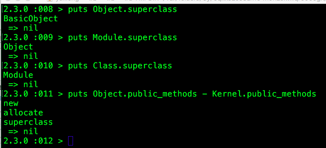

[TOC]

## 1. 从继承关系来说，是Class --> Module --> Object，即Object是继承树的顶层，紧接着是Module，然后是Class。

irb的输出结果：     
```
2.3.0 :008 > puts Object.superclass
BasicObject
 => nil 
2.3.0 :009 > puts Module.superclass 
Object
 => nil 
2.3.0 :010 > puts Class.superclass  
Module
 => nil 
2.3.0 :011 > puts Object.public_methods - Kernel.public_methods  
new
allocate
superclass
 => nil 
```
从上面的输出可以看出，Object中自己定义的方法只有"superclass" , "allocate"和"new"这三个方法，其余的方法，比如"class", "to_s", "object_id"等等都是在Kernel中实现的。     

ruby中：    

* 在Ruby中使用Class来标识所有的数据类型，所有的变量和常量都是Object的子类      
* Kernel是Module，Object的实现中包含了Kernel      



https://www.zhihu.com/question/19922190/answer/13359458   


## 2. module 与Class 区别

一句话概括，就是： `class可以实例化, module不可以`, 别的都一样.    
关于继承的一点区别:    
class是使用`<`作为继承的关键字，只支持单继承.       
module是使用`include`来做实例继承（实例化的时候动态功能插入），`extend`做类继承（可以理解为static继承）.     

module的应用场景:    
```
作为namespace，里面放一般的const或者自己的class
作为工具模块，放通用方法，别的类里面直接include或者extend以后使用，也可以看成动态扩展业务类
可以作为抽象类，module里面提供默认实现，业务类include或者extend以后覆盖
作为接口来用，一个可用的接口库，module-interface
```
http://jingpin.jikexueyuan.com/article/58139.html