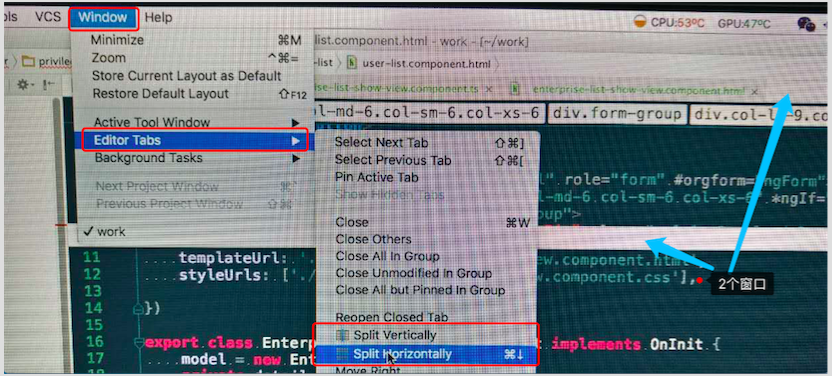

[TOC]

##  一级必会

* **Mac OS 下快捷键**        

**行注释(Comment with Line Comment): cmd + /**     
**块注释(Comment with block Comment): alt + cmd + /**     

**Ctrl+Alt+L(alt+cmd+l,)：格式化代码(reformat code)**     
**Ctrl+D(cmd +d)：复制一行**       
**Ctrl+Y(cmd+delete)：删除一行**      
* **end, cmd + →, ctl+e: 光标移到行尾**     
* **home, cmd + 左移键, ctl+A: 光标移到行尾**     
* **alt + space, cmd+Y:快速查看方法定义源码**     
* **替换(replace...): cmd + R ** 
Edit -> find -> replace...

* 移动行到上面(move line up) : alt + shit 方向键上    
* 移动行到下面(move line down) : alt + shit 方向键下    

* 移动语句到上面(move statement up) : cmd + shit 方向键上    
* 移动语句到下面(move statement down) : cmd + shit 方向键下    

* **移动光标到下一个单词(move caret to next word)： alt + 方向右键 **      
* **移动光标到上一个单词(move caret to previous word)： alt + 方向←键 **         

* **添加书签(toggle bookmark): F3**        
* **添加书签(toggle bookmark with mnemonic): alt/option + F3**        
* **显示书签(show bookmark): cmd + F3**        
* **跳到上一个书签(previous bookmark): cmd + ↑ **       
* **跳到下一个书签(previous bookmark): cmd + ↓ **       

* **向下选中： shift + ↓**      
* **向上选中： shift + 上**      

* **切换大小写(toggle case): shift + cmd + U**

* **编辑窗口拆分：**        

      

左上角 -> Window -> Editor Tabs -> Split Horizontally

Shift+F10：运行running     
Ctrl+Alt+R：弹出Rake      
Ctrl+Alt+G：弹出Generate     
Ctrl+Alt+L：格式化代码     
Alt+F1：切换视图(Project, Structure, etc.).      
Alt+F2：弹出预览窗口，可选择浏览器打开网页     
Alt+Insert：相当于File|New，不过要在class外执行    
Alt+Enter：快速修复提示，相当于Eclipse的Alt+F1    
Alt+Home：显示文件夹导航条    
Ctrl+J：插入动态模板代码，非常方便。Ctrl+Alt+J：用动态模板包围选中代码     
Ctrl+/，Ctrl+Shift+/：注释，去注释代码      
Ctrl+Space：代码自动补全，相当于Eclipse的Alt+/。建议修改为Alt+/       
Ctrl+Q：显示文档Doc         
Ctrl+W：动态选择，多次按依次选择 单词-行-段-全     
Ctrl+D：复制一行    
Ctrl+Y：删除一行   
Shift+Alt+N：在Controller,Model,View间跳转   
Shift+Alt+F10：运行，Dubug     

##  二级进阶

Alt+Home：显示导航条     
Alt+F1：在不同视图中切换 (Project, Structure, etc.).      
Ctrl+Tab：在tool窗口和打开的文件窗口中切换     
Ctrl+F：在当前文件中查找      
Ctrl+Shift+F：在文件夹中查找     
Ctrl+Shift+F7：快速显示选中代码的调用      
Ctrl+Shift+.：在*.html.erb文件中插入      
Ctrl+N，Ctrl+Shift+N，Ctrl+Shift+Alt+N：通过名字查找类，文件，符号        
Ctrl+Shift+T：To surround a block of code          
Ctrl+Alt+D：显示Model关系图，即ER图。View | Show Model Dependency Diagram         

##  三级耍酷

* a.界面调整    
Esc：从任何界面返回到编辑器      
Shift+Esc：回到编辑器，隐藏所有工具栏      
Shift+F6：重命名，文件，方法名，类名，变量名等      
F12：相当于Shift+Esc的回退键，显示最后一次打开的工具栏           
* b.变量选择       
Ctrl+Shfit+F7：高亮显示本文件中变量出现的位置           
F3，Shift+F3：在不同变量之间跳转           
Esc：取消选择            
Alt+Left, Alt+Right: 在不同的Tabs中切换             
Ctrl+点击Tab：弹出路径框，选择后会在新窗口打开。        
Ctrl+E：弹出最近打开的文件选择框            
Ctrl+Shift+Up, Ctrl+Shift+Down：把代码住上移和住下移     
Ctrl+Shift+Backspace：光标移动到上次修改的位置     
Ctrl++，Ctrl+-：展开或收缩代码     
Ctrl+Shift++，Ctrl+Shift+-：全部展开或收缩代码     
Ctrl+~：切换主题，配色等(一般默认会被输入法占用)     

## 更改快捷键

示例：把代码提示快捷键由Alt+Space改为Ctrl+Alt+/     

打开File>>Setting>>Keymap     
      
找到Main menu>>Code>>Complete Code>>Basic，选择右边的“Add Keyboard Shortcut”     
         
在弹出的框里光标放到输入框，同时按下：Ctrl+Alt+/     
          
成功后应用保存，即可生效.     

转载自：      
http://blog.csdn.net/iam_song/article/details/7863636