[TOC]

## 1. 其他的习惯设置

* **RubyMine2016.3自动补全默认第一个选项配置:**http://blog.csdn.net/lj_550566181/article/details/53504208      
* **rubymine2016官方文档英文：**https://www.jetbrains.com/help/ruby/2016.3/reference.html

-----

## 3. rubymine2016 汉化

参考链接：  http://www.jb51.net/softs/516343.html     

[**rubymine2016安装教程**](https://bitbucket.org/yulilong/my_wiki/wiki/Mac%20install%20RVM,ruby,pqadmin3,rubymine2016)         
下载链接：  https://pan.baidu.com/s/1c2ou9w8 密码: kqjh     
**RubyMine 2016汉化包使用方法：**        
解压后，里面有个文件`resources_cn.jar`,把这个文件复制到`/Applications/RubyMine.app/Contents/lib`中      

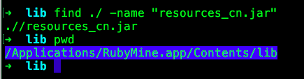    

如果没有`resources_cn.jar`,怎按照下面的步骤来制作`resources_cn.jar`：     
1、链接: https://pan.baidu.com/s/1pLlWpSn 密码: yptn   下载汉化包       
2、将/Applications/RubyMine.app/Contents/lib目录下的resources_en.jar文件复制出来，并更名resources_cn.jar      
3、双击打开resources_cn.jar(注意是打开而不是解压出来)，将下载的汉化包zh_CN目录下的所有文件拖到刚才打开的resources_cn.jar文件内的messages目录中，并保存。            
4、将resources_cn.jar文件复制回/Applications/RubyMine.app/Contents/lib       

--------------

## 4. rubymine 编辑器代码自动缩进设置    

preferences(cmd + ,) -> Editor -> Code Style:    
Indents Dection  -> detect and use existing file indents for sditing(检测并使用现有的文件缩进进行编辑) 对号去掉    

EditorConfig -> Enable EditorConfig support    对号去掉    

根据代码语言进行缩进设置： 
(TypeScript) Editor -> Code Style -> TypeScript -> Tabs and Indents        

-----------------
## 5. rubymine 颜色设置

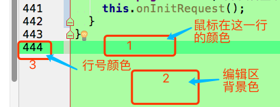       

### 整体风格颜色(主题颜色)

preferences(cmd + ,) -> Editor -> Color Scheme -> Scheme： 选择一款喜欢的主题      
其中 default 主题是窗口是白色的，其他的有黑色的

### 正则表达式颜色

preferences(cmd + ,) -> Editor -> Color Scheme -> TypeScript -> Regular expression -> foreground

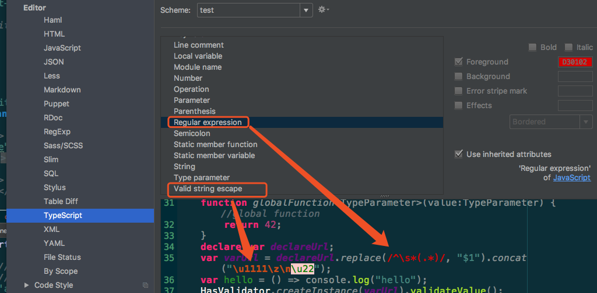

### 字符串转义 颜色设置

preferences(cmd + ,) -> Editor -> Color Scheme -> TypeScript -> valid string escape -> foreground

### 1.  输入行的背景色

preferences(cmd + ,) -> Editor ->  Colors & Fonts -> General -> Editor -> Caret row

### 2.  代码编辑区背景色     

preferences(cmd + ,) -> Editor ->  Colors Scheme -> General -> Text -> Default test -> background     

### 3. 行号字的颜色设置    

preferences(cmd + ,) -> Editor ->  Colors Scheme -> General -> Code -> Line number    

### 行号背景色设置      

preferences(cmd + ,) -> Editor ->  Colors Scheme -> General -> Editor -> Gutter background    

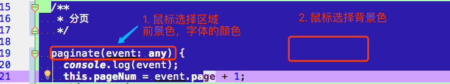     

### 4. 鼠标选择区域前景色(字体颜色)

preferences(cmd + ,) -> Editor ->  Colors & Fonts -> General -> Editor -> Selection background      

### 5. 鼠标选择的背景色    

preferences(cmd + ,) -> Editor ->  Colors & Fonts -> General -> Editor -> Selection foreground       

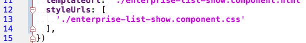       

### 6. 字符串的颜色设置

preferences(cmd + ,) -> Editor ->  Colors & Fonts -> Language Defaults -> String -> String text -> Foreground    
这是通用的设置，如果想某种语言字符串颜色特定 以ruby语言为例：    
preferences(cmd + ,) -> Editor ->  Colors & Fonts -> Ruby -> String -> Foreground     
如果勾选了 `Use inherited attributes`则会使用上面的设置，在这里也告诉了此处默认的设置位置`String -> String text` of Language Defaults    

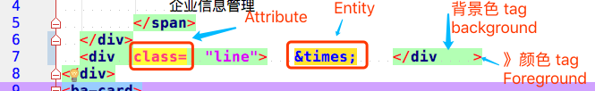       

### 7. HTML代码`
   &times;    
`      

1. `class=`  颜色背景色设置
preferences(cmd + ,) -> Editor ->  Colors & Fonts -> Language Defaults -> Markup -> Attribute ->    
Foreground 字体颜色，  Background 背景色      
2. `&times;` 颜色背景色设置   
preferences(cmd + ,) -> Editor ->  Colors & Fonts -> Language Defaults -> Markup -> Entity ->    
Foreground 字体颜色，  Background 背景色      
3.  ` <    />` 颜色背景色设置     
preferences(cmd + ,) -> Editor ->  Colors & Fonts -> Language Defaults -> Markup -> Tag ->    
Foreground `<`颜色，  Background 背景色     

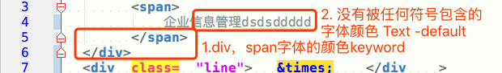      

### 8. `
企业信息管理dsdsddddd
`        
1. div span 字体的颜色设置      
preferences(cmd + ,) -> Editor ->  Colors & Fonts -> Language Defaults -> Keyword -> Foreground    
2. 没有被任何符号包含(企业信息管理ds)的字体颜色 设置         
preferences(cmd + ,) -> Editor ->  Colors & Fonts -> General -> Text -> Default text -> Foreground       

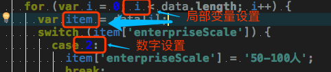  

### 9. 局部变量颜色设置

preferences(cmd + ,) -> Editor ->  Colors & Fonts -> Language Defaults -> Identifiers -> Local variable -> Foreground    
其他语言个性化设置(JavaScript)： Editor ->  Colors & Fonts -> JavaScript -> Local variable -> Foreground     

### 10. 数字颜色设置     

preferences(cmd + ,) -> Editor ->  Colors & Fonts -> Language Defaults -> Number -> Foreground     

### 11. 行注释，块注释 颜色修改     

preferences(cmd + ,) -> Editor ->  Colors & Fonts -> Language Defaults -> Comments -> Line comment -> Foreground      

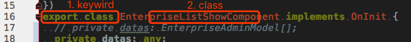     

### **12. git 新增行，修改行，删除行 颜色标记修改**

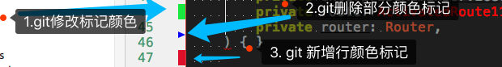      

2016版的：      
1. git 新增行标记颜色修改：    
preferences(cmd + ,) -> Editor ->  Colors & Fonts -> General -> Gutter -> Added lines -> Background        
2. git 删除行标记颜色修改：      
preferences(cmd + ,) -> Editor ->  Colors & Fonts -> General -> Gutter -> Deleted lines -> Background        
3. git 修改行标记颜色修改：    
preferences(cmd + ,) -> Editor ->  Colors & Fonts -> General -> Gutter -> modified lines -> Background    
  

2017版的：   
1. git 新增行标记颜色修改：    
preferences(cmd + ,) -> Editor ->  Colors Scheme -> VCS -> Editor Gutter -> Added lines -> Background        
2. git 删除行标记颜色修改：      
preferences(cmd + ,) -> Editor ->  Colors Scheme -> VCS -> Editor Gutter -> Deleted lines -> Background        
3. git 修改行标记颜色修改：    
preferences(cmd + ,) -> Editor ->  Colors Scheme -> VCS -> Editor Gutter -> modified lines -> Background  

### **13. git diff 弹窗 真实背景色**

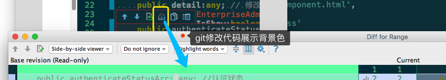     

preferences(cmd + ,) -> Editor -> Colors & Fonts -> General -> Text -> Background in readonly file - Background      

### **14. 编辑器 分隔线颜色设置**

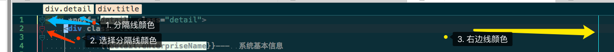     

1. 分隔线颜色设置：    
preferences(cmd + ,) -> Editor -> Colors & Fonts -> General -> Editor -> Tear line -> Foreground      
2. 选择分隔线颜色设置：    
preferences(cmd + ,) -> Editor -> Colors & Fonts -> General -> Editor -> Tear line selection -> Foreground  
3. 右边线颜色设置：     
preferences(cmd + ,) -> Editor -> Colors & Fonts -> General -> Editor -> Right margin     

### **15. 垂直缩进线颜色设置**    

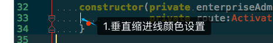    

preferences(cmd + ,) -> Editor -> Colors & Fonts -> General ->  Code -> Vertical indent guide -> Background

### **16. 括号匹配颜色 **

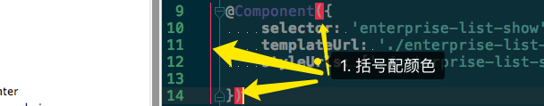    

preferences(cmd + ,) -> Editor -> Colors & Fonts -> General -> Code -> Matched brace -> Background      

### **17. 鼠标光标颜色**

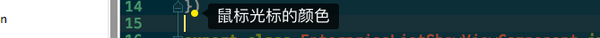   

preferences(cmd + ,) -> Editor -> Colors & Fonts -> General -> Editor -> Caret      

### **18. 折叠文本颜色 **

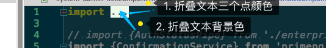     

1. 折叠文本三个点颜色：   

preferences(cmd + ,) -> Editor -> Colors & Fonts -> General -> Text -> Fold text -> Foreground       
2. 折叠文本背景色：    
preferences(cmd + ,) -> Editor -> Colors & Fonts -> General -> Text -> Fold text -> Background     

### **19. 注入语言片段背景色修改**

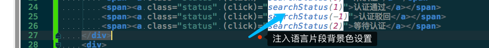      

preferences(cmd + ,) -> Editor -> Colors & Fonts -> General -> Code -> Injected language fragment -> Background       

### **20. 光标定位变量一样的 颜色**

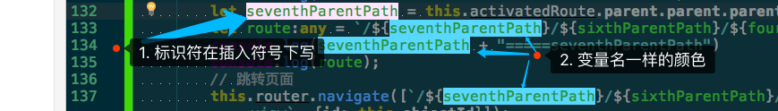     

1. 光标在变量定义处：    
preferences(cmd + ,) -> Editor -> Colors & Fonts -> General -> Code -> Identifier under caret(write) -> Background     
2. 变量一样其他变量的背景色：    
preferences(cmd + ,) -> Editor -> Colors & Fonts -> General -> Code -> Identifier under caret -> Background                

### 21 `export class EnterpriseListShowComponent implements OnInit {`      

1. `export class` keyword 关键字颜色设置
(JavaScript) Editor ->  Colors & Fonts -> JavaScript -> Keyword -> Foreground  
如果勾选了： Use inherited attributes ,则： Language Defaults -> Keyword        
2. 类名字颜色设置     
(JavaScript) Editor ->  Colors & Fonts -> JavaScript -> Class -> Foreground  
如果勾选了： Use inherited attributes : Language Defaults -> Classes -> Class name      

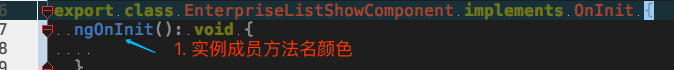   

### 22. 实例成员方法名颜色设置：    

(JavaScript) Editor ->  Colors & Fonts -> JavaScript -> Instance member function -> Foreground      
如果勾选了： Use inherited attributes,则：  Language Defaults -> Classes -> Instance method     

### 23. **方法参数颜色设置 Parameter**

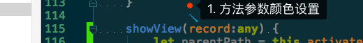     

1. 方法参数颜色设置：    
(JavaScript) Editor ->  Colors & Fonts -> JavaScript -> Parameter:     
Foreground, 字体颜色       
Background, 背景色     
如果勾选了： Use inherited attributes，则: Language Defaults -> Indentifiers -> Parameter        

### **24.实例变量颜色，接口颜色**

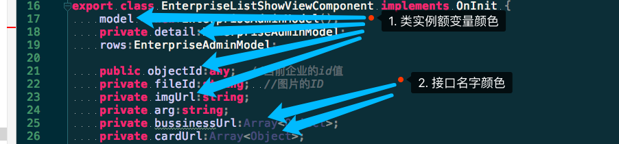     

1. 类实例变量颜色设置：     
(TypeScript)Editor ->  Colors & Fonts -> TypeScript -> Instance member variable -> Foreground     
如果勾选了： Use inherited attributes，则: JavaScript -> Instance member variable        
(通用) Editor ->  Colors & Fonts -> Language Defaults -> Classes ->Instance field -> Foreground      
2. 接口颜色设置：    
(TypeScript)Editor ->  Colors & Fonts -> TypeScript -> Interface -> Foreground      
如果勾选了： Use inherited attributes，则: Language Defaults -> Classes -> Interface name            

### 25. 搜索结果的颜色背景色设置：

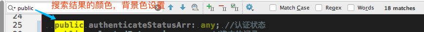      
preferences(cmd + ,) -> Editor ->  Colors & Fonts -> General -> Search Results -> Text search result     
搜索结果字体颜色： Foreground ，搜索结果背景色： Background    

## 6. 当回车后，按删除键后又回到了上一行，禁止    

Smart Keys，这个选择一下：     
preferences(cmd + ,) -> Editor -> General -> Smart Keys -> Backspace -> Unident: To nearest indent position          
Code Style,这里设置一下：   
Editor -> Code Style:    
EditorConfig  -> Enable EditorConfig support把这里的对号去掉      
根据编程语言进行相应设置：     
Editor -> Code Style -> TypeScript -> Tabs and Indents      

------

## **7. Editor Tabs 编辑器标签页设置，显示正在编辑文件的路径**    

https://www.jetbrains.com/help/ruby/2016.3/editor-tabs.html?search=editor%20tabs      

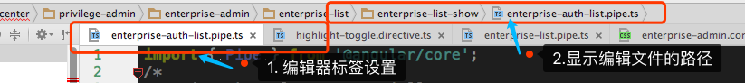      

2. 显示编辑文件的路径：    
rubymine左上角 -> View -> navigation Bar , 前面打上对号。      

## **8.工具栏显示与隐藏**

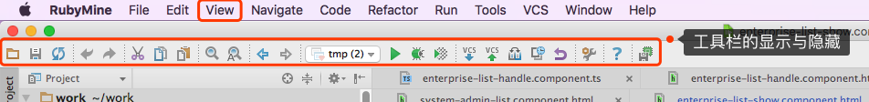      

rubymine左上角 -> View -> Toolbar , 前面打上对号。

## **9.关闭rubymine代码自动保存功能**      
https://www.jetbrains.com/help/ruby/2016.3/saving-and-reverting-changes.html      
在编辑TypeScript代码的时候，由于自动保存导致每写一点代码，服务都会从新编译运行，因此需要关闭自动保存：     
preferences(cmd + ,) -> Appearance & Behavior -> System Settings -> Synchrogazation(同步):   
save file on frame deactivation(鼠标光标停止的时候保存文件，好像这么理解), 把这个前面的对号去掉，就可以在编辑时不会自动保存了。   
Synchronize file on frame or editor tab activation, 这个是否去掉暂时不知道，           

## **12. 代码折叠设置**     

https://www.jetbrains.com/help/ruby/2016.1/code-folding.html#using_folding_comments        

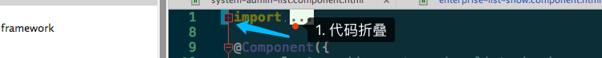     

preferences(cmd + ,) -> Editor -> General -> Code Folding：       
 -> Show code folding outline: 这个打上对号，就会显示代码折叠的提示线。     
-> Collapse by default:  这下面是默认折叠的代码块的选项，哪个不想默认折叠把前面的对号去掉就可以了。     

## **14. 编辑器代码自动换行**     

当代码一行太多的时候，如果不选择软换行，那么就会把编辑区右移，会很费劲，这时可选择软换行，在下一行接着显示这行的内容。     

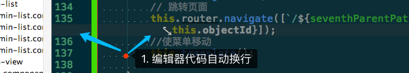      
preferences(cmd + ,) -> Editor -> General：   
Soft Wraps -> Use soft wraps in editor , 前面打上对号，就会自动软换行。         

## **21. 代码从新格式化格式设置**

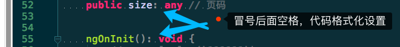     

冒号后有一个空格，从新格式化设置：    
preferences(cmd + ,) -> Editor -> Code Style -> TypeScript -> Spaces -> After type reference colon':'打上对号      

## **22. 关闭TypeScript 自动编译**

preferences(cmd + ,) -> Languages & Frameworks -> TypeScript:     
Compiler:  Enable TypeScript Compiler 去掉前面的对号，就不会自动编译了。      

## 23. 显示/隐藏 编辑器中空格上的白点    

preferences(cmd + ,) -> Editor -> General -> Appearance -> show whitespaces ,点击选中或取消。    

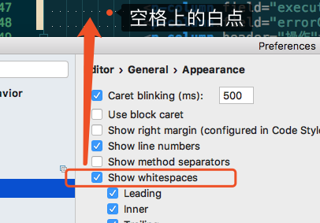    

## 24. 显示/隐藏 编辑器 代码块垂直线    

preferences(cmd + ,) -> Editor -> General -> Appearance -> Vertical indent guide ,点击选中或取消。    

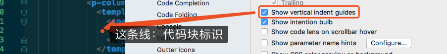    

## **25. 显示/隐藏 编辑器 行号**

preferences(cmd + ,) -> Editor -> General -> Appearance ->  show line numbers    

## **2. 显示/隐藏 编辑器 右边距**

preferences(cmd + ,) -> Editor -> General -> Appearance ->  show right margin   

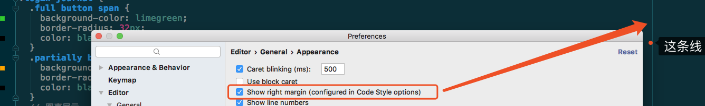  

##  编辑器标签的设置，由单行显示变多行(打开的文件名)：    

preferences(cmd + ,) -> Editor -> General -> Editor Tabs:     
Tab Appearance -> Show tabs in single row(在单行显示标签), 对号去掉。      
Tab Closing Policy(选项卡关闭策略) -> Tab limit(选项卡限制) , 里面的数字改大一点    

## 编辑过的文件名标记星号，知道修改了什么文件    

preferences(cmd + ,) -> Editor -> General -> Editor Tabs:     
Tab Appearance -> Mark modified tabs with asterisk (标记修改过的标签为星号)，打上对号。