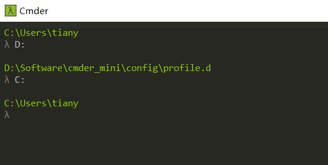

[TOC]

# windows下前端开发环境安装

## 1. Cmder 终端使用

[使用Cmder替换cmd，让开发更高效](https://www.jianshu.com/p/5b7c985240a7)

https://cmder.net/

打开网址后，选择`Download Full`版本点击，点击后会跳转到[github](https://github.com/cmderdev/cmder/releases/tag/v1.3.17)网站中，选择[cmder.zip](https://github.com/cmderdev/cmder/releases/download/v1.3.17/cmder.zip)下载。

下载好后，解压，把文件放到一个地方，然后把`Cmder.exe`发送一个桌面快捷方式，然后点击这个图表即可打开使用。

### 1.1 cmder进入指定目录

首先直接进入到指定磁盘,然后在进入到指定目录

## 2. nodejs环境安装

1、查看操作系统位数：我的电脑图标，右键选择属性，在出现的弹窗中，系统 -> 系统类型 查看是多少位操作系统。

2、打开 [nodejs 官网下载地址](https://nodejs.org/en/download/), 选择 `Windows Installer (.msi)`中对应系统操作位数的包下载，下载以后点击安装。

## 3. vscode编辑器下载

https://code.visualstudio.com/

打开网址后，选择 windows X64 中`stable`版本下载。下载后，双击安装即可。

### 3.1 vscode插件离线安装

-   获取离线插件包

    在线搜索插件：`https://marketplace.visualstudio.com/vscode`，或者在vscode插件中，找到插件，然后点击插件名字会直接跳转到插件的网址。

    在出现的插件页面中，点击`Download Extension` 按钮，下载离线包。

    

-   安装插件包

    1、打开vscode编辑器，点击插件部分。

    2、在搜索框右边的上面有三个点，点击。

    3、在出现的弹窗中，选择`Install from VSIX...`选项。

    4、在出现的弹窗中，选择插件离线包所在的目录，选择需要安装的插件，然后点击`install`按钮进行安装。
    
    

