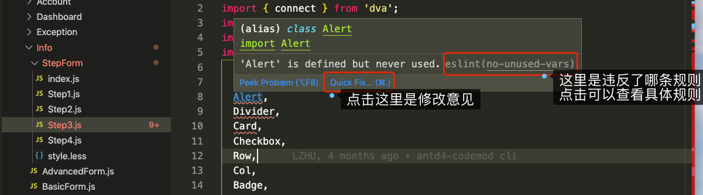
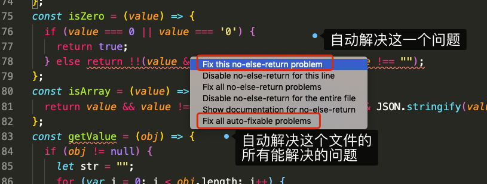
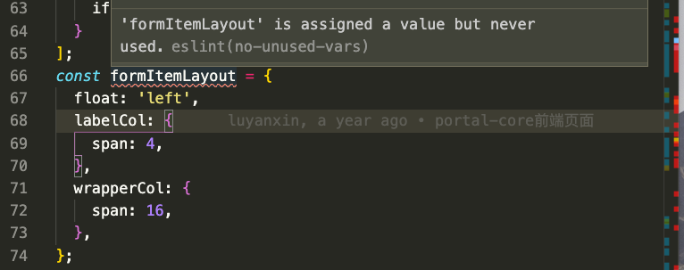
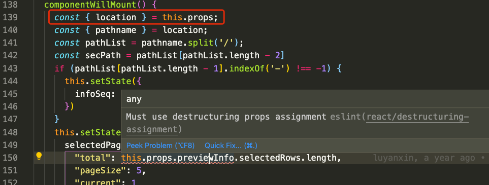
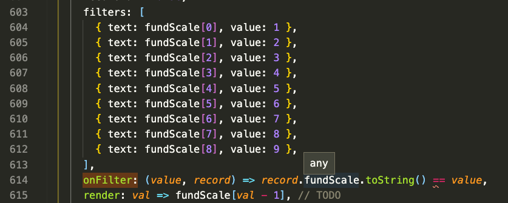
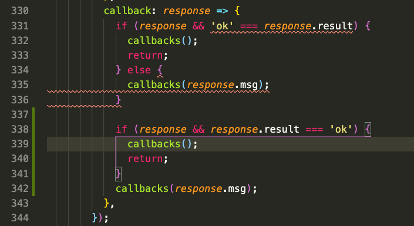
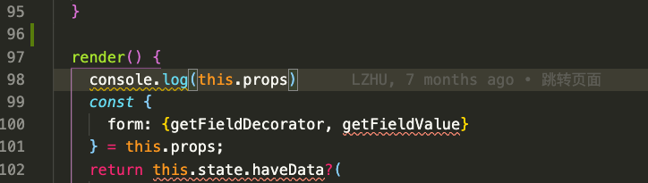
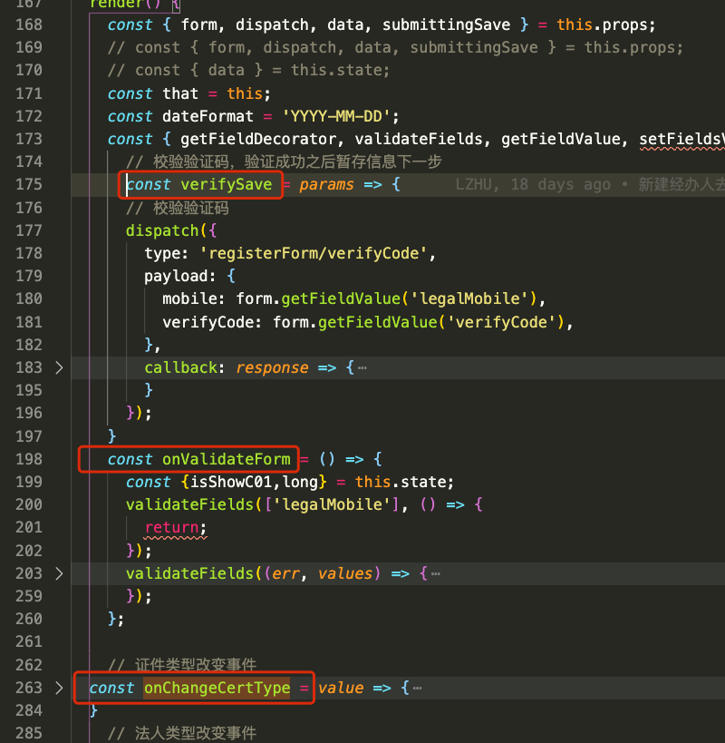
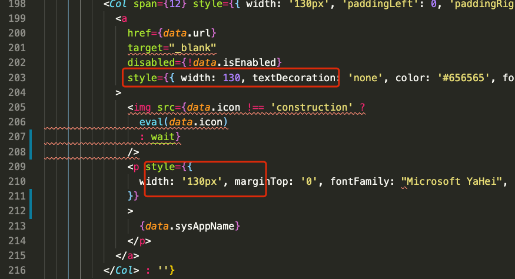
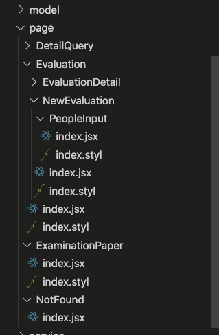

[TOC]


# 项目代码规范


## 1. 为什么要有开发规范?

由于项目开发多成员协作问题，程序员开发习惯不同，项目的不断迭代会导致代码质量问题、代码维护问题、可读性问题的出现，所以好的校验工具可以确保一个项目遵循代码规范、避免一些常见的隐患出现~

-   使 JavaScript 代码风格保持一致
-   使代码容易被理解和被维护。
-   编码规范能帮助我们降低编程中不必要的麻烦。
-   降低代码的调试成本和维护成本

## 2. ESLint和一些常用规范介绍

### 2.1 ESLint工具介绍

中文官网：http://eslint.cn/

ESLint 是一个开源的 JavaScript 和 JSX 检查工具，ESLint 的所有规则都被设计成可插入的。ESLint 的默认规则与其他的插件并没有什么区别，规则本身和测试可以依赖于同样的模式。为了便于人们使用，ESLint 内置了一些规则，当然，你可以在使用过程中自定义规则。

JavaScript 是一个动态的弱类型语言，在开发中比较容易出错。因为没有编译程序，为了寻找 JavaScript 代码错误通常需要在执行过程中不断调试。像 ESLint 这样的可以让程序员在编码的过程中发现问题而不是在执行的过程中。

#### 2.1.1 ESLint配置文件

ESlint 被设计为完全可配置的，你可以关闭每一个规则而只运行基本语法验证，或混合和匹配 ESLint 默认绑定的规则和你的自定义规则，让 ESLint 更适合你的项目。有两种主要的方式来配置 ESLint：

-   配置注释：使用 JavaScript 注释把配置信息直接嵌入到一个代码源文件中
-   配置文件：使用 JavaScript、JSON 或者 YAML 文件为整个项目指定配置信息，配置文件名一般是`.eslintrc.*`文件，ESLint 会查找和自动读取它们

一个配置文件的主要配置信息：

```js
module.exports = {
  // 指定一个解析器， 默认是Espree， 需要安装babel-eslint包
  parser: 'babel-eslint',
  // 使用的检查规则
  extends:['airbnb', 'prettier', ],
  // 指定你想要支持的 JavaScript 语言选项
  env: {
    // 浏览器环境中的全局变量
    browser: true,
    //  Node.js 全局变量和 Node.js 作用域。
    node: true,
    // 启用除了 modules 以外的所有 ECMAScript 6 特性
    es6: true,
    // 添加所有的 Mocha 测试全局变量
    mocha: true,
    jest: true,
    jasmine: true,
  },
  // 全局变量，当访问当前源文件内未定义的变量时，no-undef 规则将发出警告。配置这些全局变量，这样 ESLint 就不会发出警告了。
  globals: {
    page: true,
    ANT_DESIGN_PRO_ONLY_DO_NOT_USE_IN_YOUR_PRODUCTION: true,
  },
  // 自定义规则处，可以取消一个规则，也可以添加一个规则，key是具体规则，value是该规则的开关，值：
  // "off" 或 0：关闭规则，
  // "warn" 或 1：开启规则，使用警告级别的错误：warn (不会导致程序退出)
  // "error" 或 2：开启规则，使用错误级别的错误：error (当被触发的时候，程序会退出)
  rules: {
    'react/jsx-filename-extension': [1, { extensions: ['.js'] }],
    'react/jsx-wrap-multilines': 0,
    'react/prop-types': 0,
    'react/forbid-prop-types': 0,
    'react/jsx-one-expression-per-line': 0,
    'import/no-unresolved': [2, { ignore: ['^@/', '^umi/'] }],
  },
}
```

具体配置文件配置方法：http://eslint.cn/docs/user-guide/configuring

eslint rules 的详细规则：http://eslint.cn/docs/rules/

vue的eslint rules规则：https://eslint.vuejs.org/rules/


#### 2.1.2 .eslintignore文件介绍

`.eslintignore`用来配置不需要检查规则的文件或文件夹，比如下载的第三方库文件、项目自动生成的文件等。

书写规则与`.gitignore`文件一样。

```
/lambda/
/scripts
/config
```

#### 2.1.3 使用

首先需要安装依赖包，在`package.json`的文件里面添加依赖包：

```json
"scripts": {
  "start": "umi dev",
  "build": "umi build",
  "lint": "npm run lint:js && npm run lint:ts && npm run lint:style && npm run lint:prettier",
  "lint-staged": "lint-staged",
  "lint-staged:js": "eslint --ext .js",
  "lint-staged:ts": "tslint",
  "lint:fix": "eslint --fix --ext .js src tests && npm run lint:style && npm run tslint:fix",
  "lint:js": "eslint --ext .js src tests",
  "lint:prettier": "check-prettier lint",
  "lint:style": "stylelint --fix \"src/**/*.less\" --syntax less",
  "lint:ts": "tslint -p . -c tslint.yml",
  },
"devDependencies":{
  "babel-eslint": "^10.0.1",
  "eslint": "^5.16.0",
  "eslint-config-airbnb": "^17.1.0",
  "eslint-config-prettier": "^4.3.0",
  "eslint-plugin-babel": "^5.3.0",
  "eslint-plugin-compat": "^3.1.1",
  "eslint-plugin-import": "^2.17.3",
  "eslint-plugin-jsx-a11y": "^6.2.1",
  "eslint-plugin-markdown": "^1.0.0",
  "eslint-plugin-react": "^7.13.0",
}
```

也可以在终端使用命令单独检查一个文件：

```
~ npx eslint src/pages/Info/StepForm/Step3.js

8:3    error    'Alert' is defined but never used  
9:3    error    'Divider' is defined but never used

✖ 199 problems (196 errors, 3 warnings)
  130 errors and 0 warnings potentially fixable with the `--fix` option.
```


### 2.2 airbnb 规范

airbnb规范规定了JS代码书写规范。

英文版：https://github.com/airbnb/javascript

中文版：https://github.com/lin-123/javascript

中文版的网站：https://lin-123.github.io/javascript/

react规范：https://github.com/lin-123/javascript/tree/cn/react

## 3. vscode编辑器ESLint插件使用

由于上面使用命令行形式很麻烦，一般都不用。

而vscode的插件ESLint可以很好的解决这个问题，这个插件会实时在代码里面标记出不规范的代码，并给出修改意见。

[ESLint](https://marketplace.visualstudio.com/items?itemName=dbaeumer.vscode-eslint)


如果想在保存文件时，自动修改代码为符合eslint规范，在配置文件中添加如下配置：

```json
"editor.codeActionsOnSave": {
  "source.fixAll": true,
  "source.fixAll.eslint": true
},
```

注意，这种配置会有隐藏bug，比如修改一个第三方库文件时候，会自动修改为高级语法(var 变成 let)，导致报错。

当安装好ESLint插件后，打开一个文件后，不符合规范的代码会有红线提示：



如果想知道为什么这个不合符合规范，可以点击提示信息后面的链接，链接打开的页面会详细说明不好原因，以及怎么写最好。

点击`Quick Fix...`按钮出现如下弹窗，选择对应选项解决一个或这个文件所有能解决的问题



## 4. 一些不符合规范的例子

### 4.1 声明了一个变量，但是没使用



说明：https://eslint.org/docs/rules/no-unused-vars

声明一个未使用的变量，这样的变量会占用代码中的空间，并可能导致读者感到困惑。

解决方法：

1、删除。

2、如果下次可能会用到，或者以后可能会用到，可以把这个变量注释掉。

#### 4.1.1 import 一个库或方法，没有用的时候要删除或注释

经过对项目打包优化发现，如果import一个库有，即使没有在代码中使用，但是打包后，还是把import的库打包进了项目中，因此，为了优化考虑，也要把不用的删除或注释掉。


### 4.2 代码要正确的缩进,包括JSX中标签


```js
const isZero = (value) => {
  if (value === 0 || value === '0') {
    return true;
  } else {
    return !!(value && value !== undefined && value !== "");
  }
};
const isZero = (value) => {
  if (value === 0 || value === '0') {
    return true;
  }
  return !!(value && value !== undefined && value !== "");
};
```

### 4.3 react组件的props属性、state状态的变量要解构赋值使用



`this.props`、`this.state`对象的属性要解构赋值后在使用。

### 4.4 取消一个无法修改的例子


如上图所示，`compat/compat`规则是检查浏览器兼容性的规则。

这个规则提示了IE11浏览器不支持`Headers`，请查找资料，是否有替代方案，使用兼容性好的方法解决这个问题。

如果没有更好的方案，并且不需要管IE11浏览器，则可以点击`Quick Fix...`然后禁用这行的检查即可。

### 4.5 禁止嵌套三元表达式

嵌套三元表达式会使代码更难以理解。可以使用if else代替或者switch：


### 4.6 禁止使用==和!=要使用严格相等

不严格相等会有隐式转换，有时会产生未知的问题，比如`[] == ![]`、`3 == "03"` 都是相等的。

比如下面图片中`record.fundScale.toString()` 返回字符串， 但是value的类型是number。




### 4.7 禁止指定语法

由于有的语法有超出开发人员的本意，所以有的禁止使用，这个按照提示修改成替代语法即可。


### 4.8 类组件state、变量声明要放在构造函数中

类组件中，`constructor(props)`要放在类内最顶部，并且state、变量要在构造函数中声明。


### 4.9 if语句里面有return不需要在写else了



如上图所示，在if语句里面有return时，不需要在写else语句了，如果if语句没执行，下面也会正常执行的。

### 4.10 console语句不要提交到仓库中

console语句在开发时候可以存在，但是不要提交到代码仓库中，如果不小心提交了，下次要删除。

console语句会给不怀好意的人留下信息。比如下面的代码，如果`this.props`里面有用户敏感信息，那么就造成信息泄漏了。



### 4.11 render方法里面不要放大段的变量声明，不必要的逻辑移出去

由于render()方法会频繁执行，在这里声明的变量，每次执行后都会重新声明一次，会占用比较多内存，并影响性能，所以一些常量声明、方法移到render外面。render里面只放跟渲染有关的代码。

src/pages/User/RegisterLegalStepForm/Step1.js




### 4.12 禁止在代码中使用魔鬼数字

魔鬼数字的定义：在代码中没有具体含义的数字、字符串。

魔鬼数字主要影响了代码可读性，读者看到的数字无法理解其含义，从而难以理解程序的意图。当程序中出现的魔鬼数字过多时，代码的可维护性将会急剧下降，代码变得难以修改，并容易引入错误。

解决：定义一个对象，key是汉字英文，value是常量。


### 4.13 禁止在html中使用行内样式

1、保持代码简洁，既然有样式文件，就把样式写在样式文件中。

2、行内样式优先级较高，如果在样式文件也有对应样式声明，会导致文件中无效，从而产生隐藏bug。




### 4.14 html中类名使用"ant-tabs"不要使用style.antTabs

不建议使用如下形式：

```jsx
<div className={styles.empty}>
  <div className={styles.emptyImg}>
    
  </div>
  <p className="ant-empty-description">暂无数据</p>
</div>
```

src/pages/Dashboard/Workplace.js

如果为了避免命名冲突，可在组件中根HTML标签使用style.father形式，然后其他使用正常形式：

```less
.father {
  :global {
    .recent-visits {
      height: 50px;
    }
  }
}
```


## 5. 其他的建议

### 5.1 文件扩展名

JSX文件扩展名使用`.jsx`，JavaScript文件的扩展名才用`.js`。

### 5.2  react版本升级后，旧的声明周期不建议使用

[react新旧声明周期](http://yulilong.cn/doc/react/007-react生命周期.html)

由于react升级后，对react进行了大量的优化，解决react性能问题(如更新页面卡顿)，由于一些旧的生命周期影响性能，所以弃用了一些生命周期，新版本后不再推荐使用，并且浏览器也会报warning。


如上图的`componentWillMount()`不再推荐使用，可使用`componentDidMount()`替代

### 5.3 要有注释：文件头、方法说明

一个文件的顶部要有注释，用于说明文件的用处、作者、时间：

```js
/**
 * 功能: 
 * 作者: 
 * 日期: 
 */
```

一个方法也需要有注释，用于说明方法作用，参数作用：

```js
/**
 * 函数功能说明
 *
 * @param  {Object} data   选择的条件
 * @return {*}             有返回值在写这个，没有不写return
 */

// 如果没有参数，就直接使用这种形式说明一下函数作用即可
```


### 5.4 react 组件命名

一个组件一个文件夹，子组件在自己的文件夹中，通用的组件放到公共文件夹，如下面图片的例子：



### 5.5 项目目录安排问题

正常来说，每个页面都会在对应page文件夹下有对应文件夹。

比如：http://localhost:8000/portal/customInfo/list 页面正常应该在page文件夹下，但是组件却在`custom/routes/Neris/CustomInfo`下面

在下图中：

Dashboard文件夹下组件和文件夹名称不符。

Info文件夹下，要有一个index.jsx文件或Info.jsx文件。

User文件夹下组件有的没有放在文件夹下


### 5.6 一个组件文件内容最好不要超过300行

文件内容太多，那么里面处理的逻辑就多，时候查找，比较麻烦，可以适当的拆分成子组件。


### 5.7 JSX中引入图片问题

应用图片使用import是一种方式，还有一种更简洁的方法：

```jsx

```


## 6. 一些可以关闭的eslint规则

### 6.1 func-names

此规则规定函数必须要有明细，不允许有匿名函数，但是有的地方不需要函数名，比如函数组件：

```jsx
import React from 'react';
// import {  } from 'antd';
// import './index.less';

const RecentVisits = function ({ 
  data,
}) {
  console.log('data: ', data);
  return (
    <div className="recent-visits">
      具体内容
    </div>
  )
}
export default RecentVisits;
```

### 6.2 react/jsx-filename-extension

`'react/jsx-filename-extension': [1, { extensions: ['.js'] }]`

此条规则规定了，在jsx文件中，不允许有jsx语法。这个是不合理的。jsx文件中就需要有jsx语法的。

## 7. 开发过程中遇到的其他问题

### 7.1 组件属性里面不能放结构this.props，不能放太多方法声明

在引入的组件里面，如下图所示：

1、属性是方法，方法要拿到外面声明去。

2、属性里面不可以直接结构`this.props`属性，首先，props里面属性很多，导致很多无用的属性也给了组件，导致在查看的时候，不知道哪个属性有用，其次，过多的无用属性印象性能，因为只要有一个属性发生变化，组件就有可能重新渲染

