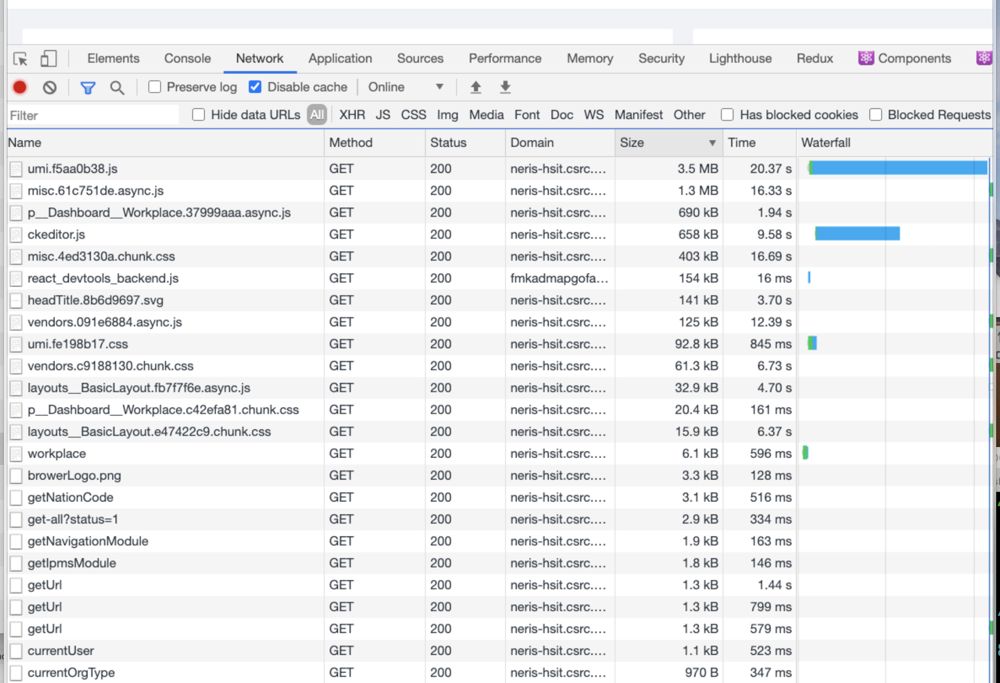
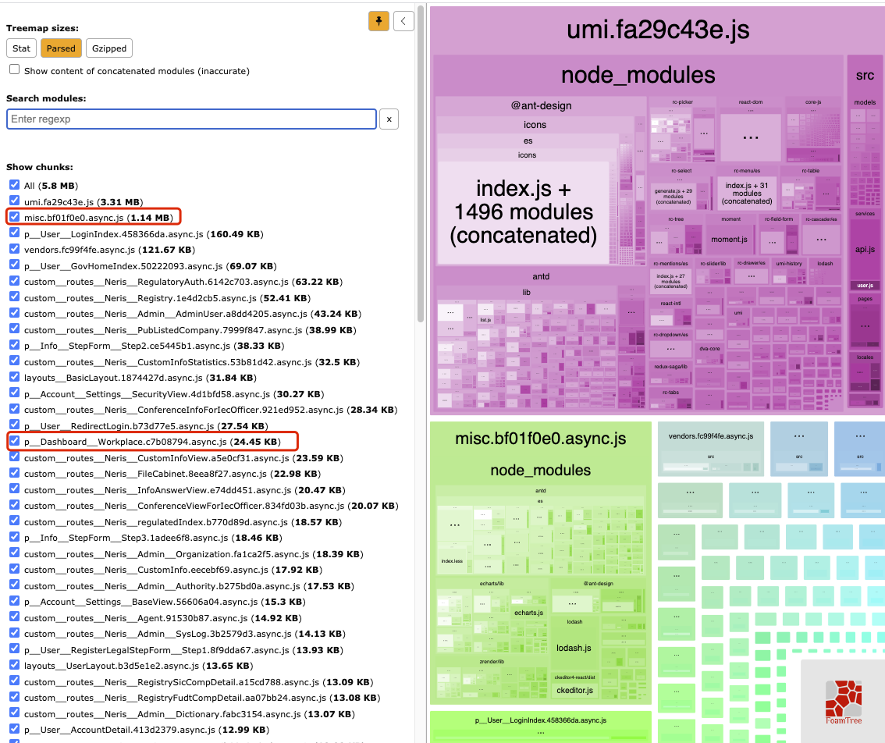

[TOC]

# 前端打包大小优化

## 1. 优化之前的项目包大小

https://pro.ant.design/docs/build-cn

使用`npm run analyze`后查看：

stat:

文件输入前的大小

parsed：

文件经过webpack打包后的大小，也是浏览器接收的文件大小。

gzip：

这是通过gzip压缩运行解析的包/模块的大小。

## 2. 优化分析

### 2.1 BizCharts.js的优化

由于查看，发现只有src/components/Charts文件夹下使用了`bizcharts`库，这个文件夹只有src/pages/Dashboard/Workplace.js组件使用了，可考虑更换为echarts图表并使用echarts的按需加载来减少包的大小。

使用echarts替换后，打包大小：

可以看到，misc.bf01f0e0.async.js文件比之前小了0.12MB

`p__Dashboard__Workplace.c7b08794.async.js`文件比之前小了640KB。

项目共计小了：0.75MB。

