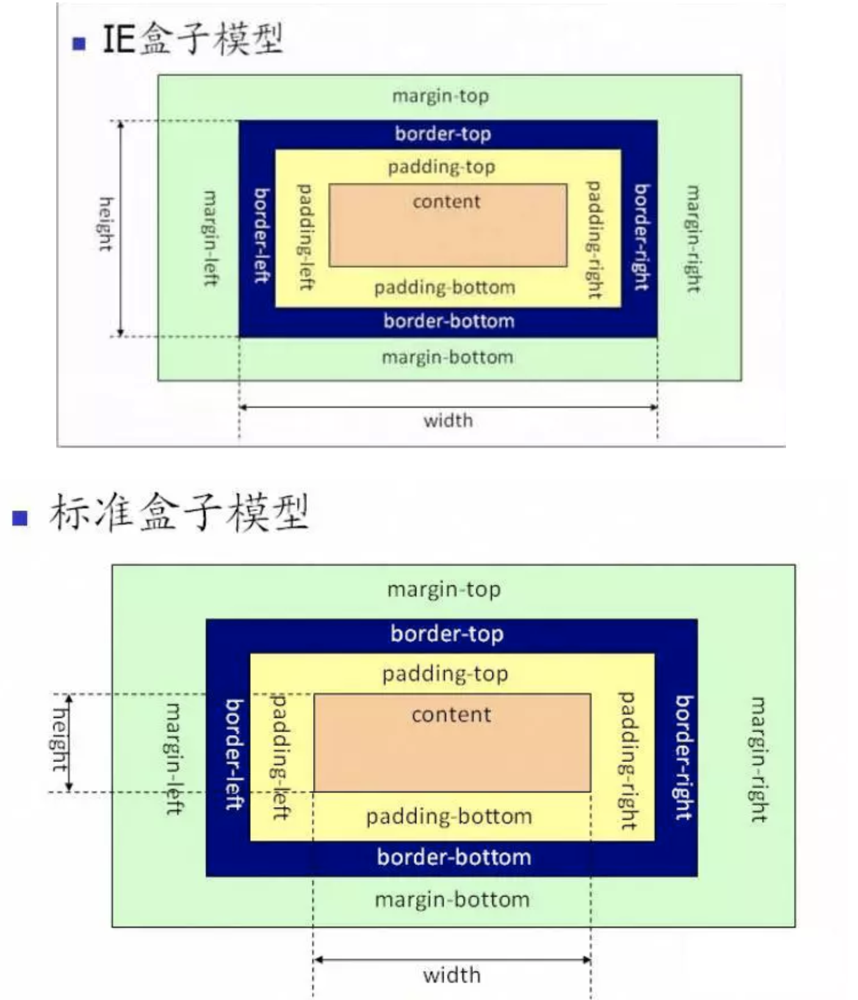

[TOC]

# CSS部分

## 1. IE盒模型和标准盒模型



可使用CSS属性来切换IE盒模型和标准盒模型：

```CSS
box-sizing:border-box || content-box || inherit
```

- 当使用content-box时：页面将采用标准模式来解析计算，content-box也是默认模式
- 当使用border-box时，页面将采用怪异模式解析计算，怪异模式也称为IE模式
- 当使用inherit时：页面将从父元素继承box-sizing的值

参考资料：https://www.jianshu.com/p/cc2bc404269b

## 2. px、em、rem区别

px是固定的像素，一旦设置了就无法因为适应页面大小而改变。

em和rem相对于px更具有灵活性，他们是相对长度单位，意思是长度不是定死了的，更适用于响应式布局。

对于em和rem的区别一句话概括：em相对于父元素，rem相对于根元素。

**chrome设置的最小字体大小为12px，意思就是说低于12px的字体大小会被默认为12px，**当然这一尬境可以由css3解决，这里就不多说了。

**em**

-   子元素字体大小的em是相对于父元素字体大小
-   元素的width/height/padding/margin用em的话是相对于该元素的font-size

**rem**

rem是全部的长度都相对于根元素，根元素是谁？`<html>`元素。通常做法是给html元素设置一个字体大小，然后其他元素的长度单位就为rem。

## 3. 实现左、中、右三列布局

实现一个左、中、右三列布局，两边宽度固定，中间自适应

使用绝对定位：

```html
<style>
  .father { position: relative; height: 400px; }
  .father > div {
    border: 1px solid;
    position: absolute;
    height: 100%;
    top: 0;
  }
  .son1 { left: 0; width: 200px; }
  .son2 {
    left: 200px;
    right: 200px;
    background-color: rgba(33, 33, 186, 0.2);
  }
  .son3 { right: 0; width: 200px; }
</style>
<div class="father">
  <div class="son1">左边</div>
  <div class="son2">中间中间中间中中间</div>
  <div class="son3">右边</div>
</div>
```

使用float:

```html
<style>
  .father { height: 400px; }
  .father > div {
    border: 1px solid;
    height: 100%;
    box-sizing: border-box;
  }
  .son1 { float: left; width: 200px; }
  .son2 {
    background-color: rgba(33, 33, 186, 0.2);
    margin: 0 200px;
  }
  .son3 { float: right; width: 200px; }
</style>
<div class="father">
  <div class="son1">左边</div>
  <div class="son3">右边</div>
  <div class="son2">中间中间中间中中间</div>
</div>
```


参考资料：[css中单位em和rem的区别](https://www.cnblogs.com/wind-lanyan/p/6978084.html)

