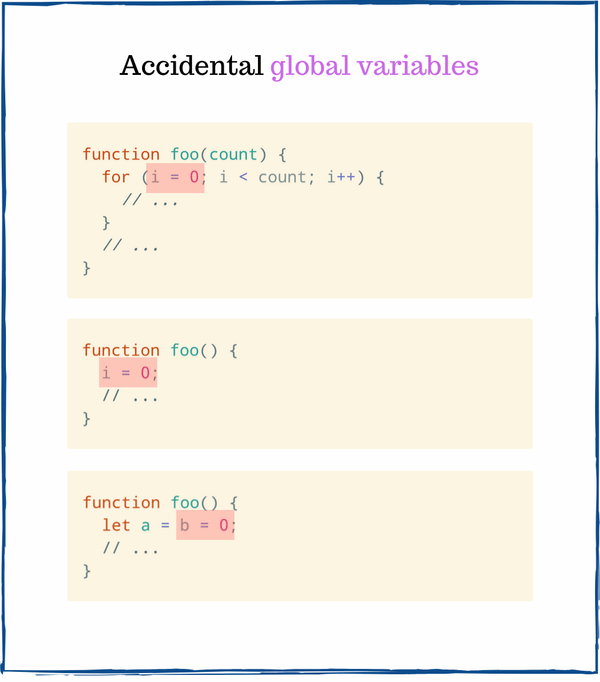
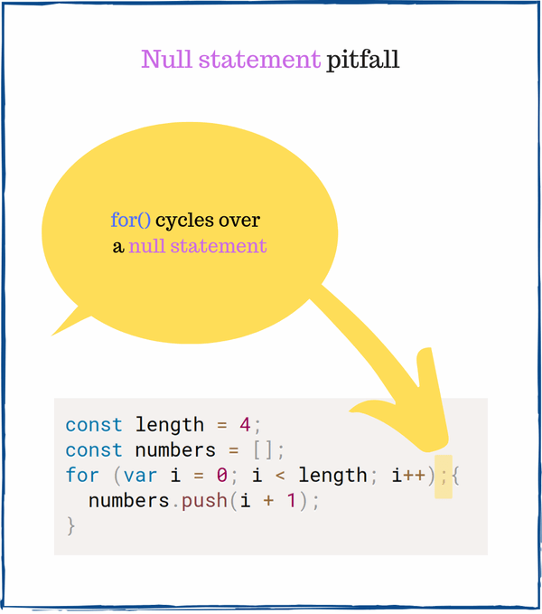
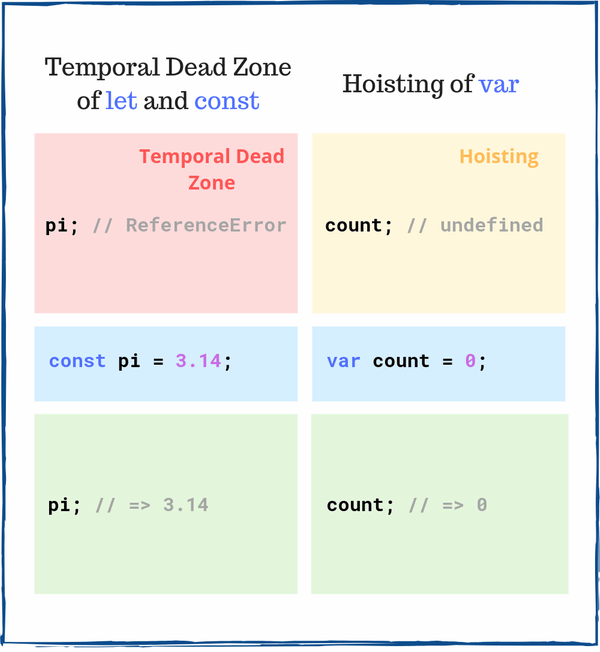

[TOC]


# 7个简单但棘手的JavaScript面试问题

本文整理、转载自：[7个简单但棘手的JavaScript面试问题](https://segmentfault.com/a/1190000022022776)

## 1. 意外全局变量

### Question

以下代码段中用于运算 `typeof a` 和 `typeof b` 的内容：

```
function foo() {
  let a = b = 0;
  a++;
  return a;
}

foo();
typeof a; // => ???
typeof b; // => ???
```

### Answer

让我们看一下第2行：`let a = b = 0`，该语句声明一个局部变量a，然儿，它也声明了全局变量b。

在 `foo()` 范围或全局范围中都没有声明变量b。因此JavaScript将 `b = 0` 表达式解释为 `window.b = 0`。换句话说，b是意外创建的全局变量。



在浏览器中，以上代码片段等效于：

```
function foo() {
  let a;
  window.b = 0;
  a = window.b;
  a++;
  return a;
}

foo();
typeof a;        // => 'undefined'
typeof window.b; // => 'number'
```

`typeof a` 等于 `'undefined'`，变量 `a` 存在于 `foo()` 范围内，而在外部范围内不使用。

因为b是一个值为0的全局变量，所以b的类型的值为 `'number'`。

## 2.数组的length属性

### Question

`clothes[0]` 的值是什么?

```js
const clothes = ['jacket', 't-shirt'];
clothes.length = 0;

clothes[0]; // => ???
```

### Answer

数组对象的 `length` 属性具有特殊的行为：减少length属性的值的副作用是删除自己的数组元素。因此，当JavaScript执行 `clothes.length = 0` 的时候将删除所有元素。

`clothes [0]` 等于 `undefined` 的，因为 `clothes` 数组已被清空。

## 3.鹰眼测试

### Question

`numbers` 数组的内容是什么？

```js
const length = 4;
const numbers = [];
for (var i = 0; i < length; i++);{
  numbers.push(i + 1);
}

numbers; // => ???
```

让我们仔细看一下分号 `；` 出现在左大括号 `{`：



这个分号很容易被忽略，它创建了一个空语句。空语句是不做任何事情的空语句。

`for()` 在空语句上进行4次迭代（不执行任何操作），而忽略实际将项目推入数组的块：`{number.push（i + 1）;}`。上面的代码等效于以下代码：

```js
const length = 4;
const numbers = [];
var i;
for (i = 0; i < length; i++) {
  // does nothing
}
{ 
  // a simple block
  numbers.push(i + 1);
}

numbers; // => [5]
```

`for()` 将 `i` 变量递增到4，然后JavaScript一次进入块 `{number.push（i + 1）;}`，将 `4 +1` 推入数字数组。

因此，`numbers` 数组的内容为 `[5]`。

## 4.自动分号插入

### Question

`arrayFromValue()` 返回什么值？

```js
function arrayFromValue(item) {
  return
    [item];
}

arrayFromValue(10); // => ???
```

### Answer

很容易错过 `return` 关键字和 `[item]` 表达式之间的换行符。此换行符使JavaScript自动在 `return` 和 `[item]` 表达式之间插入分号。

这是等效的代码，在返回后插入了分号：

```js
function arrayFromValue(item) {
  return;
  [item];
}

arrayFromValue(10); // => undefined
```

`return;` 函数内部使其返回 `undefined`。因此 `arrayFromValue(10)` 的值为 `undefined`。

## 5.经典问题：棘手的闭包

### Question

以下代码将输出什么到控制台？

```js
let i;
for (i = 0; i < 3; i++) {
  const log = () => {
    console.log(i);
  }
  setTimeout(log, 100);
}
```

### Answer

如果您以前从未听说过这个棘手的问题，则很可能您的答案是 `0`、`1` 和 `2`：这是错误的。当我第一次尝试解决它时，这也是我的答案！

执行此代码段有两个阶段。

#### **Phase 1**

1.  `for()` 重复3次，在每次迭代过程中，都会创建一个新的函数 `log()` 来捕获变量 `i`。然后 `setTimout()` 计划执行`log()`。
2.  当 `for()` 循环完成时，`i` 变量的值为 `3`。

`log()` 是一个捕获变量 `i` 的闭包，该变量在 `for()` 循环的外部范围中定义。请务必注意，闭包可以词法捕获 `i` 变量。

#### **Phase 2**

第二阶段发生在100ms之后：`setTimeout()` 调用了3次计划的 `log()` 。`log()` 读取变量i的当前值为3，并记录到控制台3。这就是为什么控制台输出为`3`、`3` 和 `3` 的原因。

>   如果您难以理解闭包，建议阅读[“ JavaScript闭包的简单说明”](https://dmitripavlutin.com/simple-explanation-of-javascript-closures/)。

*您知道如何将代码段记录为0、1和2吗？请在下面的评论中写下您的解决方案！*

## 6.浮点数计算

### Question

这个等式的结果是什么？

```js
0.1 + 0.2 === 0.3 // => ???
```

### Answer

首先，让我们看一下 `0.1 + 0.2` 的值：

```js
0.1 + 0.2; // => 0.30000000000000004
```

`0.1` 和 `0.2` 的总和不完全是 `0.3`，而是略高于 `0.3`。

由于以二进制方式对浮点数进行编码，因此像浮点数相加之类的操作会产生舍入误差。

简而言之，直接比较浮点数并不精确。

因此 `0.1 + 0.2 === 0.3` 的结果是 `false`。

点击 [0.30000000000000004.com](https://0.30000000000000004.com/) 了解更多信息。

## 7.变量提升

### Question

如果在声明前访问 `myVar` 和 `myConst`，会发生什么情况？

```js
myVar;   // => ???
myConst; // => ???

var myVar = 'value';
const myConst = 3.14;
```

### Answer

提升和临时死区是影响JavaScript变量生命周期的两个重要概念。



在声明之前访问 `myVar` 的结果为 `undefined`。在初始化之前，提升的 var 变量具有 `undefined` 的值。

然儿，在声明行之前访问 `myConst` 会引发 `ReferenceError`。`const` 变量处于临时死区，直到声明行 `const myConst = 3.14`。

## 8.最后...

您可以认为某些问题对面试毫无用处。我有同样的感觉，特别是关于鹰眼测试。尽管如此，他们可能会被问到。

无论如何，其中许多问题都可以真正评估您是否精通JavaScript，例如棘手的闭包。如果您在阅读帖子时遇到一些困难，这很好地表明了您接下来必须学习什么！

------

原文：https://dmitripavlutin.com/simple-but-tricky-javascript-interview-questions/

作者：Dmitri Pavlutin

翻译：做工程师不做码农