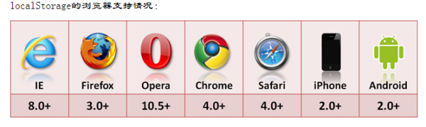

[TOC]

# 浏览器http相关问题

## 1. http常用状态码

**HTTP状态码**（英语：HTTP Status Code）用来表示请求的结果，状态码被分为五大类：

1. `100-199` 信息，服务器收到请求，需要请求者继续执行操作。
2. `200-299` 表示请求成功，操作被成功接收并处理。
3. `300-399` 重定向，需要进一步的操作以完成请求。
4. `400-499` 表示浏览器方面出错。
5. `500-599` 表示服务器方面出错。

200：请求成功，202：请求已接收，但尚未处理完成，204：没有新文档，浏览器应该继续显示原来的文档。

300：重定向到多个地方，301：永久重定向到Location指定地址，302：临时重定向。304：使用缓存数据

400：请求出现语法错误，401：请求没有登录，需要登录，403：Forbidden资源不可用，没有权限服务器拒绝处理，404：Not Found，无法找到指定位置的资源，405：Method Not Allowed，请求方法不允许，

500：服务器遇到错误，不能完成请求，502：Bad Gateway，网关或者代理请求服务器无响应，504：Gateway Timeout，请求超时，长时间服务器无响应

## 2. Cookie session localstorage 区别

cookie是将数据存储在浏览器器上，容易被篡改，如果保存的是密码之类的最好先加密再保存。而且能存储的数据很少，大约只有4kb，能保存的个数也少；并且cookie只能保存字符串格式的参数。

session是将数据存储在服务器上，保密性好，不容易被篡改，并且能保存更多的数据，能保存的数据类型也更丰富。但因为session是将数据保存在服务器上，占用的是服务器内存，如果用户量过大，会影响到服务器的性能。

localStorage这个特性主要是用来作为本地存储来使用的，解决了cookie存储空间不足的问题(cookie中每条cookie的存储空间为4k)，localStorage中一般浏览器支持的是5M大小，这个在不同的浏览器中localStorage会有所不同。

localStorage的优势

1、localStorage拓展了cookie的4K限制

2、localStorage会将第一次请求的数据直接存储到本地，这个相当于一个5M大小的针对于前端页面的数据库，相比于cookie可以节约带宽，但是这个却是只有在高版本的浏览器中才支持的

localStorage的局限

1、浏览器的大小不统一，并且在IE8以上的IE版本才支持localStorage这个属性

2、目前所有的浏览器中都会把localStorage的值类型限定为string类型，这个在对我们日常比较常见的JSON对象类型需要一些转换

3、localStorage在浏览器的隐私模式下面是不可读取的

4、localStorage本质上是对字符串的读取，如果存储内容多的话会消耗内存空间，会导致页面变卡

localStorage与sessionStorage的唯一一点区别就是localStorage属于永久性存储，而sessionStorage属于当会话结束的时候，sessionStorage中的键值对会被清空

## 3. http和https的区别

**一、HTTP和HTTPS的基本概念**

　　HTTP：是互联网上应用最为广泛的一种网络协议，是一个客户端和服务器端请求和应答的标准（TCP），用于从WWW服务器传输超文本到本地浏览器的传输协议，它可以使浏览器更加高效，使网络传输减少。

　　HTTPS：是以安全为目标的HTTP通道，简单讲是HTTP的安全版，即HTTP下加入SSL层，HTTPS的安全基础是SSL，因此加密的详细内容就需要SSL。

　　HTTPS协议的主要作用可以分为两种：一种是建立一个信息安全通道，来保证数据传输的安全；另一种就是确认网站的真实性。

**二、HTTP与HTTPS有什么区别？**

　　HTTP协议传输的数据都是未加密的，也就是明文的，因此使用HTTP协议传输隐私信息非常不安全，为了保证这些隐私数据能加密传输，于是网景公司设计了SSL（Secure Sockets Layer）协议用于对HTTP协议传输的数据进行加密，从而就诞生了HTTPS。简单来说，HTTPS协议是由SSL+HTTP协议构建的可进行加密传输、身份认证的网络协议，要比http协议安全。

　　HTTPS和HTTP的区别主要如下：

　　1、https协议需要到ca申请证书，一般免费证书较少，因而需要一定费用。

　　2、http是超文本传输协议，信息是明文传输，https则是具有安全性的ssl加密传输协议。

　　3、http和https使用的是完全不同的连接方式，用的端口也不一样，前者是80，后者是443。

　　4、http的连接很简单，是无状态的；HTTPS协议是由SSL+HTTP协议构建的可进行加密传输、身份认证的网络协议，比http协议安全。

参考资料：https://www.cnblogs.com/wqhwe/p/5407468.html