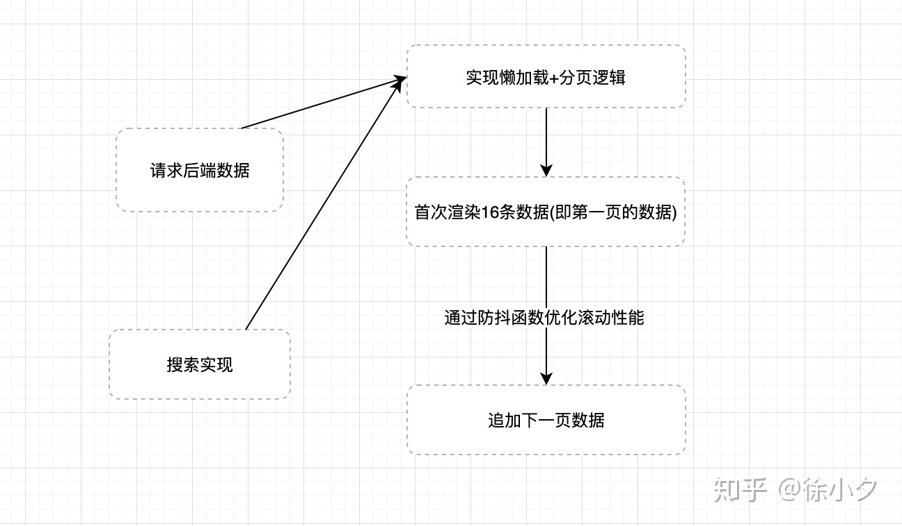
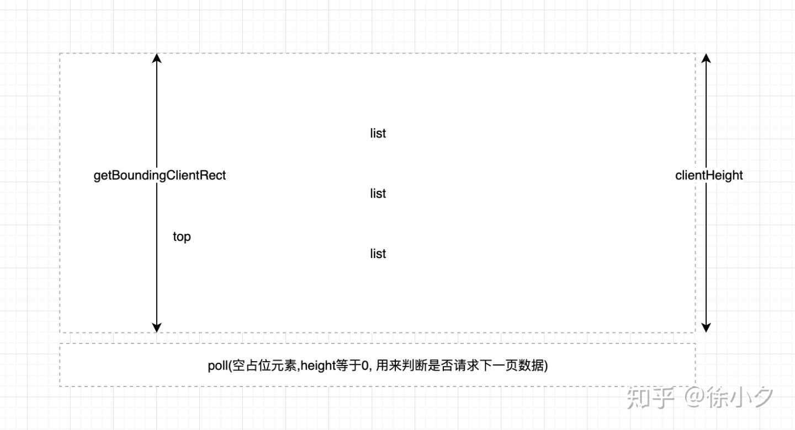

[TOC]


# 后端一次性丢给你10万条数据, 前端要怎么处理显示列表?

转载整理自：https://zhuanlan.zhihu.com/p/147178478

后端由于某种原因没有实现分页功能, 所以一次性返回了2万条数据,让前端用**select**组件展示到用户界面里.如果通过硬编码的方式去直接渲染这两万条数据到**select**中,肯定会卡死. 后面他还说需要支持搜索, 也是前端来实现,我顿时产生了兴趣. 当时想到的方案大致如下: 1. **采用懒加载+分页(前端维护懒加载的数据分发和分页)** 2. **使用虚拟滚动技术(目前react的antd4.0已支持虚拟滚动的select长列表)**

**懒加载和分页**方式一般用于做长列表优化, 类似于表格的分页功能, 具体思路就是用户每次只加载能看见的数据, 当滚动到底部时再去加载下一页的数据.

**虚拟滚动技术**也可以用来优化长列表, 其核心思路就是**每次只渲染可视区域的列表数,当滚动后动态的追加元素并通过顶部padding来撑起整个滚动内容**,实现思路也非常简单.

## 1. 初级工程师解决方案

直接从后端请求数据, 渲染到页面的硬编码方案, 搜索也是从这些数据里面查找。

这样做本质上是可以实现基本的需求,但是有明显的缺点,那就是数据一次性渲染到页面中, 数据量庞大将导致页面性能极具降低, 造成页面卡顿.

## 2. 中级工程师的方案

作为一名有一定经验的前端开发工程师,一定对页面性能有所了解, 所以一定会熟悉**防抖函数**和**节流函数**, 并使用过诸如**懒加载**和**分页**这样的方案, 接下来我们看看中级工程师的方案:



通过这个过程的优化, 代码已经基本可用了, 下面来介绍具体实现方案: 1. 懒加载+分页方案 懒加载的实现主要是通过监听窗口的滚动, 当某一个占位元素可见之后去加载下一个数据,原理如下:



这里我们通过监听**window**的**scroll**事件以及对poll元素使用**getBoundingClientRect**来获取poll元素相对于可视窗口的距离, 从而自己实现一个懒加载方案.

在滚动的过程汇总我们还需要注意一个问题就是当用户往回滚动时, 实际上是不需要做任何处理的,所以我们需要加一个单向锁, 具体代码如下:

```js
function scrollAndLoading() {
    if(window.scrollY > prevY) {  // 判断用户是否向下滚动
      prevY = window.scrollY
      if(poll.current.getBoundingClientRect().top <= window.innerHeight) {
        // 请求下一页数据
      }
    }
}

useEffect(() => {
    // something code
    const getData = debounce(scrollAndLoading, 300)
    window.addEventListener('scroll', getData, false)
    return () => {
      window.removeEventListener('scroll', getData, false)
    }
  }, [])
```

其中prevY存储的是窗口上一次滚动的距离, 只有在向下滚动并且滚动高度大于上一次时才更新其值.

至于分页的逻辑, **原生javascript**实现分页也很简单, 我们通过定义几个维度: *curPage当前的页数* pageSize 每一页展示的数量 * data 传入的数据量

有了这几个条件,我们的基本能分页功能就可以完成了. 前端分页的核心代码如下:

```js
let data = [];
let curPage = 1;
let pageSize = 16;
let prevY = 0;

// other code...

function scrollAndLoading() {
    if(window.scrollY > prevY) {  // 判断用户是否向下滚动
      prevY = window.scrollY
      if(poll.current.getBoundingClientRect().top <= window.innerHeight) {
        curPage++
        setList(searchData.slice(0, pageSize * curPage))
      }
    }
}
```

1.  防抖函数实现 **防抖函数**因为比较简单, 这里直接上一个简单的**防抖函数**代码:

```js
function debounce(fn, time) {
    return function(args) {
      let that = this
      clearTimeout(fn.tid)
      fn.tid = setTimeout(() => {
        fn.call(that, args)
      }, time);
    }
  }
```

1.  搜索实现 搜索功能代码如下:

```js
const handleSearch = (v) => {
     curPage = 1;
     prevY = 0;
     searchData = data.filter((item, i) => {
        // 采用正则来做匹配, 后期支持前端模糊搜索
       let reg = new RegExp(v, 'gi')
       return reg.test(item.title)
     })
     setList(searchData.slice(0, pageSize * curPage))
}
```

需要结合分页来实现, 所以这里为了不影响源数据, 我们采用临时数据searchData来存储. 


## 3. 高级工程师的方案

作为一名久经战场的程序员, 我们应该考虑更优雅的实现方式,比如组件化, 算法优化, 多线程这类问题, 就比如我们问题中的大数据渲染, 我们也可以用虚拟长列表来更优雅简洁的来解决我们的需求. 至于虚拟长列表的实现笔者在开头已经点过,这里就不详细介绍了, 对于更大量的数据,比如100万(虽然实际开发中不会遇到这么无脑的场景),我们又该怎么处理呢?

第一个点我们可以使用js缓冲器来分片处理100万条数据, 思路代码如下:

```js
function multistep(steps,args,callback){
    var tasks = steps.concat();

    setTimeout(function(){
        var task = tasks.shift();
        task.apply(null, args || []);   //调用Apply参数必须是数组

        if(tasks.length > 0){
            setTimeout(arguments.callee, 25);
        }else{
            callback();
        }
    },25);
}
```

这样就能比较大量计算导致的js进程阻塞问题了.更多性能优化方案可以参考笔者之前的文章:

web性能优化的15条实用技巧：https://zhuanlan.zhihu.com/p/94226707

我们还可以通过**web worker**来将需要在前端进行大量计算的逻辑移入进去, 保证js主进程的快速响应, 让**web worker**线程在后台计算, 计算完成后再通过**web worker**的通信机制来通知主进程, 比如模糊搜索等, 我们还可以对搜索算法进一步优化,比如**二分法**等,所以这些都是高级工程师该考虑的问题. 但是一定要分清场景, 寻找出性价比更高的方案.